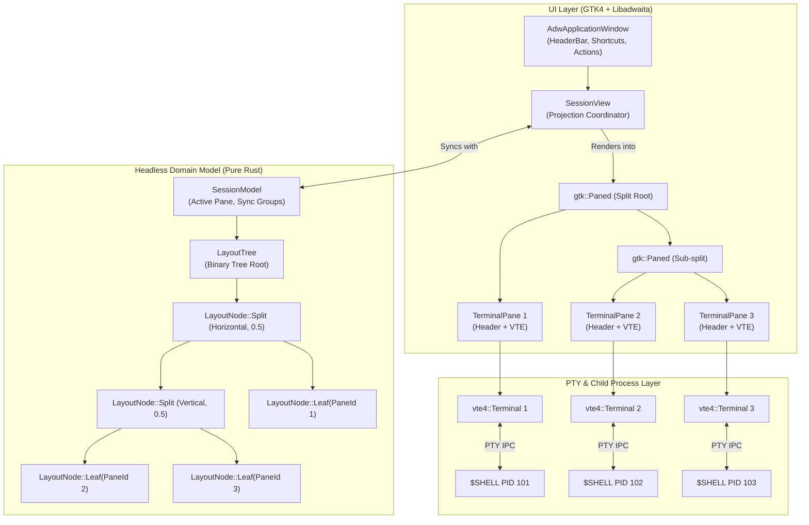

# Tilix Rust Architecture Overview

**Status:** Living Architecture Document  
**Version:** 0.1.0 (Phase 1 Draft)  
**Date:** 2026-09-15  

---

## 1. System Overview & Mission

Tilix is an advanced GTK-based tiling terminal emulator originally authored by Gerald Nunn in the D programming language using GTK3. While celebrated for its intuitive split-terminal workflow, native GNOME feel, and input synchronization, original Tilix suffered from severe architectural debt:
1. **Coupled Widget-as-State Model:** The GTK widget hierarchy *was* the session state. Tree manipulation (splitting, closing, rebalancing) manipulated live GTK3 containers directly, making headless unit testing impossible, serialization brittle, and layout transitions prone to widget layout bugs.
2. **Ecosystem Stagnation:** D language tooling and libraries in desktop distributions have waned (e.g., D compilers and packages were dropped from Arch Linux official repositories).
3. **Legacy Display Assumptions:** GTK3 abstractions lacked first-class Wayland ergonomics, modern Libadwaita adaptive design patterns, and GTK4 event controllers.

### Rust Tilix Mission
Rewrite Tilix in modern Rust using **GTK4**, **Libadwaita**, and **VTE4**, adhering to the following guiding tenets:
- **Headless Domain Core:** The terminal layout tree is a pure, immutable-friendly algebraic data structure with zero dependencies on GTK, Wayland, or X11. It is 100% unit-testable in CI without a display server.
- **Unidirectional Reactive Projection:** The UI layer is a projection of the headless domain model. When the tree changes, the UI reconciles its `gtk::Paned` containers while preserving running `vte4::Terminal` instances.
- **Rock-Solid Process & PTY Lifecycle:** Terminal child processes are spawned asynchronously with strict signal and exit handling to prevent zombie processes and broken pipes.
- **Native GNOME HIG:** Full integration with Libadwaita styling, accent colors, header bars, and responsive Wayland gestures.
- **Extensible Sync Architecture:** Foundation built from day one to support broadcast input groups across multiple terminal panes.

---

## 2. High-Level Architectural Block Diagram



---

## 3. Core Domain Model (Headless & Testable)

The domain model represents terminal arrangements as an algebraic binary tree. No GTK, GObject, or display types are referenced in this layer.

### 3.1 Data Structures
```rust
#[derive(Debug, Clone, Copy, PartialEq, Eq, Hash, PartialOrd, Ord, Serialize, Deserialize)]
pub struct PaneId(pub u64);

#[derive(Debug, Clone, Copy, PartialEq, Eq, Serialize, Deserialize)]
pub enum SplitOrientation {
    /// Side-by-side panes (left and right), separated by a vertical divider.
    Horizontal,
    /// Stacked panes (top and bottom), separated by a horizontal divider.
    Vertical,
}

#[derive(Debug, Clone, Copy, PartialEq, Eq)]
pub enum Direction {
    Up,
    Down,
    Left,
    Right,
}

#[derive(Debug, Clone, PartialEq, Serialize, Deserialize)]
pub enum LayoutNode {
    Leaf(PaneId),
    Split {
        orientation: SplitOrientation,
        ratio: f64, // Clamped between 0.05 and 0.95 (default 0.5)
        first: Box<LayoutNode>,
        second: Box<LayoutNode>,
    },
}

#[derive(Debug, Clone, PartialEq, Serialize, Deserialize)]
pub struct LayoutTree {
    root: Option<LayoutNode>,
}
```

### 3.2 Tree Invariants & Operations
1. **Empty State & Leaves:** A `LayoutTree` can represent an active session or an empty state (`root: None`).
2. **Unique Identifiers:** Every `PaneId` in the tree must be strictly unique.
3. **Splitting:**
   - `split(target: PaneId, orientation: SplitOrientation, new_pane: PaneId) -> Result<(), LayoutError>`
   - Replaces `Leaf(target)` with `Split { orientation, ratio: 0.5, first: Box::new(Leaf(target)), second: Box::new(Leaf(new_pane)) }`.
4. **Closing & Collapsing:**
   - `close(target: PaneId) -> Result<Option<PaneId>, LayoutError>`
   - Finds the parent split of `Leaf(target)`. Replaces the parent split with the target's sibling branch.
   - If the target is the root and only leaf, sets `self.root = None` and returns `Ok(None)` indicating the tree has emptied.
   - Returns `Ok(Some(sibling_id))` indicating the next pane that should receive focus.
5. **Balancing:**
   - `balance()`: Recursively resets split ratios. In binary mode, sets every ratio to `0.5`. In proportional mode, weights ratios by the leaf count of each subtree:
     $$\text{ratio} = \frac{\text{count}(\text{first})}{\text{count}(\text{first}) + \text{count}(\text{second})}$$
6. **Geometric Directional Navigation:**
   - Without GTK, the tree calculates the normalized 2D bounding boxes `[0.0, 1.0] x [0.0, 1.0]` of all leaves.
   - For a given focused `PaneId` and `Direction`, it computes ray-cast intervals to find the closest visible adjacent pane.

---

## 4. UI Projection & Event Flow

### 4.1 Projection Strategy
The UI layer maintains a pool of active `TerminalPane` widgets keyed by `PaneId`:
```rust
pub struct SessionView {
    container: gtk::Box,
    panes: HashMap<PaneId, TerminalPane>,
    model: SessionModel,
}
```
When `LayoutTree` changes (split, close, rebalance):
1. The tree is traversed recursively.
2. For each `LayoutNode::Leaf(pane_id)`, the existing `TerminalPane` is retrieved from `panes`.
3. For each `LayoutNode::Split`, a `gtk::Paned` is allocated (or reused from a pool) with the designated orientation and divider position.
4. The children are attached using GTK4's `set_start_child(Some(&child1))` and `set_end_child(Some(&child2))`.
5. Because `TerminalPane` instances are kept in `HashMap<PaneId, TerminalPane>`, reparenting them into a new `gtk::Paned` tree preserves their internal `vte4::Terminal` widget, PTY connection, running child process, and scrollback buffer without interruption.

### 4.2 Split Ratio Synchronization
- When the user drags a `gtk::Paned` divider bar, the GTK `notify::position` signal fires.
- `SessionView` calculates the new fraction relative to the allocated pixel width/height:
  $$\text{ratio} = \frac{\text{position}}{\text{allocated\_length}}$$
- The updated ratio is stored back into the `LayoutTree` model so that layout balances or state snapshots retain the user's manual adjustments.

### 4.3 Focus Management
- Each `TerminalPane` listens for focus changes via `gtk::EventControllerFocus`.
- When focus enters a terminal:
  1. The active `PaneId` in `SessionModel` is updated.
  2. The previously focused `TerminalPane` removes the `.active-pane` CSS style class.
  3. The newly focused `TerminalPane` adds the `.active-pane` CSS class, rendering a subtle accent-color border adhering to GNOME HIG.

---

## 5. PTY & VTE Integration

### 5.1 TerminalPane Composition
A `TerminalPane` is a composite widget (`gtk::Box` vertical):
- **Header Bar:** Lightweight header containing:
  - Terminal title label (dynamically bound to shell/process title).
  - Quick action buttons: Split Right, Split Down, Close.
- **Terminal Area:** `vte4::Terminal` configured for high-performance rendering.

### 5.2 Shell Spawning
Child shells are spawned asynchronously via `vte4::Terminal::spawn_async`:
- **Shell Resolution:** Checks `$SHELL` environment variable; falls back to `/bin/sh`.
- **Arguments:** Default `[shell.as_str()]`.
- **Environment:** Inherits parent process environment with standard terminal variables (`TERM=xterm-256color`, `COLORTERM=truecolor`).
- **Working Directory:** Preserved from parent or configured working directory.
- **PTY Flags:** `vte4::PtyFlags::DEFAULT`.

### 5.3 Signal Handling & Child Exit
- `terminal.connect_child_exited(move |_term, exit_code| ...)`:
  When the child shell exits (e.g., user runs `exit` or presses `Ctrl+D`), the signal dispatches a `ClosePane(pane_id)` command to the `SessionView`.
- `terminal.connect_window_title_changed(move |term| ...)`:
  Reads `term.window_title()` and updates the header title label.
- `terminal.connect_bell(...)`:
  Triggers window alert / system bell notification.

---

## 6. Input Synchronization Foundation

In Tilix, terminal synchronization allows simultaneous keyboard input across multiple panes. While full broadcast execution is slated for Phase 2, Phase 1 establishes the structural foundation:
1. **Sync Group Identifier:**
   ```rust
   #[derive(Debug, Clone, Copy, PartialEq, Eq, Hash, Serialize, Deserialize)]
   pub struct SyncGroupId(pub u32);
   ```
2. **Metadata Association:**
   Each `TerminalPane` holds an optional `SyncGroupId`.
3. **Capture Controller:**
   Key events on `TerminalPane` are routed through a `gtk::EventControllerKey` in `PropagationPhase::Capture`. If the pane belongs to an active sync group, the controller captures the raw input bytes and emits them to an asynchronous broadcast channel managed by `SessionView`.

---

## 7. Wayland, Desktop Integration & GNOME HIG

- **Native Wayland First:** Uses standard GTK4 and Libadwaita windowing. Fractional scaling, touch gestures, and Wayland seat events are handled natively by GTK4.
- **Libadwaita Styling:** Uses `adw::Application` and `adw::ApplicationWindow` with standard GNOME 4x design patterns:
  - Header bar with title, window controls, and split buttons.
  - Adaptive styling responsive to GNOME system-wide dark/light mode preference (`AdwStyleManager`).
  - Standard GNOME keyboard shortcuts (`Ctrl+Shift+T`, `Ctrl+Shift+W`, `Ctrl+Shift+R`, `Ctrl+Shift+D`, `Alt+Arrows`).
