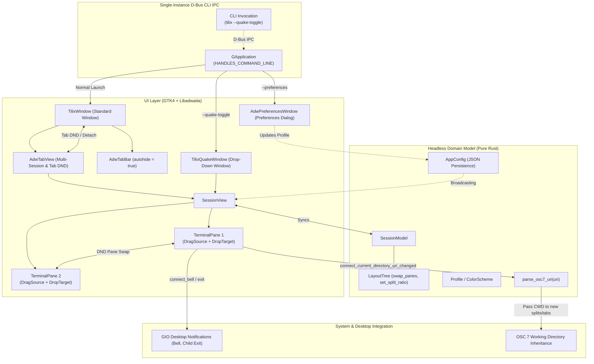

# Tilix Rust Architecture Overview

**Status:** Living Architecture Document  
**Version:** 0.3.0 (Phase 3 Architecture)  
**Date:** 2026-09-15  

---

## 1. System Overview & Mission

Tilix is an advanced GTK-based tiling terminal emulator originally authored by Gerald Nunn in the D programming language using GTK3. While celebrated for its intuitive split-terminal workflow, native GNOME feel, and input synchronization, original Tilix suffered from severe architectural debt:
1. **Coupled Widget-as-State Model:** The GTK widget hierarchy *was* the session state. Tree manipulation (splitting, closing, rebalancing) manipulated live GTK3 containers directly, making headless unit testing impossible, serialization brittle, and layout transitions prone to widget layout bugs.
2. **Ecosystem Stagnation:** D language tooling and libraries in desktop distributions have waned (e.g., D compilers and packages were dropped from Arch Linux official repositories).
3. **Legacy Display Assumptions:** GTK3 abstractions lacked first-class Wayland ergonomics, modern Libadwaita adaptive design patterns, and GTK4 event controllers.

### Rust Tilix Mission
Rewrite Tilix in modern Rust using **GTK4**, **Libadwaita**, and **VTE4**, adhering to the following guiding tenets:
- **Headless Domain Core:** The terminal layout tree, session state, profiles, templates, CLI parsing, and configuration are pure, immutable-friendly algebraic data structures with zero dependencies on GTK, Wayland, or X11. They are 100% unit-testable in CI without a display server.
- **Unidirectional Reactive Projection:** The UI layer is a projection of the headless domain model. When the tree changes, the UI reconciles its `gtk::Paned` containers while preserving running `vte4::Terminal` instances.
- **Rock-Solid Process & PTY Lifecycle:** Terminal child processes are spawned asynchronously with strict signal and exit handling to prevent zombie processes and broken pipes.
- **Native GNOME HIG & Wayland Integration:** Full integration with Libadwaita styling, accent colors, header bars, adaptive tab bar with autohide, tab detaching across windows, Wayland pane drag-and-drop, and top-docked Quake dropdown mode via D-Bus IPC.
- **Zero-Feedback Synchronized Input:** Seamless input broadcast across terminal panes using `vte.connect_commit` and `vte.feed_child`.

---

## 2. High-Level Architectural Block Diagram



---

## 3. Core Domain Model (Headless & Testable)

The domain model represents terminal arrangements as an algebraic binary tree. No GTK, GObject, or display types are referenced in this layer.

### 3.1 Data Structures
```rust
#[derive(Debug, Clone, Copy, PartialEq, Eq, Hash, PartialOrd, Ord, Serialize, Deserialize)]
pub struct PaneId(pub u64);

#[derive(Debug, Clone, Copy, PartialEq, Eq, Hash, PartialOrd, Ord, Serialize, Deserialize)]
pub struct SplitId(pub u64);

#[derive(Debug, Clone, Copy, PartialEq, Eq, Serialize, Deserialize)]
pub enum SplitOrientation {
    /// Side-by-side panes (left and right), separated by a vertical divider.
    Horizontal,
    /// Stacked panes (top and bottom), separated by a horizontal divider.
    Vertical,
}

#[derive(Debug, Clone, Copy, PartialEq, Eq)]
pub enum Direction {
    Up,
    Down,
    Left,
    Right,
}

#[derive(Debug, Clone, PartialEq, Serialize, Deserialize)]
pub enum LayoutNode {
    Leaf(PaneId),
    Split {
        id: SplitId,
        orientation: SplitOrientation,
        ratio: f64, // Clamped between 0.05 and 0.95 (default 0.5)
        first: Box<LayoutNode>,
        second: Box<LayoutNode>,
    },
}

#[derive(Debug, Clone, PartialEq, Serialize, Deserialize)]
pub struct LayoutTree {
    root: Option<LayoutNode>,
}
```

### 3.2 Tree Invariants & Operations
1. **Empty State & Leaves:** A `LayoutTree` can represent an active session or an empty state (`root: None`).
2. **Unique Identifiers:** Every `PaneId` and `SplitId` in the tree must be strictly unique.
3. **Splitting:**
   - `split(target: PaneId, orientation: SplitOrientation, new_pane: PaneId) -> Result<(), LayoutError>`
   - Replaces `Leaf(target)` with `Split { id, orientation, ratio: 0.5, first: Box::new(Leaf(target)), second: Box::new(Leaf(new_pane)) }`.
4. **Closing & Collapsing:**
   - `close(target: PaneId) -> Result<Option<PaneId>, LayoutError>`
   - Finds the parent split of `Leaf(target)`. Replaces the parent split with the target's sibling branch.
   - If the target is the root and only leaf, sets `self.root = None` and returns `Ok(None)` indicating the tree has emptied.
   - Returns `Ok(Some(sibling_id))` indicating the next pane that should receive focus.
5. **Balancing:**
   - `balance()`: Recursively resets split ratios based on leaf counts.
6. **Dynamic Split Ratio Updates:**
   - `set_split_ratio(split_id: SplitId, ratio: f64) -> bool`: Locates the split node and updates its ratio (clamped `0.05..0.95`).
7. **Pane Swapping (for DND):**
   - `swap_panes(&mut self, a: PaneId, b: PaneId) -> Result<(), LayoutError>`: Swaps the positions of two leaf panes while leaving tree topology and split ratios intact.
8. **Geometric Directional Navigation:**
   - Computes normalized 2D bounding boxes `[0.0, 1.0] x [0.0, 1.0]` of all leaves and ray-casts perpendicular intervals.

---

## 4. UI Projection & Event Flow

### 4.1 Projection Strategy
The UI layer maintains a pool of active `TerminalPane` widgets keyed by `PaneId`:
```rust
pub struct SessionView {
    container: gtk::Box,
    panes: Rc<RefCell<HashMap<PaneId, TerminalPane>>>,
    model: Rc<RefCell<SessionModel>>,
}
```
When `LayoutTree` changes (split, close, rebalance, swap):
1. The tree is traversed recursively.
2. For each `LayoutNode::Leaf(pane_id)`, the existing `TerminalPane` is retrieved from `panes`.
3. For each `LayoutNode::Split`, a `gtk::Paned` is allocated with the designated orientation and divider position.
4. Reparenting unparents running pane widgets before reattaching them, preserving running VTE instances, PTY connections, and scrollback.

### 4.2 Split Ratio Synchronization
- When the user drags a `gtk::Paned` divider bar, `notify::position` fires.
- `SessionView` calculates the new fraction relative to allocated width/height and updates `LayoutTree::set_split_ratio(split_id, ratio)`.

---

## 5. PTY & VTE Integration

### 5.1 TerminalPane Composition
A `TerminalPane` is a composite widget (`gtk::Box` vertical):
- **Header Bar:** Lightweight header with title label, sync override button (`input-keyboard-symbolic`), drag handle, quick action buttons (Split Right, Split Down, Close).
- **Terminal Area:** `vte4::Terminal` configured for high-performance rendering.

### 5.2 Shell Spawning & CWD Inheritance
Child shells are spawned asynchronously via `vte4::Terminal::spawn_async`:
- **Directory Inheritance:** Spawns in target directory if provided, falling back to `$PWD` or `$HOME`.
- **Environment:** Inherits parent environment with `TERM=xterm-256color`, `COLORTERM=truecolor`.
- **PTY Flags:** `vte4::PtyFlags::DEFAULT`.

---

## 6. Multi-Session Tab Management (`AdwTabView` & `AdwTabBar`)

1. **Separation of Concerns:** Each tab page (`AdwTabPage`) wraps a distinct `SessionView`.
2. **HIG Autohide:** The `AdwTabBar` sits in `ToolbarView::add_top_bar` with `autohide = true`.
3. **Dynamic Title Propagation:** Process titles update `TerminalPane` and bubble to `AdwTabPage::set_title()`.
4. **Tab Detachment & Cross-Window Migration:** Connected to `tab_view.connect_create_window` to support dragging tabs into new windows.

---

## 7. Synchronized Input Broadcast Engine

1. **Interception via `connect_commit`:** User typing in active terminal emits `commit` with text.
2. **Cycle-Free Replication via `feed_child`:** `SessionView` broadcasts to eligible sibling panes using `feed_child(text.as_bytes())`.
3. **Weak References:** Callback closures capture `Rc::downgrade(panes)` to prevent circular reference leaks.

---

## 8. Profiles, Theming & Palette Subsystem

1. **Headless Domain Model:** `ColorScheme` and `Profile` in `src/model/theme.rs` and `src/model/profile.rs`.
2. **Tilix & GNOME JSON Palettes:** Full 16-color ANSI palettes with background, foreground, and cursor colors.
3. **Interactive Preferences:** Managed via `AdwPreferencesWindow` with immediate reactive broadcast to open terminals.

---

## 9. Split Ratio Persistence & Session Templates

1. **Addressable Split Nodes:** `LayoutNode::Split` includes a unique `SplitId`.
2. **Divider Tracking:** `gtk::Paned`'s `notify::position` signal writes back to the model.
3. **Session Layout Templates:** `SessionLayoutTemplate` serializes session structures to JSON via `serde` with collision-free sequential ID remapping.

---

## 10. Wayland, Desktop Integration & GNOME HIG

- **Native Wayland First:** Uses standard GTK4 and Libadwaita windowing without X11 dependencies.
- **Libadwaita Styling:** Standard GNOME 4x design patterns, dark/light mode preference (`AdwStyleManager`), standard keyboard accelerators.

---

## 11. OSC 7 Working Directory Inheritance

1. **Headless URI Parsing:** `parse_osc7_uri` converts `file://localhost/path` or `file:///path` into canonical local `PathBuf`s with percent-decoding.
2. **Active Directory Tracking:** `TerminalPane` listens to `vte.connect_current_directory_uri_changed`.
3. **Directory Forwarding:** Splitting a pane or opening a new tab inherits the active directory.

---

## 12. Wayland Quake / Drop-Down Architecture

1. **Single-Instance D-Bus IPC:** `adw::Application` configured with `gio::ApplicationFlags::HANDLES_COMMAND_LINE`.
2. **CLI Routing:** Secondary CLI calls (`tilix --quake-toggle`) forward to the primary process via D-Bus.
3. **Top-Docked Presentation:** `TilixQuakeWindow` presents a full-width, top-docked window toggled on demand without X11 global grabs.

---

## 13. GTK4 Event Controllers: Drag & Drop and Tab Detaching

1. **Tab Detachment:** `AdwTabView`'s `connect_create_window` reparents tabs into freshly spawned windows.
2. **Pane Swapping DND:** `TerminalPane` headers attach `GtkDragSource` transmitting `PaneId`; pane bodies attach `GtkDropTarget` receiving `PaneId` and invoking pure domain `LayoutTree::swap_panes`.

---

## 14. Reactive Preferences & Desktop Notifications

1. **Preferences Window:** `AdwPreferencesWindow` provides interactive appearance controls.
2. **AppConfig Persistence:** Automatically saved to `~/.config/tilix/config.json`.
3. **Desktop Notifications:** `NotificationService` dispatches alerts for bells and process completion when panes are unfocused.
