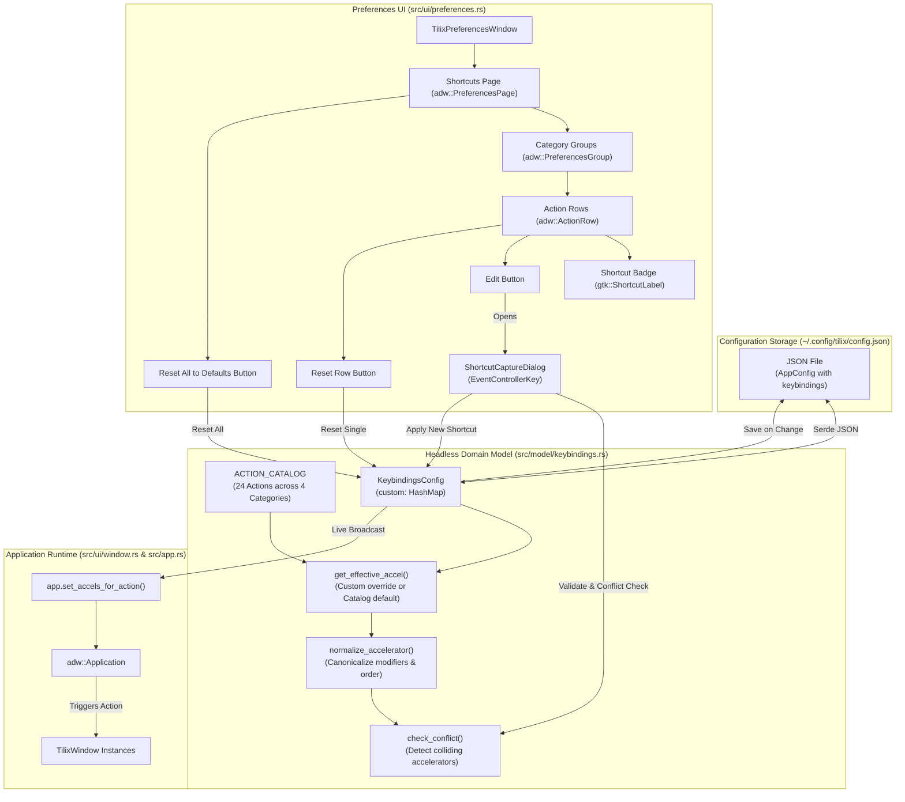

# Master Specification: Phase 7 — Custom Keybinding Manager

- **Document ID:** `SPEC-0007`
- **Date:** 2026-09-17
- **Status:** Approved / Decision Ready
- **Workflow Level:** Medium/Large (Phase 7 of Tilix Rewrite)
- **Preceding Specifications:**
  - [`docs/specs/spec-0005-window-style-wide-handle-2026-09-17.md`](file:///playground/tilix/docs/specs/spec-0005-window-style-wide-handle-2026-09-17.md)
  - [`docs/specs/spec-0006-pane-toolbar-terminal-title-2026-09-17.md`](file:///playground/tilix/docs/specs/spec-0006-pane-toolbar-terminal-title-2026-09-17.md)
- **Target Location:** `/playground/tilix`

---

## 1. Context & Motivation

Tilix is a power-user terminal emulator where efficient workflow relies heavily on keyboard accelerators. Power users utilize shortcuts for splitting panes, navigating between splits, switching tabs, toggling input synchronization, and opening preferences.

Prior to Phase 7, all keyboard accelerators were statically defined in `src/ui/window.rs:setup_accels(app: &adw::Application)`:
- `win.new-tab`: `<Primary><Shift>t`
- `win.close-pane`: `<Primary><Shift>w`
- `win.close-tab`: Unbound / None by default
- `win.tab-next`: `<Primary>Page_Down`
- `win.tab-prev`: `<Primary>Page_Up`
- `win.split-right`: `<Primary><Shift>r`
- `win.split-down`: `<Primary><Shift>d`
- `win.balance-layout`: `<Primary><Shift>b`
- `win.toggle-sync-input`: `<Primary><Shift>i`
- `win.preferences`: `<Primary>comma`
- `win.focus-up`: `<Alt>Up`
- `win.focus-down`: `<Alt>Down`
- `win.focus-left`: `<Alt>Left`
- `win.focus-right`: `<Alt>Right`
- `win.toggle-tab-bar`: `F12`, `<Primary><Shift>F12`
- `win.switch-tab-1` .. `win.switch-tab-9`: `<Alt>1` .. `<Alt>9`

Hardcoded accelerators present significant usability barriers:
1. **Desktop / Window Manager Key Collisions:** Shortcuts such as `<Alt>Up`/`<Alt>Down` or `<Primary><Shift>r` frequently collide with desktop environment shortcuts (GNOME Shell, KDE Plasma, Sway, i3, Hyprland).
2. **Ergonomic Preferences:** Different keyboard layouts (e.g. Colemak, Dvorak, 60% compact keyboards lacking dedicated function or page navigation keys) require customized keybinding ergonomics.
3. **Inability to Rebind or Disable:** Users could neither reassign shortcuts to preferred sequences nor unbind shortcuts that interfered with CLI programs (e.g. Vim, Emacs, Tmux, Ranger).

Phase 7 introduces the **Custom Keybinding Manager** (自定义快捷键管理界面), providing a headless domain model, live dynamic application rebinding without restart, conflict detection, and a native Libadwaita preferences interface with interactive keypress capture.

---

## 2. Amended Documents & Scope

- **Amended Document:** [`docs/architecture/overview.md`](file:///playground/tilix/docs/architecture/overview.md)
- **Status of Living Architecture:** Active (Extended for Phase 7)

### 2.1 Affected Scope
- `src/model/config.rs`: `AppConfig` extended with `keybindings: KeybindingsConfig` field (pure additive schema).
- `src/ui/window.rs:setup_accels`: Refactored from static string definitions to dynamic configuration dispatch via `apply_keybindings_to_app(app, &config.keybindings)`.
- `src/ui/preferences.rs`: Added dedicated "Shortcuts" (`adw::PreferencesPage`) with categories, action rows, capture dialog, and reset capabilities.

### 2.2 Unaffected Scope
- Phase 1–6 domain models (`LayoutTree`, `SessionModel`, `Profile`, `WindowStyle`, `PaneTitleStyle`, `use_wide_handle`, `show_tab_bar`).
- PTY / process lifecycle and terminal input broadcast (`vte4::Terminal`).
- Existing configuration files: 100% backwards-compatible via `#[serde(default)]`.

---

## 3. Goals & Non-Goals

### Goals
1. **Headless Domain Model (`src/model/keybindings.rs`):**
   - Action catalog defining all standard Tilix actions, categorized into logical groups (`Session & Tabs`, `Splits & Layout`, `Navigation`, `View & Settings`), with human-readable titles, descriptions, and default accelerators.
   - `KeybindingsConfig` containing a `HashMap<String, String>` of custom overrides.
   - Effective accelerator resolution (custom override taking precedence over catalog defaults).
   - Shortcut disablement support (empty string `""` represents explicitly unassigned).
   - Deterministic accelerator normalization (canonicalizing modifier aliases such as `<Control>`/`<Ctrl>` to `<Primary>`, sorting modifier order `<Primary><Shift><Alt><Super>`, and trimming keys).
   - Headless conflict detection: detecting when an assigned or candidate shortcut collides with another action's effective shortcut, 100% testable in CI without a display server.
   - Reset individual action to default or reset all actions to default.
2. **Schema & Compatibility (`src/model/config.rs`):**
   - Add `pub keybindings: KeybindingsConfig` to `AppConfig` with `#[serde(default)]`.
   - Preserve 100% backwards and forwards compatibility with legacy JSON configs (Phase 1–6).
3. **Live Reactive Application Updates (`src/ui/window.rs`):**
   - Implement `apply_keybindings_to_app(app: &adw::Application, keybindings: &KeybindingsConfig)`.
   - Implement `apply_keybindings_globally(keybindings: &KeybindingsConfig)` using `gio::Application::default()`.
   - Modifying a shortcut immediately updates `adw::Application` accelerator maps via `app.set_accels_for_action` without requiring application restart.
4. **Native Libadwaita Preferences UI (`src/ui/preferences.rs`):**
   - A dedicated "Shortcuts" page (`adw::PreferencesPage`) with icon `preferences-desktop-keyboard-shortcuts-symbolic`.
   - Categorized groups (`adw::PreferencesGroup`) for "Session & Tabs", "Splits & Layout", "Navigation", and "View & Settings".
   - Each action rendered as an `adw::ActionRow` displaying action title, description subtitle, current shortcut badge (`gtk::ShortcutLabel` or "Disabled"), an "Edit / Record" button, and a "Reset to Default" button (visible only when customized).
   - A top-level "Reset All to Defaults" button in the header/view.
5. **Interactive Shortcut Capture & Editor Dialog:**
   - Modal window/dialog attached to the preferences window.
   - Keypress capture via `gtk::EventControllerKey`: listens for key combinations, ignores standalone modifier presses (Shift, Ctrl, Alt, Super), handles Escape (cancel), and handles Backspace/Delete (disable).
   - Real-time conflict checking: displays a warning badge/label if the captured shortcut is already assigned to another action, identifying the conflicting action.
   - Allows explicit user confirmation ("Set" / "Apply") or "Disable Shortcut".
6. **Headless Quality & Verification Standards:**
   - 100% headless CI testability for all domain logic, normalization, conflict detection, and JSON roundtrips.
   - Integration test suite `tests/test_phase7_keybindings.rs`.
   - Zero compilation warnings under `cargo check --all-targets` and zero lints under `cargo clippy --all-targets -- -D warnings`.

### Non-Goals
- Global system-wide shortcut daemon (Tilix shortcuts apply when Tilix application windows have focus; Quake global toggle remains driven via D-Bus IPC or desktop environment shortcuts).
- Mouse gesture / mouse button binding customization (scoped exclusively to keyboard accelerators).
- Complex chorded sequences (e.g. Emacs multi-key chords like `Ctrl+X Ctrl+C`; GTK4 accelerator architecture binds single combinations `<Mod>Key`).

---

## 4. Decision Gating Log

| Topic | Resolution | Source | Reason |
| :--- | :--- | :--- | :--- |
| **Storage Representation** | `HashMap<String, String>` custom map inside `KeybindingsConfig` | Fact / Requirement | Leanest footprint. Only user overrides are persisted to JSON; defaults live in code catalog. Upgrades to default shortcuts seamlessly apply to non-customized actions. |
| **Default Acceleration Schema** | Array of defaults `&'static [&'static str]` per action | Decision | Allows actions like `win.toggle-tab-bar` to support multiple default accelerators (`["F12", "<Primary><Shift>F12"]`) while supporting single custom override. |
| **Accelerator Normalization** | Pure Rust parser and canonicalizer (`<Primary>`, `<Shift>`, `<Alt>`, `<Super>` + key) | Decision | Decouples conflict detection and validation from GTK display initialization, enabling 100% headless testing in headless Linux CI. |
| **Modifier Canonicalization** | Standardize `<Control>` and `<Ctrl>` to `<Primary>` | Decision | GTK4 on Linux uses `<Primary>` to represent the primary platform accelerator. Normalizing ensures `<Ctrl><Shift>t` matches `<Primary><Shift>t`. |
| **Empty Shortcut Semantic** | Empty string `""` represents disabled / unassigned | Decision | Provides explicit way for users to unbind unwanted shortcuts without removing the action from the catalog. Unassigned shortcuts never trigger conflict warnings. |
| **Live Rebinding Mechanism** | Call `app.set_accels_for_action(action_id, &[&accel])` dynamically | Fact | GTK4 `GtkApplication` immediately updates active accelerator maps across all application windows without process restart. |
| **UI Capture Model** | Modal dialog with `gtk::EventControllerKey` | Decision | Matches GNOME HIG pattern (similar to GNOME Control Center shortcuts). Intercepts keypresses directly and prevents accelerator dispatch while capturing. |
| **Conflict Handling Policy** | Informative warning with confirmation override | Decision | Clearly informs the user of collisions (e.g., "Already used by 'New Tab'"), allowing them to choose another key or override and reassign. |

---

## 5. Architecture & Component Design

### 5.1 Architectural Diagram



---

### 5.2 Action Catalog Definition

The catalog covers all actions registered in `TilixWindow::setup_actions`:

| Category | Action ID | Action Title | Default Accelerator(s) | Description |
| :--- | :--- | :--- | :--- | :--- |
| **Session & Tabs** | `win.new-tab` | New Tab | `<Primary><Shift>t` | Create a new terminal tab |
| | `win.close-pane` | Close Terminal Pane | `<Primary><Shift>w` | Close active split pane, or close tab if only one pane |
| | `win.close-tab` | Close Tab | *(None / `""`)* | Close current tab and all of its split panes |
| | `win.tab-next` | Next Tab | `<Primary>Page_Down` | Switch to the next tab |
| | `win.tab-prev` | Previous Tab | `<Primary>Page_Up` | Switch to the previous tab |
| | `win.switch-tab-1` | Switch to Tab 1 | `<Alt>1` | Jump directly to tab 1 |
| | `win.switch-tab-2` | Switch to Tab 2 | `<Alt>2` | Jump directly to tab 2 |
| | `win.switch-tab-3` | Switch to Tab 3 | `<Alt>3` | Jump directly to tab 3 |
| | `win.switch-tab-4` | Switch to Tab 4 | `<Alt>4` | Jump directly to tab 4 |
| | `win.switch-tab-5` | Switch to Tab 5 | `<Alt>5` | Jump directly to tab 5 |
| | `win.switch-tab-6` | Switch to Tab 6 | `<Alt>6` | Jump directly to tab 6 |
| | `win.switch-tab-7` | Switch to Tab 7 | `<Alt>7` | Jump directly to tab 7 |
| | `win.switch-tab-8` | Switch to Tab 8 | `<Alt>8` | Jump directly to tab 8 |
| | `win.switch-tab-9` | Switch to Tab 9 | `<Alt>9` | Jump directly to tab 9 |
| **Splits & Layout** | `win.split-right` | Split Right | `<Primary><Shift>r` | Split active terminal vertically (side by side) |
| | `win.split-down` | Split Down | `<Primary><Shift>d` | Split active terminal horizontally (stacked) |
| | `win.balance-layout` | Balance Layout | `<Primary><Shift>b` | Equalize dimensions of all split panes in session |
| | `win.toggle-sync-input` | Toggle Input Sync | `<Primary><Shift>i` | Broadcast keystrokes to all terminal panes in tab |
| **Navigation** | `win.focus-up` | Focus Terminal Above | `<Alt>Up` | Move focus to terminal pane above active pane |
| | `win.focus-down` | Focus Terminal Below | `<Alt>Down` | Move focus to terminal pane below active pane |
| | `win.focus-left` | Focus Terminal Left | `<Alt>Left` | Move focus to terminal pane to the left |
| | `win.focus-right` | Focus Terminal Right | `<Alt>Right` | Move focus to terminal pane to the right |
| **View & Settings** | `win.toggle-tab-bar` | Toggle Tab Bar | `F12`, `<Primary><Shift>F12` | Toggle tab bar visibility |
| | `win.preferences` | Preferences | `<Primary>comma` | Open application preferences dialog |

---

## 6. Functional Requirements & Implementation Details

### FR-1: Domain Model (`src/model/keybindings.rs`)
1. **`ActionCategory` Enum:**
   ```rust
   #[derive(Debug, Clone, Copy, PartialEq, Eq, Hash, Serialize, Deserialize)]
   #[serde(rename_all = "snake_case")]
   pub enum ActionCategory {
       SessionAndTabs,
       SplitsAndLayout,
       Navigation,
       ViewAndSettings,
   }

   impl ActionCategory {
       pub fn title(&self) -> &'static str {
           match self {
               Self::SessionAndTabs => "Session & Tabs",
               Self::SplitsAndLayout => "Splits & Layout",
               Self::Navigation => "Navigation",
               Self::ViewAndSettings => "View & Settings",
           }
       }
   }
   ```

2. **`ActionShortcutDef` Struct:**
   ```rust
   #[derive(Debug, Clone, PartialEq, Eq)]
   pub struct ActionShortcutDef {
       pub id: &'static str,
       pub title: &'static str,
       pub description: &'static str,
       pub category: ActionCategory,
       pub default_accels: &'static [&'static str],
   }

   impl ActionShortcutDef {
       pub fn primary_default_accel(&self) -> &'static str {
           self.default_accels.first().copied().unwrap_or("")
       }
   }
   ```

3. **`KeybindingsConfig` Struct & Methods:**
   ```rust
   #[derive(Debug, Clone, PartialEq, Eq, Serialize, Deserialize, Default)]
   #[serde(default)]
   pub struct KeybindingsConfig {
       pub custom: HashMap<String, String>,
   }

   impl KeybindingsConfig {
       pub fn new() -> Self {
           Self { custom: HashMap::new() }
       }

       pub fn get_effective_accel(&self, action_id: &str) -> Option<String> {
           if let Some(custom_accel) = self.custom.get(action_id) {
               return Some(custom_accel.clone());
           }
           ACTION_CATALOG
               .iter()
               .find(|def| def.id == action_id)
               .map(|def| def.primary_default_accel().to_string())
       }

       pub fn get_all_effective_accels(&self, action_id: &str) -> Vec<String> {
           if let Some(custom_accel) = self.custom.get(action_id) {
               if custom_accel.trim().is_empty() {
                   return Vec::new();
               }
               return vec![custom_accel.clone()];
           }
           ACTION_CATALOG
               .iter()
               .find(|def| def.id == action_id)
               .map(|def| def.default_accels.iter().map(|s| s.to_string()).collect())
               .unwrap_or_default()
       }

       pub fn is_customized(&self, action_id: &str) -> bool {
           self.custom.contains_key(action_id)
       }

       pub fn set_custom_accel(&mut self, action_id: &str, accel: impl Into<String>) {
           let accel_str = accel.into();
           // If user sets back to default, remove from custom map for clean serialization
           let default_accel = ACTION_CATALOG
               .iter()
               .find(|def| def.id == action_id)
               .map(|def| def.primary_default_accel())
               .unwrap_or("");
           if accel_str == default_accel {
               self.custom.remove(action_id);
           } else {
               self.custom.insert(action_id.to_string(), accel_str);
           }
       }

       pub fn reset_action(&mut self, action_id: &str) {
           self.custom.remove(action_id);
       }

       pub fn reset_all(&mut self) {
           self.custom.clear();
       }

       pub fn check_conflict(&self, target_action_id: &str, candidate_accel: &str) -> Option<ConflictInfo> {
           let norm_candidate = normalize_accelerator(candidate_accel);
           if norm_candidate.is_empty() {
               return None;
           }

           for def in ACTION_CATALOG {
               if def.id == target_action_id {
                   continue;
               }
               for effective in self.get_all_effective_accels(def.id) {
                   let norm_effective = normalize_accelerator(&effective);
                   if !norm_effective.is_empty() && norm_candidate == norm_effective {
                       return Some(ConflictInfo {
                           action_id: def.id.to_string(),
                           action_title: def.title.to_string(),
                           conflicting_accel: effective,
                       });
                   }
               }
           }
           None
       }
   }
   ```

4. **Accelerator Normalization (`normalize_accelerator`):**
   - Parses `<...>` modifier tokens:
     - `<Primary>`, `<Ctrl>`, `<Control>` $\rightarrow$ `primary = true`
     - `<Shift>` $\rightarrow$ `shift = true`
     - `<Alt>` $\rightarrow$ `alt = true`
     - `<Super>`, `<Meta>` $\rightarrow$ `super_mod = true`
   - Remainder after modifiers is the key name (trimmed).
   - Produces a canonical formatted string:
     `"<Primary>"` (if set) + `"<Shift>"` (if set) + `"<Alt>"` (if set) + `"<Super>"` (if set) + `key`.
   - Empty input or whitespace-only returns empty `""`.

---

### FR-2: Configuration Schema & Compatibility (`src/model/config.rs`)
1. Extend `AppConfig`:
   ```rust
   #[derive(Debug, Clone, PartialEq, Serialize, Deserialize)]
   #[serde(default)]
   pub struct AppConfig {
       pub default_profile: Profile,
       pub quake_height_percent: u32,
       pub quake_hide_on_unfocus: bool,
       pub notifications_enabled: bool,
       pub bell_notifications: bool,
       pub process_exit_notifications: bool,
       pub window_style: WindowStyle,
       pub use_wide_handle: bool,
       pub pane_title_style: PaneTitleStyle,
       pub pane_title_show_when_single: bool,
       pub show_tab_bar: bool,
       pub keybindings: KeybindingsConfig,
   }
   ```
2. Update `Default for AppConfig`:
   - `keybindings: KeybindingsConfig::default()`
3. Re-export in `src/model/mod.rs`:
   - `pub use keybindings::{ActionCategory, ActionShortcutDef, ConflictInfo, KeybindingsConfig, ACTION_CATALOG};`

---

### FR-3: Live Dynamic Application Rebinding (`src/ui/window.rs`)
1. Implement `apply_keybindings_to_app(app: &adw::Application, keybindings: &KeybindingsConfig)`:
   - Iterates through `ACTION_CATALOG`.
   - Resolves `keybindings.get_all_effective_accels(def.id)`.
   - Converts `Vec<String>` to slice of `&str`: `let refs: Vec<&str> = accels.iter().map(|s| s.as_str()).collect();`
   - Calls `app.set_accels_for_action(def.id, &refs)`.
2. Implement `apply_keybindings_globally(keybindings: &KeybindingsConfig)`:
   - Retrieves `gio::Application::default()` and downcasts to `adw::Application`.
   - Calls `apply_keybindings_to_app(&app, keybindings)`.
3. Refactor `setup_accels(app: &adw::Application)`:
   - Replaces static accelerator calls with:
     ```rust
     pub fn setup_accels(app: &adw::Application) {
         let config = crate::model::AppConfig::load();
         apply_keybindings_to_app(app, &config.keybindings);
     }
     ```

---

### FR-4: Preferences UI & Shortcut Capture (`src/ui/preferences.rs`)
1. **"Shortcuts" Preferences Page:**
   - Add `adw::PreferencesPage` with title `"Shortcuts"` and icon `"preferences-desktop-keyboard-shortcuts-symbolic"`.
   - Include a top action row or header button for `"Reset All to Defaults"` (`destructive-action` style confirmation).
2. **Category Groups:**
   - Group 1: `"Session & Tabs"`
   - Group 2: `"Splits & Layout"`
   - Group 3: `"Navigation"`
   - Group 4: `"View & Settings"`
3. **Action Rows (`adw::ActionRow`):**
   - Title: `def.title`
   - Subtitle: `def.description`
   - Suffix Box:
     - `gtk::ShortcutLabel` showing primary effective accelerator. If empty, displays a dimmed `gtk::Label` `"Disabled"`.
     - "Edit" `gtk::Button` (icon `document-edit-symbolic` or label `"Edit"`).
     - "Reset" `gtk::Button` (icon `edit-undo-symbolic`, tooltip `"Reset to default"`). Visible only if `keybindings.is_customized(def.id)`.
4. **Interactive Shortcut Capture Dialog (`ShortcutCaptureDialog`):**
   - Modal window transient for `TilixPreferencesWindow`.
   - Contains an `EventControllerKey`:
     - Listens to `connect_key_pressed`.
     - Ignores lone modifier keys (`Shift_L`, `Shift_R`, `Control_L`, `Control_R`, `Alt_L`, `Alt_R`, `Super_L`, `Super_R`).
     - Escape cancels dialog without saving.
     - Formats key combination into accelerator string via `gtk::accelerator_name` (normalized).
     - Calls `keybindings.check_conflict(action_id, &new_accel)`.
     - Displays conflict warning banner if a collision is found: `"⚠️ Already assigned to '{conflicting_title}'"`.
     - Provides `"Apply"` button (saves and updates), `"Disable Shortcut"` button (sets to empty), and `"Cancel"` button.
5. **Live Update on Change:**
   - On change, updates `current_config.borrow_mut().keybindings`.
   - Saves to disk via `cfg.save()`.
   - Calls `apply_keybindings_globally(&cfg.keybindings)`.
   - Refreshes the row's `ShortcutLabel` and the reset button's visibility.

---

## 7. Configuration Schema & Serialization

### 7.1 JSON Schema Representation
```json
{
  "default_profile": { ... },
  "quake_height_percent": 40,
  "quake_hide_on_unfocus": false,
  "notifications_enabled": true,
  "bell_notifications": true,
  "process_exit_notifications": true,
  "window_style": "normal",
  "use_wide_handle": false,
  "pane_title_style": "normal",
  "pane_title_show_when_single": true,
  "show_tab_bar": true,
  "keybindings": {
    "custom": {
      "win.new-tab": "<Primary>t",
      "win.close-tab": "<Primary>w",
      "win.toggle-sync-input": ""
    }
  }
}
```

### 7.2 Backwards & Forwards Compatibility Rules
1. **Legacy JSON (Phases 1–6):**
   If `"keybindings"` key is omitted from `config.json`, Serde populates `KeybindingsConfig::default()`. All effective shortcuts seamlessly fall back to default catalog definitions. No config corruption occurs.
2. **Minimal Footprint:**
   Actions that remain at their default values are never stored in `"custom"`, minimizing config bloat.
3. **Forward Compatibility:**
   Unknown JSON keys are ignored during deserialization.

---

## 8. Test-First Validation Strategy

### 8.1 Headless Unit Tests (`src/model/keybindings.rs` & `src/model/config.rs`)
- `test_default_keybindings_empty`: Default `custom` map is empty.
- `test_catalog_completeness`: Catalog contains all 24 actions with valid IDs and non-empty titles.
- `test_catalog_defaults_unique`: Default catalog contains no unintended internal conflicts.
- `test_effective_accel_fallback`: Uncustomized action resolves to default accelerator.
- `test_effective_accel_custom_override`: Customized action resolves to overridden accelerator.
- `test_effective_accel_disabled`: Empty string custom override returns empty accelerator.
- `test_is_customized_lifecycle`: Action reports `false` initially, `true` after override, `false` after reset.
- `test_reset_action_and_reset_all`: Verifies single action reset and full configuration reset.
- `test_accelerator_normalization`:
  - `"<Shift><Primary>t"` $\rightarrow$ `"<Primary><Shift>t"`
  - `"<Control><Shift>w"` $\rightarrow$ `"<Primary><Shift>w"`
  - `"<ctrl><alt>up"` $\rightarrow$ `"<Primary><Alt>Up"`
- `test_conflict_detection_positive`: Setting `win.split-right` to `"<Primary><Shift>t"` flags collision with `win.new-tab`.
- `test_conflict_detection_self_no_conflict`: Setting `win.new-tab` to its own shortcut flags no conflict.
- `test_conflict_detection_disabled_no_conflict`: Setting candidate `""` never flags conflict.
- `test_config_serde_roundtrip_with_keybindings`: AppConfig JSON roundtrip with custom keybindings.
- `test_legacy_config_deserialization`: Deserializing Phase 6 config cleanly populates default keybindings.

### 8.2 Headless Integration Tests (`tests/test_phase7_keybindings.rs`)
- Full roundtrip file I/O using temporary directory.
- Legacy configuration compatibility matrix (Phase 1 through Phase 6 JSON payloads).
- Forward compatibility with unknown future schema fields.
- Reassignment and conflict resolution simulation.

### 8.3 Quality Gates
```bash
cargo test
cargo check --all-targets
cargo clippy --all-targets -- -D warnings
```
All commands must exit with code 0 and zero warnings.
