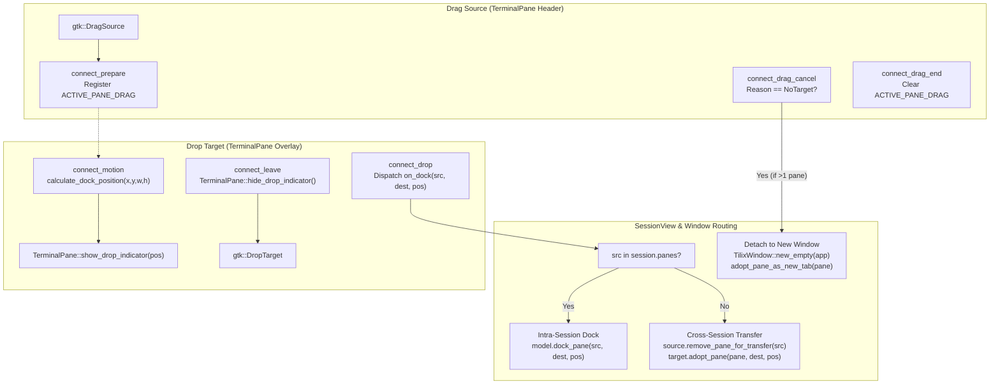

# Master Specification: Phase 8 — Advanced Pane Drag-and-Drop, Directional Docking & Window Detach

- **Document ID:** `SPEC-0008`
- **Date:** 2026-09-17
- **Status:** Approved / Decision Ready
- **Workflow Level:** Medium/Large (Phase 8 of Tilix Rewrite)
- **Preceding Specifications:**
  - [`docs/specs/spec-0001-rust-tilix-foundation-2026-09-15.md`](file:///playground/tilix/docs/specs/spec-0001-rust-tilix-foundation-2026-09-15.md)
  - [`docs/specs/spec-0002-sessions-sync-profiles-2026-09-15.md`](file:///playground/tilix/docs/specs/spec-0002-sessions-sync-profiles-2026-09-15.md)
  - [`docs/specs/spec-0003-wayland-quake-osc-dnd-2026-09-15.md`](file:///playground/tilix/docs/specs/spec-0003-wayland-quake-osc-dnd-2026-09-15.md)
  - [`docs/specs/spec-0005-window-style-wide-handle-2026-09-17.md`](file:///playground/tilix/docs/specs/spec-0005-window-style-wide-handle-2026-09-17.md)
  - [`docs/specs/spec-0006-pane-toolbar-terminal-title-2026-09-17.md`](file:///playground/tilix/docs/specs/spec-0006-pane-toolbar-terminal-title-2026-09-17.md)
  - [`docs/specs/spec-0007-custom-keybindings-manager-2026-09-17.md`](file:///playground/tilix/docs/specs/spec-0007-custom-keybindings-manager-2026-09-17.md)
- **Target Location:** `/playground/tilix`

---

## 1. Context & Motivation

Tilix is distinguished among Linux terminal emulators by its intuitive tiling workflow. In original Tilix (GTK3/D), users rearrange terminal panes interactively by dragging their header bars:
1. **Directional Docking Feedback:** As the pointer hovers over any target pane, a semi-transparent blue highlight overlay dynamically indicates where the pane will dock: the top half, bottom half, left half, right half, or full center (swap).
2. **Dynamic Split Insertion:** Dropping the pane splits the target pane in the indicated direction, rebalancing the layout tree seamlessly.
3. **Cross-Window Drag and Drop:** Dragging a pane from Window A and dropping it into Window B transfers the running terminal pane, preserving the underlying shell process, PTY, scrollback history, and running applications (such as Vim, htop, or active compilation jobs) without interruption.
4. **Desktop Detach to New Window:** Dragging a pane and releasing it outside of any Tilix window (dropped onto the desktop workspace) automatically creates a new top-level `TilixWindow` containing the detached pane with its running child process uninterrupted.

Prior to Phase 8, Tilix Rust possessed only a minimal DND stub in `src/ui/dnd.rs` that supported only full pane swapping within the same tab, lacked visual drop target overlays, failed to support directional splits, could not transfer panes across windows, and lacked desktop window detachment.

Phase 8 implements the complete interactive Drag-and-Drop docking and detaching system with full headless testability, GTK4 overlay visuals, and zero shell process interruption.

---

## 2. Amended Documents & Scope

- **Amended Document:** [`docs/architecture/overview.md`](file:///playground/tilix/docs/architecture/overview.md)
- **Status of Living Architecture:** Active (Extended for Phase 8)

### 2.1 Affected Scope
- `src/model/layout.rs`:
  - Introduce `DockPosition` enum (`Top`, `Bottom`, `Left`, `Right`, `Center`).
  - Introduce pure mathematical directional calculation function `calculate_dock_position(x, y, width, height) -> DockPosition`.
  - Add `LayoutTree::dock_pane(source, target, position)` for intra-tree pane moves and swaps.
  - Add `LayoutTree::insert_pane_dock(new_pane, target, position)` for inserting external or newly adopted panes.
- `src/model/session.rs`:
  - Add `SessionModel::remove_pane(id)` to excise a pane from layout and tracking without destroying terminal state.
  - Add `SessionModel::dock_pane(source, target, position)` and `SessionModel::adopt_pane(pane_id, target, position)`.
- `src/model/mod.rs`:
  - Re-export `DockPosition` and `calculate_dock_position`.
- `src/ui/terminal_pane.rs`:
  - Wrap internal layout with `gtk::Overlay` containing an indicator `gtk::Box` with CSS class `.drop-indicator-overlay`.
  - Add `show_drop_indicator(position)` and `hide_drop_indicator()`.
  - Add `clear_callbacks()` to allow safe rebinding when adopted by a different session.
- `src/ui/dnd.rs`:
  - Implement process-wide thread-local active drag tracking (`ACTIVE_PANE_DRAG`).
  - Enhance `gtk::DragSource` with `connect_prepare`, `connect_drag_cancel` (detecting `DragCancelReason::NoTarget` for window detachment), and `connect_drag_end`.
  - Enhance `gtk::DropTarget` with `connect_motion` (continuous zone calculation and overlay display), `connect_leave`, and `connect_drop`.
- `src/ui/session_view.rs`:
  - Connect directional docking in `setup_drop_target`.
  - Implement `remove_pane_for_transfer(id) -> Option<TerminalPane>` and `adopt_pane(pane, target, position)`.
  - Support cross-session/cross-window pane movement.
- `src/ui/window.rs`:
  - Add CSS styling for `.drop-indicator-overlay`.
  - Implement `create_tab_with_existing_pane(pane)`.
  - Handle window auto-closure when the last remaining pane in a window is transferred away.
- `tests/test_phase8_dnd.rs`:
  - Comprehensive integration test suite covering zone calculations, layout tree docking mutations, session pane transfers, and reparenting workflows.

### 2.2 Unaffected Scope
- Core configuration schema (`AppConfig`), keybinding definitions, and profile storage.
- PTY spawn subsystem (`src/pty/mod.rs`).
- Terminal input broadcasting logic (`sync_input`).

---

## 3. Goals & Non-Goals

### Goals
1. **Directional Drop Indicator Overlay:**
   - Semi-transparent blue highlight overlay on the target pane during DND hover.
   - Visually indicates the exact target region: Top half (`DockPosition::Top`), Bottom half (`DockPosition::Bottom`), Left half (`DockPosition::Left`), Right half (`DockPosition::Right`), or Full/Center (`DockPosition::Center`).
   - Uses GTK4 `gtk::Overlay` with `drop_indicator.set_can_target(false)` so overlay never intercepts pointer motion events.
2. **Directional Zone Detection Algorithm:**
   - Deterministic 5-zone calculation based on pointer coordinates $(x, y)$ relative to target pane dimensions $(w, h)$.
   - Center zone occupies the middle 50% region ($[0.25, 0.75] \times [0.25, 0.75]$).
   - Outer regions are partitioned by minimal distance to the four outer boundaries (Top, Bottom, Left, Right).
   - Pure headless Rust function `calculate_dock_position` testable in CI without X11/Wayland.
3. **Dynamic Split Insertion & Docking:**
   - Intra-session docking: moving an existing pane to split an existing pane horizontally or vertically, or swapping panes if dropped in the center.
   - Clean updates to `LayoutTree` and `SessionView` projection with automatic rebalancing.
4. **Cross-Window Drag and Drop:**
   - Dragging a pane from Window A to Window B transfers the `TerminalPane` widget cleanly.
   - Window A unparents the widget, removes it from its `SessionModel`, and rebuilds its projection.
   - If Window A has no remaining panes in that session, the tab or window closes cleanly.
   - Window B adopts the running `TerminalPane`, wires its session callbacks, docks it into its `LayoutTree`, and rebuilds its projection.
5. **Zero PTY Interruption During Reparenting:**
   - Shell child process, PTY file descriptors, and VTE terminal state remain continuously active and running without restarts or signal interruptions.
6. **Detach to New Window on Desktop Drop:**
   - When a pane is dragged outside any Tilix window and released on the desktop (`gdk::DragCancelReason::NoTarget`), if the source window has $> 1$ pane, detach the pane into a newly spawned `TilixWindow`.
   - Child shell process continues running uninterrupted.
7. **Robust Edge Case Handling:**
   - Dragging a pane onto itself is a no-op and never triggers an indicator or invalid split.
   - Canceling a drag (Escape key / `DragCancelReason::UserCancelled`) restores original state cleanly without side effects.
   - Transferring the final pane of a window triggers clean top-level window closure.

### Non-Goals
- Tab-to-pane docking (dragging an entire tab bar into a split pane). Tab detaching is already handled natively by Libadwaita `adw::TabBar`.
- Cross-process DND (transferring terminal panes between two separate running Tilix processes; Tilix runs as a single GtkApplication instance with multiple windows).
- Custom mouse gesture triggers (DND is initiated exclusively by click-dragging the pane's header bar).

---

## 4. Decision Gating Log

| Topic | Resolution | Source | Reason |
| :--- | :--- | :--- | :--- |
| **Zone Partitioning Algorithm** | 5-Zone Model: Center deadzone ($[0.25, 0.75]$), outer regions determined by minimal edge distance | Decision | Provides a forgiving, stable center zone for pane swapping while ensuring natural, predictable snapping when approaching any border. |
| **Visual Indicator Rendering** | `gtk::Overlay` wrapping `TerminalPane` with `.drop-indicator-overlay` child | Fact / GTK4 Best Practice | Avoids custom cairo drawing hacks. Leverages native GTK4 CSS styling and hardware-accelerated composition. |
| **Pointer Event Pass-Through** | Set `drop_indicator.set_can_target(false)` | Fact / GTK4 Requirement | Prevents the overlay child from capturing or interrupting `DropTarget` motion events while hovering. |
| **DND State Registry** | Thread-local `ACTIVE_PANE_DRAG` storing source session weak ref, pane ID, and `TerminalPane` clone | Decision | GTK4 runs strictly on the main thread. A thread-local context avoids complex cross-window IPC and enables zero-copy widget reparenting. |
| **PTY Life-Cycle Preservation** | Detach widget (`w.unparent()`) without calling `TerminalPane::close()` or destroying `vte::Terminal` | Fact / Requirement | VTE retains its child PID and master PTY file descriptor as long as the widget is not finalized. Reparenting preserves the running shell seamlessly. |
| **Desktop Detach Trigger** | Intercept `drag_source.connect_drag_cancel` with `reason == gdk::DragCancelReason::NoTarget` | Fact / GTK4 API | GTK4 explicitly signals `NoTarget` when a drag operation is released outside any registered drop target on the desktop. |
| **Single-Pane Window Detach Guard** | Detach to new window only if source window has $> 1$ pane | Requirement / Usability | Prevents destructive or jarring churn when dragging the sole pane of an existing window onto the desktop. |
| **Pane ID Collision Defense** | Ensure unique pane IDs and rebind callbacks via `pane.clear_callbacks()` upon adoption | Decision | Guarantees that adopted panes route UI events (sync input, title changes, split, close) to the destination session without stale references. |

---

## 5. Architecture & Component Design

### 5.1 Architecture Diagram



### 5.2 Pure Domain Model & Directional Detection Algorithm

#### 5.2.1 `DockPosition` Enum
```rust
#[derive(Debug, Clone, Copy, PartialEq, Eq, Serialize, Deserialize)]
pub enum DockPosition {
    Top,
    Bottom,
    Left,
    Right,
    Center,
}
```

#### 5.2.2 Mathematical Zone Calculation: `calculate_dock_position`
Given pointer coordinates $(x, y)$ and target bounding box dimensions $(w, h)$:
1. If $w \le 0.0$ or $h \le 0.0$, return `DockPosition::Center`.
2. Normalize coordinates into the unit square $[0.0, 1.0]$:
   $$nx = \operatorname{clamp}\left(\frac{x}{w}, 0.0, 1.0\right), \quad ny = \operatorname{clamp}\left(\frac{y}{h}, 0.0, 1.0\right)$$
3. **Center Zone:**
   If $0.25 \le nx \le 0.75$ and $0.25 \le ny \le 0.75$, the pointer is within the central deadzone $\implies \text{return } \text{DockPosition::Center}$.
4. **Directional Boundary Proximity:**
   Outside the center zone, calculate the Euclidean-orthogonal distance to the four outer edges:
   - Distance to Top: $d_{\text{top}} = ny$
   - Distance to Bottom: $d_{\text{bottom}} = 1.0 - ny$
   - Distance to Left: $d_{\text{left}} = nx$
   - Distance to Right: $d_{\text{right}} = 1.0 - nx$
5. The minimal distance determines the target quadrant:
   - If $d_{\text{top}} \le d_{\text{bottom}}$ and $d_{\text{top}} \le d_{\text{left}}$ and $d_{\text{top}} \le d_{\text{right}} \implies \text{DockPosition::Top}$
   - Else if $d_{\text{bottom}} \le d_{\text{left}}$ and $d_{\text{bottom}} \le d_{\text{right}} \implies \text{DockPosition::Bottom}$
   - Else if $d_{\text{left}} \le d_{\text{right}} \implies \text{DockPosition::Left}$
   - Else $\implies \text{DockPosition::Right}$

This mathematical algorithm is 100% pure, deterministic, and testable without display server dependencies.

### 5.3 LayoutTree & SessionModel Mutations

#### 5.3.1 `LayoutTree::dock_pane` (Intra-Tree)
```rust
pub fn dock_pane(&mut self, source: PaneId, target: PaneId, position: DockPosition) -> Result<(), LayoutError> {
    if source == target {
        return Ok(());
    }
    if !self.contains(source) {
        return Err(LayoutError::PaneNotFound(source));
    }
    if !self.contains(target) {
        return Err(LayoutError::PaneNotFound(target));
    }
    if position == DockPosition::Center {
        return self.swap_panes(source, target);
    }
    self.close(source)?;
    self.insert_pane_dock(source, target, position)
}
```

#### 5.3.2 `LayoutTree::insert_pane_dock` (Tree Insertion)
Inserts an external pane into the layout tree adjacent to `target`:
- `Left`: Replaces `target` leaf with `Split` (orientation: `Horizontal`, first: `Leaf(new_pane)`, second: `Leaf(target)`).
- `Right`: Replaces `target` leaf with `Split` (orientation: `Horizontal`, first: `Leaf(target)`, second: `Leaf(new_pane)`).
- `Top`: Replaces `target` leaf with `Split` (orientation: `Vertical`, first: `Leaf(new_pane)`, second: `Leaf(target)`).
- `Bottom`: Replaces `target` leaf with `Split` (orientation: `Vertical`, first: `Leaf(target)`, second: `Leaf(new_pane)`).
- `Center`: Invalid for insertion (returns `Err(LayoutError::InvalidSplit)`).

#### 5.3.3 `SessionModel::remove_pane`
Excises `PaneId` from `layout`, `sync_groups`, `pane_sync_overrides`, and `focus_history`, updating `active_pane` to the next fallback without terminating any running process.

### 5.4 Visual Drop Indicator Overlay

Each `TerminalPane` wraps its vertical content box in a `gtk::Overlay`:
- The overlay contains:
  1. Main vertical box (`container`: header + `vte::Terminal`).
  2. Overlay highlight box (`drop_indicator`): CSS class `.drop-indicator-overlay`, `can_target = false`, `visible = false`.
- Dynamic alignment and size adjustment when `show_drop_indicator(position)` is invoked:
  - `Top`: `halign = Fill`, `valign = Start`, size request $(-1, H / 2)$.
  - `Bottom`: `halign = Fill`, `valign = End`, size request $(-1, H / 2)$.
  - `Left`: `halign = Start`, `valign = Fill`, size request $(W / 2, -1)$.
  - `Right`: `halign = End`, `valign = Fill`, size request $(W / 2, -1)$.
  - `Center`: `halign = Fill`, `valign = Fill`, size request $(-1, -1)$.
- CSS Styling in `src/ui/window.rs`:
```css
.drop-indicator-overlay {
    background-color: alpha(@accent_color, 0.35);
    border: 2px solid @accent_color;
    border-radius: 4px;
    transition: all 120ms ease-in-out;
}
```

### 5.5 DND Protocol & Process-Wide Active Drag Registry

In `src/ui/dnd.rs`:
```rust
#[derive(Clone)]
pub struct ActivePaneDrag {
    pub pane_id: PaneId,
    pub source_session: glib::WeakRef<gtk::Widget>,
    pub pane: TerminalPane,
}

thread_local! {
    static ACTIVE_PANE_DRAG: RefCell<Option<ActivePaneDrag>> = const { RefCell::new(None) };
}
```

1. **`gtk::DragSource` Lifecycle:**
   - `connect_prepare`: Instantiates `ActivePaneDrag`, sets `ACTIVE_PANE_DRAG`, provides `pane_id.0.to_value()`.
   - `connect_drag_cancel`: Intercepts `DragCancelReason::NoTarget`. If source window pane count $> 1$, detaches pane to a new window.
   - `connect_drag_end`: Clears `ACTIVE_PANE_DRAG`.
2. **`gtk::DropTarget` Lifecycle:**
   - `connect_motion`: If dragging over self, ignore. Otherwise, compute position, display overlay, and accept `DragAction::MOVE`.
   - `connect_leave`: Hide drop indicator overlay.
   - `connect_drop`: Hide drop indicator overlay and dispatch `on_dock(src_id, dest_id, position)`.

### 5.6 Cross-Window Reparenting & VTE Process Preservation

When transferring `TerminalPane` from Session A (in Window A) to Session B (in Window B):
1. **Unparent from Session A:**
   - Remove from Session A's `panes` map and `model`.
   - Call `SessionView::detach_widget(pane.widget())`.
   - Session A calls `rebuild_projection()`.
   - If Session A has 0 panes remaining, Window A closes the tab. If Window A has 0 tabs, Window A closes.
2. **Clear & Rebind Callbacks:**
   - `pane.clear_callbacks()` empties the callback vectors (`close_callbacks`, `split_callbacks`, `focus_callbacks`, `commit_callbacks`, `title_callbacks`, `sync_toggled_callbacks`, `bell_callbacks`, `child_exit_callbacks`).
   - `vte::Terminal` and its underlying child PID and master PTY remain completely alive and uninterrupted.
3. **Adopt into Session B:**
   - Session B inserts `pane` into its `panes` map and `model.adopt_pane(id, dest_id, position)`.
   - Session B re-wires all UI callbacks to Session B's handlers.
   - Session B sets up drop target for `pane`.
   - Session B calls `rebuild_projection()`, which inserts `pane.widget()` into the destination `gtk::Paned` hierarchy.
   - Session B focuses the newly adopted pane.

### 5.7 Detach to New Window on Desktop Drop

When `drag_source.connect_drag_cancel` fires with `gdk::DragCancelReason::NoTarget`:
1. Check total pane count in the source window.
2. If $> 1$:
   - Retrieve `pane` and `source_session` from `ACTIVE_PANE_DRAG`.
   - Unparent `pane` from `source_session` via `remove_pane_for_transfer`.
   - Rebuild `source_session.rebuild_projection()`.
   - If `source_session` is empty, close the source tab/window.
   - Spawn `let new_win = TilixWindow::new_empty(&app);`.
   - Call `new_win.create_tab_with_existing_pane(pane)`.
   - Present `new_win`.
   - Return `true` (handled).

---

## 6. Validation & Test-First Strategy

### 6.1 Mathematical & Headless Unit Tests (`src/model/layout.rs`)
1. `test_calculate_dock_position_center_zone`: Validates $(0.5, 0.5)$, $(0.3, 0.3)$, $(0.7, 0.7)$ evaluate to `Center`.
2. `test_calculate_dock_position_directional_zones`: Validates pointer coordinates near top, bottom, left, and right borders evaluate correctly.
3. `test_calculate_dock_position_boundary_clamping`: Tests negative coordinates, zero dimensions, and coordinates outside bounds.
4. `test_layout_tree_dock_pane_intra_tree`: Verifies `dock_pane` Left, Right, Top, Bottom, and Center (swap).
5. `test_layout_tree_insert_pane_dock_external`: Verifies `insert_pane_dock` adds a new leaf with the correct split orientation and ratio.
6. `test_layout_tree_dock_pane_self_noop`: Verifies docking a pane onto itself is a safe no-op.

### 6.2 Session Model Tests (`src/model/session.rs`)
1. `test_session_model_remove_pane`: Verifies `remove_pane` removes from layout, sync groups, and focus history.
2. `test_session_model_dock_pane`: Verifies intra-session docking and focus tracking.
3. `test_session_model_adopt_pane`: Verifies adopting an external pane into the layout tree.

### 6.3 Integration Test Suite (`tests/test_phase8_dnd.rs`)
1. Headless integration tests for layout trees and multi-step drag sequences.
2. GTK integration tests (via `run_gtk_test`):
   - `TerminalPane` overlay indicator visibility and size updates.
   - Intra-session docking via `SessionView`.
   - Cross-session pane transfer between two distinct `SessionView` instances, asserting zero widget leaks and preserved terminal state.
   - `TilixWindow` tab creation with an existing pane.

### 6.4 Validation Commands
```bash
cargo test
cargo check --all-targets
cargo clippy --all-targets -- -D warnings
```
