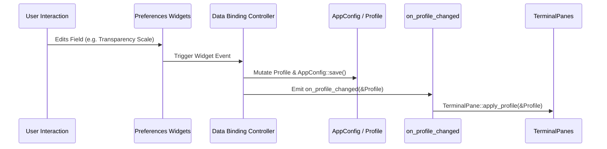

# Master Specification: Phase 10 — Profile Preferences UI Parity with Original Tilix

- **Document ID:** `SPEC-0010`
- **Date:** 2026-09-17
- **Status:** Approved / Ready for Execution
- **Workflow Level:** Medium/Large (Phase 10 of Tilix Rewrite)
- **Preceding Specifications:**
  - [`docs/specs/spec-0001-rust-tilix-foundation-2026-09-15.md`](file:///playground/tilix/docs/specs/spec-0001-rust-tilix-foundation-2026-09-15.md)
  - [`docs/specs/spec-0002-sessions-sync-profiles-2026-09-15.md`](file:///playground/tilix/docs/specs/spec-0002-sessions-sync-profiles-2026-09-15.md)
  - [`docs/specs/spec-0003-wayland-quake-osc-dnd-2026-09-15.md`](file:///playground/tilix/docs/specs/spec-0003-wayland-quake-osc-dnd-2026-09-15.md)
  - [`docs/specs/spec-0005-window-style-wide-handle-2026-09-17.md`](file:///playground/tilix/docs/specs/spec-0005-window-style-wide-handle-2026-09-17.md)
  - [`docs/specs/spec-0006-pane-toolbar-terminal-title-2026-09-17.md`](file:///playground/tilix/docs/specs/spec-0006-pane-toolbar-terminal-title-2026-09-17.md)
  - [`docs/specs/spec-0007-custom-keybindings-manager-2026-09-17.md`](file:///playground/tilix/docs/specs/spec-0007-custom-keybindings-manager-2026-09-17.md)
  - [`docs/specs/spec-0008-pane-dnd-docking-detach-2026-09-17.md`](file:///playground/tilix/docs/specs/spec-0008-pane-dnd-docking-detach-2026-09-17.md)
  - [`docs/specs/spec-0009-profile-customization-complete-2026-09-17.md`](file:///playground/tilix/docs/specs/spec-0009-profile-customization-complete-2026-09-17.md)
- **Target Location:** `/playground/tilix`

---

## 1. Context & Motivation

In Phase 9, Tilix Rust successfully implemented the headless domain model, multi-profile lifecycle CRUD, VTE terminal properties, token expansion engine, automatic profile switching, and shell execution arguments for the complete profile subsystem.

However, the user compared the Phase 9 Profile Preferences UI (`screenshots/tilix-rust-Color.png`) against the original upstream Tilix screenshots (`screenshots/General.png`, `Command.png`, `Color.png`, `Scrolling.png`, `Compatibility.png`, `Badge.png`, and `Advanced.png`). The comparison revealed that the Phase 9 implementation incorrectly employed Libadwaita list-row card styling (`adw::ActionRow`, `adw::SwitchRow`, `adw::SpinRow`, `adw::ComboRow`, and an artificial "Settings Section" dropdown).

In original Tilix:
1. Profiles are not browsed via an awkward section dropdown inside an action row; instead, profile settings are arranged beneath a clean top **Profile Management Header Bar** with a standard **Top Tab Bar** featuring the 7 canonical tabs:
   `General | Command | Color | Scrolling | Compatibility | Badge | Advanced`.
2. Each tab uses compact, classic GTK grid layouts with **right-aligned labels** in column 0, native spin boxes with dedicated **Reset** buttons, entry fields with embedded **token helper popovers**, a full **18-color ANSI/theme palette grid**, dedicated **Scale sliders** for transparency and dimming, an **Advanced color overrides popover**, and interactive modal dialogs for link rules and automatic profile switching.

The user explicitly instructed:
> **"如果遇到需要向后兼容时，不需要进行向后兼容" (No need for backwards compatibility if encountered).**

Phase 10 completely overhauls the Profile Preferences page in `src/ui/preferences.rs` to eliminate the Libadwaita row containers and achieve **100% visual and behavioral parity** with original Tilix.

---

## 2. Amended Documents & Scope

- **Amended Document:** [`docs/architecture/overview.md`](file:///playground/tilix/docs/architecture/overview.md)
- **Status of Living Architecture:** Active (Version bumped to 0.10.0 for Phase 10)

### 2.1 Affected Scope
- `src/ui/preferences.rs`:
  - Completely replace the Profile Preferences page implementation.
  - Implement top Profile Management Header Bar: `Profile:` label, `gtk::DropDown` selector, and action buttons (`[ New ]`, `[ Duplicate ]`, `[ Delete ]`, `[ Set as Default ]`).
  - Implement 7-tab `gtk::Notebook` containing:
    1. **General Tab**: Grid with right-aligned labels, title token popover, initial size with reset button, cell spacing with reset button, margin spin button, text blink dropdown, custom font checkbox + font button, word selection chars entry, cursor shape & blink dropdowns, terminal bell dropdown.
    2. **Command Tab**: Login shell checkbox, custom command checkbox with indented command entry (dynamically sensitized), exit action dropdown.
    3. **Color Tab**: Color scheme dropdown + export button, 2-column 18-button palette grid (16 ANSI colors + background + foreground) with live update to custom scheme, `[ Advanced v ]` menu button with popover for bold/cursor/highlight overrides, bright bold checkbox, horizontal scale sliders for transparency (0..100) and unfocused dimming (0..100).
    4. **Scrolling Tab**: Show scrollbar checkbox, scroll on output checkbox, scroll on keystroke checkbox, limit scrollback checkbox + spin button with mutual sensitivity.
    5. **Compatibility Tab**: Right-aligned dropdowns for Backspace key, Delete key, Encoding, Ambiguous-width characters.
    6. **Badge Tab**: Badge entry with token helper popover, badge position dropdown, custom font checkbox + font button.
    7. **Advanced Tab**: Notify on silence section with enable checkbox and threshold spin button, Custom Links section with description and `[ Edit ]` dialog button, Automatic Profile Switching section with description, framed list of `hostname:directory` rules and `[ Add ]`, `[ Edit ]`, `[ Delete ]` modal dialog.
  - Modal Dialogs:
    - Rule Editor Dialog for Automatic Profile Switching (`hostname:directory`).
    - Custom Hyperlink Rule Dialog (`name`, `pattern`, `uri`).
- `tests/test_phase10_profile_ui_parity.rs`:
  - Headless integration test suite verifying widget types, tab structures, button actions, sensitivity linkages, and profile CRUD synchronization.

### 2.2 Unaffected Scope
- `src/model/profile.rs`: Profile schema, preference enums, token expansion engine, and switch rule matching remain unchanged.
- `src/model/config.rs`: `AppConfig` profile storage, CRUD methods, and serialization remain unchanged.
- `src/ui/terminal_pane.rs`, `src/ui/session_view.rs`, `src/ui/window.rs`: Profile consumption logic and reactive updates remain unchanged.
- Other preference pages in `TilixPreferencesWindow` (`Appearance`, `Behavior`, `Shortcuts`) remain unchanged.

---

## 3. Goals & Non-Goals

### Goals
1. **100% Visual Parity with Original Tilix Screenshots:**
   - Reproduce the layout, hierarchy, alignments, spacing, and widget choices shown in `screenshots/General.png`, `Command.png`, `Color.png`, `Scrolling.png`, `Compatibility.png`, `Badge.png`, and `Advanced.png`.
2. **Top Profile Management Bar:**
   - Display `Profile:` label with `gtk::DropDown` selector and action buttons `[ New ]`, `[ Duplicate ]`, `[ Delete ]`, and `[ Set as Default ]`.
   - `Delete` is disabled when only one profile remains.
   - `Set as Default` is disabled when the active profile is already the default.
3. **Canonical 7-Tab Navigation:**
   - Use `gtk::Notebook` with tabs `General`, `Command`, `Color`, `Scrolling`, `Compatibility`, `Badge`, `Advanced`.
   - Active tab indicator matching original GTK styling.
4. **Exact Widget Controls per Tab:**
   - **General:** Right-aligned labels; Title token popover (`${id}: ${title}`, `${title}`, `${profile}`, `${directory}`, `${appName}`); Size spin buttons with `Reset` to 80x24; Cell spacing spin buttons with `Reset` to 1.0x1.0; Margin spin button; Text blink dropdown; Custom font checkbox + FontButton; Word selection entry; Cursor shape & blink dropdowns; Terminal bell dropdown.
   - **Command:** Login shell checkbox; Custom command checkbox with indented command entry; Exit action dropdown.
   - **Color:** Color scheme dropdown + `[ Export ]` button; 2-column palette grid with 16 ANSI colors and Background/Foreground color buttons; `[ Advanced v ]` popover for Bold, Cursor, and Highlight overrides; Bright bold checkbox; Horizontal sliders (`gtk::Scale`) for Transparency and Unfocused Dimming.
   - **Scrolling:** Scrollbar checkbox; Scroll on output checkbox; Scroll on keystroke checkbox; Limit scrollback checkbox + spin button with mutual sensitivity.
   - **Compatibility:** Dropdowns for Backspace key, Delete key, Encoding, and Ambiguous-width characters.
   - **Badge:** Badge text entry with token popover; Position dropdown; Custom font checkbox + FontButton.
   - **Advanced:** Notify on silence section with enable checkbox and threshold spin button; Custom Links section with `[ Edit ]` dialog; Automatic Profile Switching section with `hostname:directory` list, framed view, and `[ Add ]`, `[ Edit ]`, `[ Delete ]` dialogs.
5. **Direct Replacement without Backwards Compatibility Debt:**
   - Completely remove the Libadwaita list-row card structure (`adw::ActionRow`, `adw::SwitchRow`, etc.) and the "Settings Section" dropdown in the Profile page as explicitly requested.
6. **Reactive Real-Time Synchronization:**
   - Changes in any tab instantly update the domain `AppConfig`, persist to disk, and broadcast to active terminal panes via `on_profile_changed`.

### Non-Goals
- Changing the top window tabs (`Profiles`, `Appearance`, `Behavior`, `Shortcuts`) of `TilixPreferencesWindow`.
- Changing the backend configuration file format or path (`~/.config/tilix/config.json`).
- Rewriting the VTE rendering pipeline or layout tree algorithms.

---

## 4. Architecture & Design Decisions

### 4.1 Decision Gating: Facts, Decisions, Assumptions, Deferred Items

- **Facts:**
  - Original Tilix used GTK3 `GtkNotebook` with 7 canonical tabs.
  - `screenshots/General.png` through `Advanced.png` prove that Tilix profile editing uses classic grid forms with right-aligned column 0 labels, horizontal spin-button boxes with Reset buttons, 18-button color palette grids, and horizontal scale sliders.
  - `screenshots/tilix-rust-Color.png` shows that the Phase 9 implementation incorrectly used Libadwaita list rows (`adw::ActionRow`, `adw::SwitchRow`, `adw::SpinRow`) and a dropdown section switcher.
  - The user explicitly stated: "如果遇到需要向后兼容时，不需要进行向后兼容" (No need for backwards compatibility if encountered).
  - `gtk4::Notebook`, `gtk4::Grid`, `gtk4::ColorButton`, `gtk4::FontButton`, `gtk4::Scale`, `gtk4::DropDown`, and `gtk4::MenuButton` with `gtk4::Popover` are fully available in GTK4 / `gtk4` crate v0.11.
- **Decisions:**
  - **Remove Libadwaita Row Cards from Profiles Page:** Inside `profiles_page`, replace the `PreferencesGroup` list rows with a clean container holding the Profile Management Bar and a `gtk::Notebook`.
  - **Grid Layout with Right-Aligned Labels:** Use `gtk::Grid` with `column_spacing = 12`, `row_spacing = 8`. All labels in column 0 have `halign = gtk::Align::End` and `xalign = 1.0`. Section header labels have `halign = gtk::Align::Start`, `xalign = 0.0`, bold font styling, and top margin.
  - **Notebook Tabs:** Create a `gtk::Notebook` with pages: `General`, `Command`, `Color`, `Scrolling`, `Compatibility`, `Badge`, `Advanced`.
  - **Title and Badge Token Presets:** Attach a `gtk::MenuButton` with icon `pan-down-symbolic` to the title and badge entries. The popover displays preset options:
    - `${id}: ${title}`
    - `${title}`
    - `${profile}`
    - `${directory}`
    - `${appName}`
    Clicking a preset replaces or appends into the entry.
  - **Size and Cell Spacing Reset Buttons:**
    - Size Reset: Resets columns to 80 and rows to 24.
    - Spacing Reset: Resets width to 1.0 and height to 1.0.
  - **Color Palette 18-Button Grid:**
    - 2-column grid:
      - Left column: Background button + label; Black (normal, bright) + label; Red (normal, bright) + label; Green (normal, bright) + label; Orange (normal, bright) + label.
      - Right column: Foreground button + label; Blue (normal, bright) + label; Purple (normal, bright) + label; Turquoise (normal, bright) + label; Grey (normal, bright) + label.
    - Modifying any color button immediately applies the color, updates the profile's `color_scheme`, sets the scheme dropdown to "Custom", and persists the configuration.
  - **Advanced Color Overrides Popover:**
    - A `gtk::MenuButton` labeled `Advanced v` opens a popover containing:
      - Bold Color override: CheckButton + ColorButton.
      - Cursor Colors override: CheckButton + Cursor Background ColorButton + Cursor Foreground ColorButton.
      - Highlight Colors override: CheckButton + Highlight Background ColorButton + Highlight Foreground ColorButton.
  - **Sliders for Transparency & Dimming:**
    - `Transparency`: `gtk::Scale::with_range(Horizontal, 0.0, 100.0, 1.0)` with draw_value = false.
    - `Unfocused dim`: `gtk::Scale::with_range(Horizontal, 0.0, 100.0, 1.0)` with draw_value = false.
  - **Mutual Sensitivity Handlers:**
    - `Custom font` CheckButton -> `FontButton` sensitivity.
    - `Run custom command` CheckButton -> `Command` Entry sensitivity.
    - `Limit scrollback to:` CheckButton -> `Scrollback Lines` SpinButton sensitivity.
  - **Automatic Profile Switching List & Dialog:**
    - Scrolled framed ListBox displaying rules in format `hostname:directory -> Profile`.
    - `[ Add ]` opens a modal dialog with `Hostname` and `Directory` fields, enforcing the colon requirement.
    - `[ Edit ]` edits the selected rule.
    - `[ Delete ]` deletes the selected rule.
- **Assumptions:**
  - Headless test execution in CI/container will run using `run_gtk_test` without a physical display.
- **Deferred Items:**
  - Exporting color schemes writes the JSON file directly to `~/.config/tilix/schemes/<name>.json` or presents a standard file save dialog.

---

## 5. Detailed Technical Specifications

### 5.1 Navigation Structure & Profile Management Header Bar

```
+-------------------------------------------------------------------------------+
| Profile: [ Default          v ]   [ New ] [ Duplicate ] [ Delete ] [ Set Default ] |
+-------------------------------------------------------------------------------+
| General | Command | Color | Scrolling | Compatibility | Badge | Advanced      |
+-------------------------------------------------------------------------------+
| (Tab Content Page)                                                            |
| ...                                                                           |
+-------------------------------------------------------------------------------+
```

- **Container:** `gtk::Box` (orientation Vertical, spacing 12, margins 16).
- **Profile Management Header Bar (`header_box`):**
  - Horizontal `gtk::Box` with spacing 8.
  - `gtk::Label` with text `"Profile:"`, bold or semi-bold.
  - `gtk::DropDown` showing list of profile names.
  - `[ New ]` `gtk::Button`: Creates a new profile with unique ID, selects it.
  - `[ Duplicate ]` `gtk::Button`: Clones the selected profile with `(Copy)` suffix, selects it.
  - `[ Delete ]` `gtk::Button`: Destructive button. Deletes selected profile. Disabled when `profiles.len() <= 1`.
  - `[ Set as Default ]` `gtk::Button`: Sets active profile as default. Disabled when already default.
- **Tab Bar (`gtk::Notebook`):**
  - Directly beneath the header bar.
  - 7 pages appended with labels `"General"`, `"Command"`, `"Color"`, `"Scrolling"`, `"Compatibility"`, `"Badge"`, `"Advanced"`.

---

### 5.2 Tab 1: General Tab Specification

Matches `screenshots/General.png`:

- **Layout:** `gtk::Grid` with `column_spacing = 12`, `row_spacing = 8`.
- **Labels in Column 0:** All right-aligned (`halign = Align::End`, `xalign = 1.0`).
- **Section Headers:** Bold labels spanning columns 0..2, left-aligned (`halign = Align::Start`), with top margin (12px).
- **Fields:**
  1. `Profile name`: `gtk::Entry`.
  2. `Terminal title`: Horizontal `gtk::Box` containing `gtk::Entry` (expanding) and `gtk::MenuButton` (icon: `pan-down-symbolic`).
     - Menu popover items: `${id}: ${title}`, `${title}`, `${profile}`, `${directory}`, `${appName}`. Clicking any item sets the entry text.
  3. Section **`Text Appearance`**
     - `Terminal size`: Horizontal `gtk::Box`:
       - `gtk::SpinButton` (columns: 20..500, default 80).
       - Label `"columns"`.
       - `gtk::SpinButton` (rows: 5..200, default 24).
       - Label `"rows"`.
       - `[ Reset ]` `gtk::Button` (resets to 80x24).
     - `Cell spacing`: Horizontal `gtk::Box`:
       - `gtk::SpinButton` (width: 0.5..2.0, step 0.1, digits 1, default 1.0).
       - Label `"width"`.
       - `gtk::SpinButton` (height: 0.5..2.0, step 0.1, digits 1, default 1.0).
       - Label `"height"`.
       - `[ Reset ]` `gtk::Button` (resets to 1.0x1.0).
     - `Margin`: `gtk::SpinButton` (0..500, default 80).
     - `Text blink mode`: `gtk::DropDown` (`Never`, `Focused`, `Unfocused`, `Always`).
     - `Custom font`: Horizontal `gtk::Box`:
       - `gtk::CheckButton`.
       - `gtk::FontButton` (displays font string, e.g. `"Monospace Regular 10"`, sensitive only when CheckButton is active).
     - `Word-wise select chars`: `gtk::Entry` (default `-,./?%&#:_`).
  4. Section **`Cursor`**
     - `Cursor`: `gtk::DropDown` (`Block`, `I-Beam`, `Underline`).
     - `Cursor blink mode`: `gtk::DropDown` (`System`, `On`, `Off`).
  5. Section **`Notification`**
     - `Terminal bell`: `gtk::DropDown` (`None`, `Sound`, `Icon`, `Icon and sound`).

---

### 5.3 Tab 2: Command Tab Specification

Matches `screenshots/Command.png`:

- **Layout:** `gtk::Box` (Vertical, spacing 10, margins 16).
- **Controls:**
  1. `[ ] Run command as a login shell`: `gtk::CheckButton`.
  2. `[ ] Run a custom command instead of my shell`: `gtk::CheckButton`.
  3. Sub-indented horizontal `gtk::Box` (`margin_start = 24`, spacing 12):
     - `gtk::Label` `"Command"`.
     - `gtk::Entry` (custom command, expanding, sensitive only when custom command checkbox is active).
  4. Horizontal `gtk::Box` (spacing 12):
     - `gtk::Label` `"When command exits"`.
     - `gtk::DropDown` (`Exit the terminal`, `Restart the command`, `Hold the terminal open`).

---

### 5.4 Tab 3: Color Tab Specification

Matches `screenshots/Color.png`:

- **Layout:** `gtk::Box` (Vertical, spacing 12, margins 16).
- **Top Row (Color Scheme):**
  - Horizontal `gtk::Box` (spacing 12):
    - `gtk::Label` `"Color scheme"`, bold.
    - `gtk::DropDown` (options: `Tilix Dark`, `Tilix Light`, `Solarized Dark`, `Monokai`, `Custom`, expanding).
    - `[ Export ]` `gtk::Button`: Exports active color scheme to JSON.
- **Palette Grid (Color Palette):**
  - Horizontal `gtk::Box` (spacing 12):
    - `gtk::Label` `"Color palette"`, bold, valign Start.
    - 2-column `gtk::Grid` (`column_spacing = 24`, `row_spacing = 6`):
      - **Left Column:**
        - Row 0: `[ColorButton(Background)]` `gtk::Label("Background")`
        - Row 1: `[ColorButton(0)] [ColorButton(8)]` `gtk::Label("Black")`
        - Row 2: `[ColorButton(1)] [ColorButton(9)]` `gtk::Label("Red")`
        - Row 3: `[ColorButton(2)] [ColorButton(10)]` `gtk::Label("Green")`
        - Row 4: `[ColorButton(3)] [ColorButton(11)]` `gtk::Label("Orange")`
      - **Right Column:**
        - Row 0: `[ColorButton(Foreground)]` `gtk::Label("Foreground")`
        - Row 1: `[ColorButton(4)] [ColorButton(12)]` `gtk::Label("Blue")`
        - Row 2: `[ColorButton(5)] [ColorButton(13)]` `gtk::Label("Purple")`
        - Row 3: `[ColorButton(6)] [ColorButton(14)]` `gtk::Label("Turquoise")`
        - Row 4: `[ColorButton(7)] [ColorButton(15)]` `gtk::Label("Grey")`
- **Section Options:**
  - Bold label `"Options"`.
  - Horizontal `gtk::Box` (spacing 12):
    - `gtk::CheckButton` `"Use theme colors for foreground/background"`.
    - `[ Advanced v ]` `gtk::MenuButton`:
      - Popover contains:
        - `[ ] Override Bold Color` CheckButton + `ColorButton`
        - `[ ] Override Cursor Colors` CheckButton + BG `ColorButton` + FG `ColorButton`
        - `[ ] Override Highlight Colors` CheckButton + BG `ColorButton` + FG `ColorButton`
  - `gtk::CheckButton` `"Show bold text in bright colors"`.
  - Grid or Box for Sliders:
    - `Transparency`: `gtk::Label("Transparency", halign: End)` + `gtk::Scale(0..100)`.
    - `Unfocused dim`: `gtk::Label("Unfocused dim", halign: End)` + `gtk::Scale(0..100)`.

---

### 5.5 Tab 4: Scrolling Tab Specification

Matches `screenshots/Scrolling.png`:

- **Layout:** `gtk::Box` (Vertical, spacing 10, margins 16).
- **Controls:**
  1. `[ ] Show scrollbar`: `gtk::CheckButton`.
  2. `[ ] Scroll on output`: `gtk::CheckButton`.
  3. `[x] Scroll on keystroke`: `gtk::CheckButton`.
  4. Horizontal `gtk::Box` (spacing 10):
     - `[x] Limit scrollback to:` `gtk::CheckButton`.
     - `gtk::SpinButton` (100..100000, default 8192, sensitive only when Limit scrollback is checked).

---

### 5.6 Tab 5: Compatibility Tab Specification

Matches `screenshots/Compatibility.png`:

- **Layout:** `gtk::Grid` (`column_spacing = 12`, `row_spacing = 10`, margins 16).
- **Labels in Column 0:** Right-aligned (`halign = Align::End`, `xalign = 1.0`).
- **Rows:**
  1. `Backspace key generates`: `gtk::DropDown` (`Automatic`, `Control-H`, `ASCII DEL`, `Escape sequence`, `TTY`).
  2. `Delete key generates`: `gtk::DropDown` (`Automatic`, `Control-H`, `ASCII DEL`, `Escape sequence`, `TTY`).
  3. `Encoding`: `gtk::DropDown` (`UTF-8 Unicode`, `ISO-8859-1`, `Windows-1252`, `US-ASCII`).
  4. `Ambiguous-width characters`: `gtk::DropDown` (`Narrow`, `Wide`).

---

### 5.7 Tab 6: Badge Tab Specification

Matches `screenshots/Badge.png`:

- **Layout:** `gtk::Grid` (`column_spacing = 12`, `row_spacing = 10`, margins 16).
- **Labels in Column 0:** Right-aligned (`halign = Align::End`, `xalign = 1.0`).
- **Rows:**
  1. `Badge`: Horizontal `gtk::Box` with `gtk::Entry` (expanding) and `gtk::MenuButton` with token presets (`${id}: ${title}`, `${title}`, `${profile}`, `${directory}`, `${appName}`).
  2. `Badge position`: `gtk::DropDown` (`Northwest`, `Northeast`, `Southwest`, `Southeast`).
  3. `Custom font`: Horizontal `gtk::Box`:
     - `gtk::CheckButton`.
     - `gtk::FontButton` (sensitive only when CheckButton is active).

---

### 5.8 Tab 7: Advanced Tab Specification

Matches `screenshots/Advanced.png`:

- **Layout:** `gtk::Box` (Vertical, spacing 16, margins 16).
- **Section 1: `Notify New Activity`**
  - Bold label `"Notify New Activity"`.
  - Subtitle label: `"A notification can be raised when new activity occurs after a specified period of silence."` (`opacity = 0.7`).
  - Grid:
    - Row 0: `Enable by default` (right-aligned label) + `gtk::CheckButton`.
    - Row 1: `Threshold for continuous silence` (right-aligned label) + Horizontal `gtk::Box` (`gtk::SpinButton(1..3600)` + `gtk::Label("(seconds)")`).
- **Section 2: `Custom Links`**
  - Bold label `"Custom Links"`.
  - Horizontal `gtk::Box`:
    - Subtitle label: `"A list of user defined links that can be clicked on in the terminal based on regular expression definitions."` (expanding, wrap: true).
    - `[ Edit ]` `gtk::Button`: Opens Custom Hyperlink Rules modal dialog.
- **Section 3: `Automatic Profile Switching`**
  - Bold label `"Automatic Profile Switching"`.
  - Subtitle label: `"Profiles are automatically selected based on the values entered here. Values are entered using a hostname:directory format. Either the hostname or directory can be omitted but the colon must be present. Entries with neither hostname or directory are not permitted."` (wrap: true).
  - Horizontal `gtk::Box` (spacing 8):
    - `gtk::Frame` / `gtk::ScrolledWindow` (expanding, min-height 120):
      - `gtk::ListBox` displaying active rules (e.g. `server.local:/var/log`).
    - Vertical `gtk::Box` (spacing 6):
      - `[ Add ]` `gtk::Button`: Opens modal dialog to add a rule.
      - `[ Edit ]` `gtk::Button`: Opens modal dialog to edit selected rule.
      - `[ Delete ]` `gtk::Button`: Removes selected rule from profile.

---

## 6. Implementation Architecture & Data Binding

### 6.1 State Management & Mutation Cycle



1. **`is_populating` Guard Flag:** An `Rc<Cell<bool>>` prevents feedback loops when loading profile values into the UI controls.
2. **Profile Selection Switch:**
   - When the user selects a profile in the header dropdown, `is_populating` is set to `true`, all controls across all 7 tabs are populated with that profile's values, sensitivity linkages are updated, and `is_populating` is reset to `false`.
3. **Palette Live Edit to Custom:**
   - When the user adjusts any color button in the palette grid, the profile's `color_scheme` is updated with the new color, the scheme's name is set to `"Custom"`, and the scheme dropdown selection switches to `"Custom"`.

---

## 7. Testing & Validation Strategy

1. **Headless Integration Test Suite (`tests/test_phase10_profile_ui_parity.rs`):**
   - Headless GTK test verifying full instantiation of `TilixPreferencesWindow`.
   - Inspection of `gtk::Notebook` containing exactly 7 pages with the canonical tab titles.
   - Validation of General Tab: initial columns 80, initial rows 24, reset button restores 80x24.
   - Validation of Command Tab: custom command entry sensitivity linked to custom command checkbox.
   - Validation of Color Tab: 18 palette color buttons exist and trigger scheme updates; scale sliders for transparency and dimming exist.
   - Validation of Scrolling Tab: scrollback spin button sensitivity toggles with limit scrollback checkbox.
   - Validation of Compatibility & Badge Tabs: token popovers and dropdowns function properly.
   - Validation of Advanced Tab: silence notifications, rule list, and dialog triggers.
   - Validation of Profile Management: New, Duplicate, Delete, Set Default actions update configuration and notify panes.
2. **Cargo Verification:**
   - `cargo check --tests`
   - `cargo test` passes 100% across the full repository.
3. **Visual Verification:**
   - Comparing generated UI layout against the 7 canonical screenshots.

---

## 8. Traceability Matrix

| Requirement | Spec Section | Target File | Verification Test |
| :--- | :--- | :--- | :--- |
| Profile Management Header Bar (`Profile:`, New, Dup, Del, Default) | §5.1 | `src/ui/preferences.rs` | `test_phase10_profile_management_header` |
| 7-Tab `gtk::Notebook` Structure | §5.1 | `src/ui/preferences.rs` | `test_phase10_notebook_tabs` |
| General Tab: Grid, Right-aligned labels, Token popover, Resets | §5.2 | `src/ui/preferences.rs` | `test_phase10_general_tab` |
| Command Tab: Login shell, Custom command sensitivity, Exit action | §5.3 | `src/ui/preferences.rs` | `test_phase10_command_tab` |
| Color Tab: 18-button palette grid, Scheme export, Overrides popover, Sliders | §5.4 | `src/ui/preferences.rs` | `test_phase10_color_tab` |
| Scrolling Tab: Mutual sensitivity limit scrollback + spin button | §5.5 | `src/ui/preferences.rs` | `test_phase10_scrolling_tab` |
| Compatibility Tab: Backspace, Delete, Encoding, CJK dropdowns | §5.6 | `src/ui/preferences.rs` | `test_phase10_compatibility_tab` |
| Badge Tab: Token popover, Position, Font button sensitivity | §5.7 | `src/ui/preferences.rs` | `test_phase10_badge_tab` |
| Advanced Tab: Silence, Custom Links dialog, Auto Switching list & dialogs | §5.8 | `src/ui/preferences.rs` | `test_phase10_advanced_tab` |
| Complete Removal of Libadwaita Rows in Profile Page | §4.1, §5.1 | `src/ui/preferences.rs` | `test_phase10_no_adw_rows_in_profile_page` |
