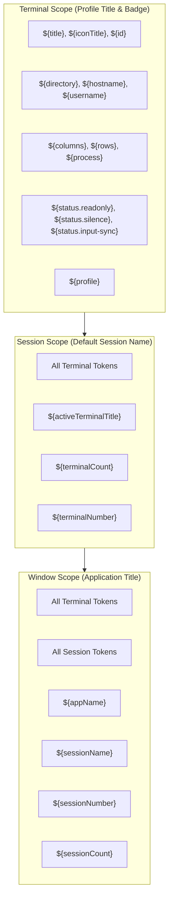
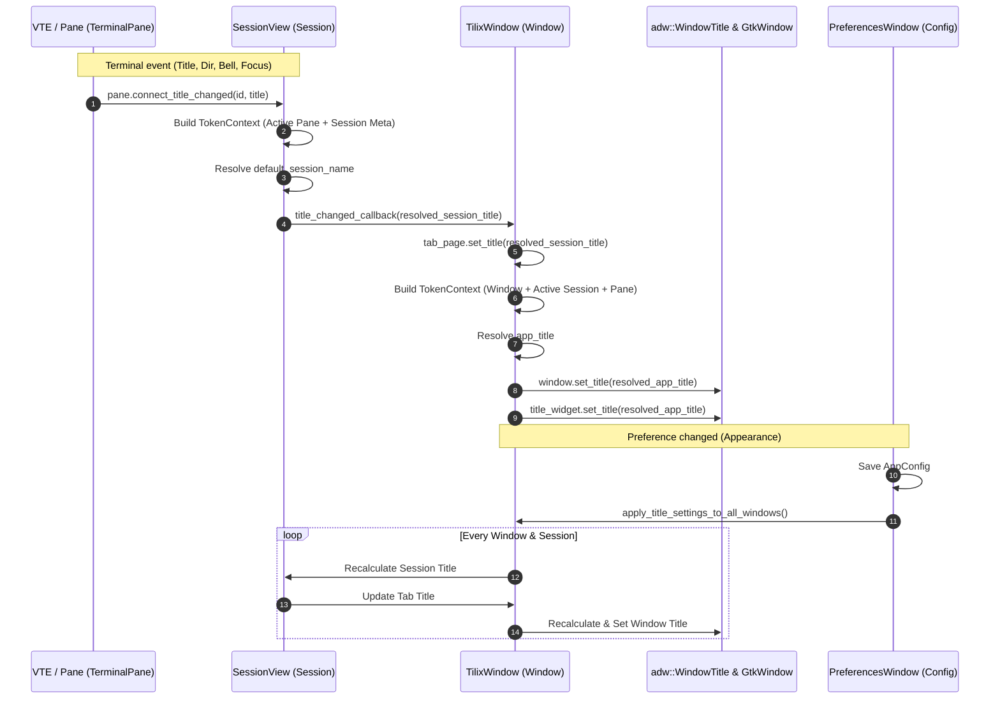

# Master Specification: Phase 11 — Default Session Name & Application Title Settings

- **Document ID:** `SPEC-0011`
- **Date:** 2026-09-18
- **Status:** Approved / Ready for Execution
- **Workflow Level:** Medium/Large (Phase 11 of Tilix Rewrite)
- **Preceding Specifications:**
  - [`docs/specs/spec-0001-rust-tilix-foundation-2026-09-15.md`](file:///playground/tilix/docs/specs/spec-0001-rust-tilix-foundation-2026-09-15.md)
  - [`docs/specs/spec-0002-sessions-sync-profiles-2026-09-15.md`](file:///playground/tilix/docs/specs/spec-0002-sessions-sync-profiles-2026-09-15.md)
  - [`docs/specs/spec-0005-window-style-wide-handle-2026-09-17.md`](file:///playground/tilix/docs/specs/spec-0005-window-style-wide-handle-2026-09-17.md)
  - [`docs/specs/spec-0006-pane-toolbar-terminal-title-2026-09-17.md`](file:///playground/tilix/docs/specs/spec-0006-pane-toolbar-terminal-title-2026-09-17.md)
  - [`docs/specs/spec-0007-custom-keybindings-manager-2026-09-17.md`](file:///playground/tilix/docs/specs/spec-0007-custom-keybindings-manager-2026-09-17.md)
  - [`docs/specs/spec-0008-pane-dnd-docking-detach-2026-09-17.md`](file:///playground/tilix/docs/specs/spec-0008-pane-dnd-docking-detach-2026-09-17.md)
  - [`docs/specs/spec-0009-profile-customization-complete-2026-09-17.md`](file:///playground/tilix/docs/specs/spec-0009-profile-customization-complete-2026-09-17.md)
  - [`docs/specs/spec-0010-profile-preferences-ui-parity-2026-09-17.md`](file:///playground/tilix/docs/specs/spec-0010-profile-preferences-ui-parity-2026-09-17.md)
- **Target Location:** `/playground/tilix`

---

## 1. Context & Motivation

In previous phases, Tilix Rust established the tiling layout model, multi-session tab architecture, profile management, and pane toolbar header titles. In Phase 10, the Profile Preferences UI was refactored into complete parity with original Tilix.

However, original Tilix (`tilix`) provides rich title parameterization across three hierarchical scopes: **Terminal**, **Session**, and **Window (Application)**. Upstream Tilix defines customizable templates for:
1. **Terminal Title**: Set per-profile (`${title}`, `${id}`, `${directory}`, `${process}`, etc.).
2. **Default Session Name**: Global preference configuring the title template for session tabs (`default-session-name`, default: `"${title}"`).
3. **Application Title**: Global preference configuring the window header bar title template (`app-title`, default: `"${appName}: ${sessionName}"`).

Currently in Tilix Rust:
- Session tab titles simply copy the active terminal pane's title (`pane.title()`).
- The window header bar displays a static `"Tilix"` title widget and does not react to the active session or active terminal.
- The token expansion logic only supports a minimal set of 5 tokens (`${id}`, `${title}`, `${profile}`, `${directory}`, `${appName}`), omitting critical upstream variables such as `${iconTitle}`, `${hostname}`, `${username}`, `${columns}`, `${rows}`, `${process}`, `${status.readonly}`, `${status.silence}`, `${status.input-sync}`, `${activeTerminalTitle}`, `${terminalCount}`, `${terminalNumber}`, `${sessionNumber}`, and `${sessionCount}`.
- The token popover menu in preferences hardcodes 5 preset buttons and overwrites the entire text field when clicked, instead of supporting scoped token categories ("Terminal", "Session", "Window", "Help") and inserting tokens at the current cursor position.
- The Appearance preferences page lacks options to configure `default_session_name` and `app_title`.

Phase 11 implements the complete upstream title option subsystem: domain model extensions, a full token evaluation engine, a reusable scoped token menu popover matching upstream `titleeditor.d`, preferences UI controls, and live dynamic title synchronization across terminals, sessions, and windows.

---

## 2. Amended Documents & Scope

- **Amended Document:** [`docs/architecture/overview.md`](file:///playground/tilix/docs/architecture/overview.md)
- **Status of Living Architecture:** Active (Version bumped to 0.11.0 for Phase 11)

### 2.1 Affected Scope
- `src/model/config.rs`:
  - Extend `AppConfig` with `default_session_name: String` (default: `"${title}"`) and `app_title: String` (default: `"${appName}: ${sessionName}"`).
  - Maintain backwards and forwards serde compatibility with legacy JSON configuration files.
- `src/model/title.rs` (or `src/model/profile.rs` / `src/model/mod.rs`):
  - Implement full upstream token catalog evaluation across Terminal, Session, and Window scopes.
  - Define `TitleEditScope` (`Window`, `Session`, `Terminal`).
  - Provide `TokenContext` and scoped evaluation functions (`expand_title_tokens`, `expand_title_tokens_scoped`).
  - Maintain backward compatibility for existing `TitleTokenContext`, `expand_title_format`, and `expand_badge_format`.
- `src/ui/preferences.rs`:
  - Implement reusable scoped token menu popover helper matching upstream Tilix `titleeditor.d` with cursor-position insertion and external documentation link.
  - In `Appearance` page, add `Default session name` (Session scope) and `Application title` (Window scope) preference rows.
  - Update `General` tab (Terminal title) and `Badge` tab (Badge text) in `Profiles` to use the enhanced token popover helper.
  - Wire real-time preference persistence and live synchronization broadcast.
- `src/ui/session_view.rs`:
  - Resolve session titles dynamically using `default_session_name`, active terminal pane attributes, and session-level counters (`terminalCount`, `terminalNumber`, `activeTerminalTitle`).
  - Notify window of resolved session title changes via `title_changed_callback`.
- `src/ui/window.rs`:
  - Update `adw::TabPage` titles using resolved session titles.
  - Resolve `app_title` using window-level metadata (`appName`, `sessionName`, `sessionNumber`, `sessionCount`) and active session tokens.
  - Update `adw::WindowTitle` and `window.set_title` dynamically on tab switch, terminal title change, session split/close, and preference update.
  - Add global broadcast helper `apply_title_settings_to_all_windows()` to update all open windows and tabs immediately when preferences change.
- `tests/test_phase11_title_options.rs`:
  - Comprehensive headless integration test suite covering token parsing, config serde roundtrips, UI construction, cursor insertion, and dynamic title updates.

### 2.2 Unaffected Scope
- `src/pty/*`: Shell spawning, PTY stream handling, and OSC 7 directory extraction remain unchanged.
- `src/model/layout.rs`: Split tree nodes, split ratio calculations, and docking geometry remain unchanged.
- `src/ui/terminal_pane.rs`: Pane headers and VTE rendering pipeline remain unchanged (except passing necessary token attributes).

---

## 3. Goals & Non-Goals

### Goals
1. **Upstream Token Catalog Parity:**
   - Support all upstream Tilix tokens across Terminal (12 tokens + profile), Session (3 tokens), and Window (4 tokens) scopes.
   - Gracefully handle missing, empty, or uninitialized tokens without crashing or generating garbage output.
2. **Backward-Compatible Domain Configuration:**
   - Add `default_session_name` and `app_title` to `AppConfig` with default values matching upstream Tilix (`"${title}"` and `"${appName}: ${sessionName}"`).
   - Seamlessly load legacy configuration files missing these fields.
3. **Reusable Scoped Token Menu Popover (`titleeditor.d` Parity):**
   - Provide `TitleEditScope` (`Window`, `Session`, `Terminal`).
   - Group tokens into clear sections: "Terminal", "Session" (for Session and Window scopes), and "Window" (for Window scope).
   - Provide a "Help" action linking to the official documentation (`https://gnunn1.github.io/tilix-web/manual/title/`).
   - Clicking a token inserts the text at the target entry's active cursor position (`gtk::Editable::insert_text`) without erasing existing input.
4. **Appearance Preferences Integration:**
   - Add dedicated rows in the Appearance page under "Terminal Title" for "Default session name" and "Application title".
   - Save changes immediately and trigger live title recalculation.
5. **Dynamic Hierarchical Title Synchronization:**
   - Terminal pane changes (command execution, OSC title escape, directory change, focus change) immediately trigger session title re-evaluation.
   - Session title re-evaluation immediately updates the tab label and triggers window title re-evaluation.
   - Switching tabs, splitting/closing panes, or modifying title preferences immediately updates the window title and active tab title.
6. **100% Automated Headless Test Coverage:**
   - Unit tests for all token expansions and edge cases.
   - Serde roundtrip tests with legacy compatibility checks.
   - UI tests verifying widget hierarchy, popover construction, cursor insertion, and title propagation.

### Non-Goals
- Changing terminal emulator rendering or OSC escape sequence parsing pipelines.
- Introducing external web view widgets for documentation (use standard desktop URI launcher).
- Storing per-session custom title overrides in session layout templates (deferred to future session state persistence milestones).

---

## 4. Architecture & Design Decisions

### 4.1 Decision Gating: Facts, Decisions, Assumptions, Deferred Items

- **Facts:**
  - Upstream Tilix defines token replacement in `titleeditor.d` and `terminal.d`.
  - In upstream Tilix, `default-session-name` defaults to `"${title}"` and `app-title` defaults to `"${appName}: ${sessionName}"`.
  - Upstream Tilix divides title editors into scopes:
    - `Terminal`: Only terminal tokens + profile.
    - `Session`: Terminal tokens + session tokens (`${activeTerminalTitle}`, `${terminalCount}`, `${terminalNumber}`).
    - `Window`: Terminal tokens + session tokens + window tokens (`${appName}`, `${sessionName}`, `${sessionNumber}`, `${sessionCount}`).
  - In GTK4, `gtk::Editable` provides `position()` and `insert_text(&str, &mut i32)` to insert text at cursor position.
- **Decisions:**
  - **Module Separation (`src/model/title.rs`):** Create a dedicated, pure Rust module `src/model/title.rs` for token parsing, scoping, catalog definitions, and expansion algorithms, re-exported via `src/model/mod.rs`. This keeps `src/model/profile.rs` clean while ensuring headless unit testability with zero GTK dependencies.
  - **Unified Context with Defaults (`TokenContext`):** Define a comprehensive `TokenContext` with optional fields and helper builder methods. Maintain the legacy `TitleTokenContext` in `src/model/profile.rs` for existing callers by bridging it to `TokenContext`.
  - **Scoped Menu Popover Helper:** Implement `create_scoped_token_menu_button(entry: &gtk::Entry, scope: TitleEditScope)` in `src/ui/preferences.rs`. The popover creates categorized buttons with clean labels and monospace tooltips, plus an external documentation link for help.
  - **Cursor Insertion Semantics:** When a token button is clicked in the popover, query `entry.position()`, call `entry.insert_text(tok, &mut pos)`, set `entry.set_position(pos)`, close the popover, and grab focus on the entry.
  - **Global Window Synchronization:** Add `apply_title_settings_to_all_windows()` to `src/ui/window.rs` using the existing `WINDOW_HEADER_BARS` / window registry pattern.
- **Assumptions:**
  - `glib::host_name()` and `glib::user_name()` provide reliable host and user identification across desktop Linux environments.
  - VTE reports dimensions via `vte.column_count()` and `vte.row_count()`.
- **Deferred Items:**
  - Dynamic user-prompted custom tab renaming dialogs (can build directly on top of the session naming pipeline in a later phase).

---

## 5. Token Catalog & Grammar Specification

### 5.1 Token Matrix

| Token | Scope | Category | Description | Fallback Value |
| :--- | :--- | :--- | :--- | :--- |
| `${title}` | Terminal | Dynamic | Terminal process or OSC title | `"Terminal"` |
| `${iconTitle}` | Terminal | Dynamic | Icon title set by OSC 1/0 | Same as `${title}` |
| `${id}` | Terminal | Identity | Unique numerical ID of the terminal pane | `"1"` |
| `${directory}` | Terminal | Environment | Current working directory (path or folder name) | `""` |
| `${hostname}` | Terminal | Environment | Hostname of machine running terminal | `glib::host_name()` |
| `${username}` | Terminal | Environment | Current user name | `glib::user_name()` |
| `${columns}` | Terminal | Geometry | Terminal width in character columns | `"80"` |
| `${rows}` | Terminal | Geometry | Terminal height in character rows | `"24"` |
| `${process}` | Terminal | Process | Current foreground process or shell | `""` |
| `${status.readonly}` | Terminal | Status | Read-only indicator | `"[RO]"` / `""` |
| `${status.silence}` | Terminal | Status | Silence monitor indicator | `"[Silence]"` / `""` |
| `${status.input-sync}` | Terminal | Status | Synchronized input active indicator | `"[Sync]"` / `""` |
| `${profile}` | Terminal | Identity | Name of the active profile | `"Default"` |
| `${activeTerminalTitle}`| Session | Session | Title of the active terminal in session | Same as `${title}` |
| `${terminalCount}` | Session | Session | Total terminal panes in session | `"1"` |
| `${terminalNumber}` | Session | Session | 1-based index of active terminal pane | `"1"` |
| `${appName}` | Window | Application | Application name | `"Tilix"` |
| `${sessionName}` | Window | Session | Resolved title of the active session tab | Resolved session title |
| `${sessionNumber}` | Window | Window | 1-based index of active session tab | `"1"` |
| `${sessionCount}` | Window | Window | Total number of session tabs in window | `"1"` |

### 5.2 Scoping & Visibility Rules



---

## 6. Data Structures & Contract Interfaces

### 6.1 Domain Configuration Extension (`src/model/config.rs`)

```rust
#[derive(Debug, Clone, PartialEq, Serialize, Deserialize)]
#[serde(default)]
pub struct AppConfig {
    // Existing fields
    pub default_profile: Profile,
    pub profiles: Vec<Profile>,
    pub default_profile_id: String,
    pub quake_height_percent: u32,
    pub quake_hide_on_unfocus: bool,
    pub notifications_enabled: bool,
    pub bell_notifications: bool,
    pub process_exit_notifications: bool,
    pub window_style: WindowStyle,
    pub use_wide_handle: bool,
    pub pane_title_style: PaneTitleStyle,
    pub pane_title_show_when_single: bool,
    pub show_tab_bar: bool,
    pub keybindings: KeybindingsConfig,

    // Phase 11 Extensions
    #[serde(default = "default_session_name_default")]
    pub default_session_name: String,

    #[serde(default = "default_app_title_default")]
    pub app_title: String,
}

pub fn default_session_name_default() -> String {
    "${title}".to_string()
}

pub fn default_app_title_default() -> String {
    "${appName}: ${sessionName}".to_string()
}
```

### 6.2 Token Evaluation Engine (`src/model/title.rs`)

```rust
#[derive(Debug, Clone, Copy, PartialEq, Eq)]
pub enum TitleEditScope {
    Terminal,
    Session,
    Window,
}

#[derive(Debug, Clone, Default)]
pub struct TokenContext {
    // Terminal scope
    pub title: String,
    pub icon_title: Option<String>,
    pub id: Option<u64>,
    pub directory: Option<PathBuf>,
    pub hostname: Option<String>,
    pub username: Option<String>,
    pub columns: Option<u32>,
    pub rows: Option<u32>,
    pub process: Option<String>,
    pub readonly: bool,
    pub silence: bool,
    pub input_sync: bool,
    pub profile_name: Option<String>,

    // Session scope
    pub active_terminal_title: Option<String>,
    pub terminal_count: Option<usize>,
    pub terminal_number: Option<usize>,

    // Window scope
    pub app_name: Option<String>,
    pub session_name: Option<String>,
    pub session_number: Option<usize>,
    pub session_count: Option<usize>,
}

pub fn expand_title_tokens(format_str: &str, ctx: &TokenContext) -> String;
pub fn expand_title_tokens_scoped(
    format_str: &str,
    scope: TitleEditScope,
    ctx: &TokenContext,
) -> String;
```

### 6.3 Reusable Token Menu Popover Interface (`src/ui/preferences.rs`)

```rust
pub fn create_scoped_token_menu_button(
    target_entry: &gtk::Entry,
    scope: TitleEditScope,
) -> gtk::MenuButton;
```

---

## 7. Reactive Title Propagation Architecture



---

## 8. Backward Compatibility & Resilience

1. **Serde Forward/Backward Compatibility:**
   - Existing configuration files created in Phase 1 through 10 omit `default_session_name` and `app_title`.
   - `#[serde(default = "...")]` ensures missing fields automatically deserialize to `"${title}"` and `"${appName}: ${sessionName}"`.
   - New configuration files with these fields can still be parsed safely.
2. **Token Robustness:**
   - Unrecognized tokens (e.g. `${unknownToken}`) are preserved as literal text without error.
   - Incomplete tokens (e.g. `${`, `$}`) do not trigger panics or regex hangs.
   - Missing optional context values (e.g. absent directory or process) fall back gracefully to empty strings or sensible defaults.
3. **Headless Environment Safety:**
   - All token parsing and expansion functions are pure Rust functions, operating without GTK, Wayland, or X11 dependencies.
   - `TokenContext` can be tested 100% in CI headless test harnesses.

---

## 9. Residual Risks & Tech Debt

- **Process Name Resolution on BSD/macOS:** Process lookup uses Linux `/proc` filesystem conventions. On platforms without `/proc`, process token falls back to empty string.
- **Async OSC 7 Latency:** When changing directories rapidly in a subshell, OSC 7 sequences are emitted asynchronously; token evaluation updates on the next event tick.
- **Custom Per-Session Name Overrides:** In future phases, allowing users to right-click and manually rename an individual tab will require an explicit override flag on `SessionModel` to bypass `default_session_name` evaluation.
