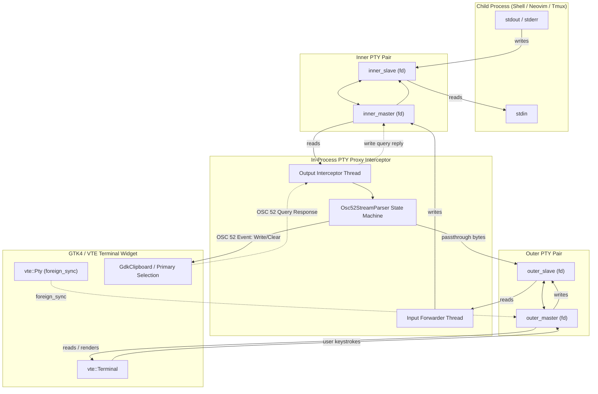

# Master Specification: Phase 14 — OSC 52 & Clipboard Integration

- **Document ID:** `SPEC-0014`
- **Date:** 2026-09-19
- **Status:** Proposed / Ready for Execution
- **Workflow Level:** Medium/Large (Phase 14 of Tilix Rewrite)
- **Preceding Specifications:**
  - [`docs/specs/spec-0001-rust-tilix-foundation-2026-09-15.md`](file:///playground/tilix/docs/specs/spec-0001-rust-tilix-foundation-2026-09-15.md)
  - [`docs/specs/spec-0002-sessions-sync-profiles-2026-09-15.md`](file:///playground/tilix/docs/specs/spec-0002-sessions-sync-profiles-2026-09-15.md)
  - [`docs/specs/spec-0003-wayland-quake-osc-dnd-2026-09-15.md`](file:///playground/tilix/docs/specs/spec-0003-wayland-quake-osc-dnd-2026-09-15.md)
  - [`docs/specs/spec-0004-packaging-distribution-polish-2026-09-16.md`](file:///playground/tilix/docs/specs/spec-0004-packaging-distribution-polish-2026-09-16.md)
  - [`docs/specs/spec-0005-window-style-wide-handle-2026-09-17.md`](file:///playground/tilix/docs/specs/spec-0005-window-style-wide-handle-2026-09-17.md)
  - [`docs/specs/spec-0006-pane-toolbar-terminal-title-2026-09-17.md`](file:///playground/tilix/docs/specs/spec-0006-pane-toolbar-terminal-title-2026-09-17.md)
  - [`docs/specs/spec-0007-custom-keybindings-manager-2026-09-17.md`](file:///playground/tilix/docs/specs/spec-0007-custom-keybindings-manager-2026-09-17.md)
  - [`docs/specs/spec-0008-pane-dnd-docking-detach-2026-09-17.md`](file:///playground/tilix/docs/specs/spec-0008-pane-dnd-docking-detach-2026-09-17.md)
  - [`docs/specs/spec-0009-profile-customization-complete-2026-09-17.md`](file:///playground/tilix/docs/specs/spec-0009-profile-customization-complete-2026-09-17.md)
  - [`docs/specs/spec-0010-profile-preferences-ui-parity-2026-09-17.md`](file:///playground/tilix/docs/specs/spec-0010-profile-preferences-ui-parity-2026-09-17.md)
  - [`docs/specs/spec-0011-session-and-application-title-options-2026-09-18.md`](file:///playground/tilix/docs/specs/spec-0011-session-and-application-title-options-2026-09-18.md)
  - [`docs/specs/spec-0012-dynamic-window-geometry-default-size-2026-09-18.md`](file:///playground/tilix/docs/specs/spec-0012-dynamic-window-geometry-default-size-2026-09-18.md)
  - [`docs/specs/spec-0013-terminal-zoom-and-alt-drag-2026-09-18.md`](file:///playground/tilix/docs/specs/spec-0013-terminal-zoom-and-alt-drag-2026-09-18.md)
- **Target Location:** `/playground/tilix`

---

## 1. Context & Motivation

Terminal clipboard workflows are a cornerstone of developer productivity. Modern terminal utilities—including multiplexers (`tmux`, `zellij`), editors (`neovim`, `helix`), CLI helpers, and remote SSH / mosh sessions—rely on **OSC 52 (Operating System Command 52)** escape sequences to programmatically manipulate the desktop clipboard across network and container boundaries without requiring X11 forwarding or Wayland socket sharing.

Upstream Tilix provides rich clipboard functionality:
1. **OSC 52 Support:** Allows child terminal processes to read, write, and clear system clipboard and primary selection buffers via standard escape sequences (`\x1b]52;<targets>;<base64>\x07` or `\x1b]52;<targets>;<base64>\x1b\\`).
2. **Standard Clipboard Actions & Accelerators:** Standard shortcuts for Copy (`Ctrl+Shift+C` and `Ctrl+Insert`), Copy as HTML, Paste (`Ctrl+Shift+V` and `Shift+Insert`), Paste Primary Selection, Cut (`Ctrl+Shift+X`), and Select All (`Ctrl+Shift+A`).
3. **Context Menu Parity:** Right-clicking anywhere on the terminal canvas displays a contextual menu exposing clipboard operations, text selection, split management, pane closing, and preferences access.
4. **Copy on Select:** Optional preference where highlighting any text in the terminal immediately populates the clipboard buffer without requiring manual keystrokes.

In standard GNOME `libvte`, OSC 52 handling has historically been absent or strictly constrained. To deliver full fidelity with upstream Tilix and provide robust clipboard control, Phase 14 introduces an **in-process PTY proxy interceptor** paired with a **pure domain streaming OSC 52 parser**. The proxy couples the child process PTY with VTE via `vte::Pty::foreign_sync`, scanning child stream output for OSC 52 sequences while passing through regular terminal output transparently. When OSC 52 write or query sequences arrive, the proxy updates or reads the native desktop clipboard on the GTK main thread.

---

## 2. Amended Documents & Scope

- **Amended Document:** [`docs/architecture/overview.md`](file:///playground/tilix/docs/architecture/overview.md)
- **Status of Living Architecture:** Active (Version bumped to 0.14.0 for Phase 14)

### 2.1 Affected Scope

1. **`Cargo.toml`:**
   - Add `libc = "0.2"` dependency for PTY pair creation (`libc::openpty`), window sizing ioctls (`TIOCSWINSZ`, `TIOCGWINSZ`), process group control (`setsid`, `TIOCSCTTY`), and file descriptor manipulation.
2. **`src/pty/osc52.rs` (New Pure Domain Parser Module):**
   - Headless, pure-domain parser and serializer for OSC 52 escape sequences.
   - Enums: `Osc52Target` (`Clipboard`, `Primary`, `Secondary`, `CutBuffer(u8)`), `Osc52Operation` (`Write`, `Query`, `Clear`).
   - Event: `Osc52Event` carrying target lists and decoded byte payloads.
   - Streaming state machine: `Osc52StreamParser` supporting chunked inputs, BEL (`\x07`) and ST (`\x1b\\` or `0x9c`) terminators, non-OSC byte passthrough, and payload safety length bounds.
   - Base64 encoding/decoding via `glib::base64_decode` and `glib::base64_encode`.
3. **`src/pty/proxy.rs` (New PTY Proxy Interceptor Module):**
   - Dual-PTY architecture using `libc::openpty`: Inner PTY (child process) and Outer PTY (VTE).
   - Bi-directional stream forwarding between inner and outer masters.
   - Background worker threads forwarding user input from outer slave to inner master and child output from inner master to outer slave through `Osc52StreamParser`.
   - Main thread dispatch via `glib::idle_add_local` to interact with `gdk::Display::clipboard()` and `gdk::Display::primary_clipboard()`.
   - Window resize propagation via `TIOCSWINSZ` ioctls.
4. **`src/pty/mod.rs`:**
   - Expose `osc52` and `proxy` submodules and re-export core types.
5. **`src/model/profile.rs` & `src/model/config.rs`:**
   - Extend `Profile` with:
     * `copy_on_select: bool` (default: `false`)
     * `enable_osc52: bool` (default: `true`)
     * `osc52_allow_query: bool` (default: `false`)
   - Preserve full serde JSON backwards compatibility for older configs.
6. **`src/model/keybindings.rs`:**
   - Add `ActionCategory::Clipboard` ("Clipboard & Edit").
   - Add 6 new actions to `ACTION_CATALOG`:
     * `win.copy` ("Copy", `<Primary><Shift>c`, `<Primary>Insert`)
     * `win.copy-html` ("Copy as HTML", `[]`)
     * `win.paste` ("Paste", `<Primary><Shift>v`, `<Shift>Insert`)
     * `win.paste-primary` ("Paste Primary Selection", `[]`)
     * `win.cut` ("Cut", `<Primary><Shift>x`)
     * `win.select-all` ("Select All", `<Primary><Shift>a`)
   - Expand `ACTION_CATALOG` length from 27 to 33.
7. **`src/ui/terminal_pane.rs`:**
   - Public clipboard methods: `copy_clipboard()`, `copy_html()`, `paste_clipboard()`, `paste_primary()`, `cut_clipboard()`, `select_all()`.
   - Context menu model setup on `vte::Terminal` via `set_context_menu_model`.
   - Selection change event handler for `copy_on_select`.
   - Integration with `PtyProxy` during terminal process spawning.
8. **`src/ui/session_view.rs`:**
   - Active pane clipboard dispatchers: `copy_clipboard_active()`, `copy_html_active()`, `paste_clipboard_active()`, `paste_primary_active()`, `cut_clipboard_active()`, `select_all_active()`.
9. **`src/ui/window.rs`:**
   - Register 6 window-level `gio::SimpleAction`s for clipboard operations.
10. **`src/ui/preferences.rs`:**
    - Display `ActionCategory::Clipboard` in the Shortcuts preferences tab.
    - Add `copy_on_select` checkbox in the Profile General tab.
    - Add `enable_osc52` and `osc52_allow_query` checkboxes in the Profile Compatibility tab.
11. **`tests/test_phase7_keybindings.rs`:**
    - Update catalog count assertion to 33 and test the `Clipboard` category.
12. **`tests/test_phase14_osc52_and_clipboard.rs` (New Integration Suite):**
    - Headless verification of OSC 52 parser, proxy interceptor, model serialization, action dispatch, and context menu model.

### 2.2 Unaffected Scope

- `src/model/layout.rs`: Split tree topology, docking math, and layout balancing remain unchanged.
- `src/model/theme.rs`: Color palettes and theme parsing remain unchanged.
- `src/model/title.rs`: Token expansion engine remains unchanged.
- `src/ui/dnd.rs`: Pane drag-and-drop mechanics remain unchanged.
- `src/ui/geometry.rs`: Window geometry computation remains unchanged.

---

## 3. Goals & Non-Goals

### Goals

1. **Pure Domain OSC 52 Parser (`src/pty/osc52.rs`):**
   - Parse all standard clipboard targets: `c` (clipboard), `p` (primary selection), `q` (secondary selection), `0` through `7` (cut buffers), and compound targets (e.g., `cp`).
   - Default target fallback: empty target string defaults to `c`.
   - Parse all operations: Write (`<base64-payload>`), Query (`?`), and Clear (`""`).
   - Robust streaming state machine handling chunked inputs across arbitrary byte boundaries, terminated by BEL (`\x07`) or ST (`\x1b\\` or `0x9c`).
   - Non-OSC 52 byte streams passed through untouched without corruption. Other OSC sequences (such as OSC 7 directory reporting or window titles) must pass through to VTE.
   - 100% headless unit testable with zero GTK / display server dependencies.
2. **In-Process PTY Proxy Interceptor (`src/pty/proxy.rs`):**
   - Dual-PTY architecture (`libc::openpty`) isolating the child process on `inner_slave` while attaching VTE to `outer_master` via `vte::Pty::foreign_sync`.
   - Low-latency bi-directional stream forwarding.
   - OSC 52 interception: write child output through parser, filter out OSC 52 bytes, pass clean bytes to VTE, and dispatch clipboard updates to the main thread via `glib::idle_add_local`.
   - OSC 52 Query response: when queries are permitted, read current desktop clipboard, base64-encode, format OSC 52 response, and feed back into `inner_master`.
   - Terminal window resize propagation: synchronize rows and columns from VTE to child process via `TIOCSWINSZ`.
3. **Profile Configuration & Backwards Compatibility:**
   - Support `enable_osc52` (default: `true`), `osc52_allow_query` (default: `false`), and `copy_on_select` (default: `false`).
   - Seamless deserialization of legacy configurations without schema breakage.
4. **Keybinding Catalog Expansion:**
   - Add `ActionCategory::Clipboard` ("Clipboard & Edit") with 6 standard clipboard actions.
   - Configure default accelerators matching upstream Tilix and GNOME standards.
   - Guarantee zero accelerator collisions.
5. **Terminal & UI Integration:**
   - Public clipboard control methods on `TerminalPane`.
   - Context menu attached to `vte::Terminal` via `gio::Menu` model.
   - Automatic copy on selection changes when enabled.
   - Full preferences UI integration in Shortcuts, General, and Compatibility pages.
6. **Comprehensive Automated Test Coverage:**
   - Headless unit and integration tests covering parser, proxy, config, keybindings, and UI actions.

### Non-Goals

- Standalone system clipboard daemon implementation (Tilix relies on native GTK4/GDK clipboard infrastructure on X11 and Wayland).
- Supporting arbitrary non-clipboard OSC escape sequences inside the proxy (other OSC sequences pass directly to VTE).
- Supporting non-text clipboard mime-types over OSC 52 (OSC 52 is strictly a text/bytes base64 transport).
- Enabling OSC 52 queries by default (security risk: rogue terminal applications could silently read sensitive user passwords or tokens).

---

## 4. Architecture & Design Decisions

### 4.1 Decision Gating: Facts, Decisions, Assumptions, Deferred Items

- **Facts:**
  - `vte::Terminal` in GTK4 provides `copy_clipboard_format(vte4::Format)`, `copy_primary()`, `paste_clipboard()`, `paste_primary()`, `select_all()`, and `unselect_all()`.
  - `vte::Terminal` provides `set_context_menu_model(Some(&model))` for setting a `gio::MenuModel`.
  - `vte::Pty::foreign_sync(fd: OwnedFd, cancellable)` wraps an existing PTY file descriptor into a `vte::Pty` object.
  - `gdk::Display::default()` provides `clipboard()` (standard clipboard) and `primary_clipboard()` (primary selection) returning `gdk::Clipboard`.
  - `glib::base64_decode` and `glib::base64_encode` provide standard base64 encoding and decoding.
  - VTE does not natively handle OSC 52 write or query sequences to desktop clipboards on all configurations.
- **Decisions:**
  - **In-Process Proxy Architecture:**
    - Use `libc::openpty` to create two PTY pairs:
      1. Inner Pair: `(inner_master, inner_slave)` — child process runs attached to `inner_slave`.
      2. Outer Pair: `(outer_master, outer_slave)` — VTE attaches to `outer_master`.
    - Proxy worker thread 1 (Input Forwarder): reads from `outer_slave`, writes to `inner_master`.
    - Proxy worker thread 2 (Output Interceptor): reads from `inner_master`, streams into `Osc52StreamParser`, writes non-OSC bytes to `outer_slave`, and dispatches clipboard events to the GTK main thread.
  - **OSC 52 Parser Safety & Bounds:**
    - Maximum allowable OSC 52 payload buffer: 5 MB (`MAX_OSC52_PAYLOAD_SIZE = 5 * 1024 * 1024`). Payloads exceeding this limit abort sequence collection and flush bytes to prevent memory exhaustion attacks.
    - Security posture: `osc52_allow_query` defaults to `false`. Terminal applications cannot read the clipboard unless the user explicitly enables it.
  - **Clipboard Targets Mapping:**
    - `Osc52Target::Clipboard` ('c') -> maps to `display.clipboard()`.
    - `Osc52Target::Primary` ('p') -> maps to `display.primary_clipboard()`.
    - `Osc52Target::Secondary` ('q') / `CutBuffer` ('0'..='7') -> recorded in internal state; fall back to `display.clipboard()` if separate cut buffers are unsupported by the desktop session.
  - **Context Menu Structure:**
    - Context menu is constructed as a structured `gio::Menu` with 4 sections:
      1. Section 1 (Clipboard): Copy (`win.copy`), Copy as HTML (`win.copy-html`), Paste (`win.paste`), Paste Primary (`win.paste-primary`), Cut (`win.cut`).
      2. Section 2 (Selection): Select All (`win.select-all`).
      3. Section 3 (Splits & Navigation): Split Right (`win.split-right`), Split Down (`win.split-down`), Close Terminal (`win.close-pane`).
      4. Section 4 (Settings): Preferences (`win.preferences`).
- **Assumptions:**
  - Standard Unix PTY file descriptors can be converted to `io_lifetimes::OwnedFd` using `FromRawFd::from_raw_fd`.
  - When child process exits, closing `inner_slave` causes `inner_master` read to return `EOF` (or `EIO`), which propagates to close `outer_slave` and informs VTE of child termination.
- **Deferred Items:**
  - OSC 52 paste confirmation prompt for query requests (future security milestone).
  - Configurable maximum clipboard buffer size in preferences (future milestone).

### 4.2 Architecture Diagrams

#### 4.2.1 Bi-directional PTY Proxy Data Flow



#### 4.2.2 OSC 52 Stream Parser State Machine

```mermaid
stateDiagram-v2
    [*] --> Ground

    Ground --> Escape : byte == 0x1B (ESC)
    Ground --> Ground : emit byte to passthrough

    Escape --> OscHeader : byte == ']' (0x5D)
    Escape --> Ground : byte != ']' (emit ESC + byte to passthrough)

    OscHeader --> OscTargets : prefix matches "52;"
    OscHeader --> Ground : prefix does not match "52" (emit buffered to passthrough)

    OscTargets --> OscPayload : byte == ';'
    OscTargets --> OscTargets : accumulate target chars ('c', 'p', etc.)
    OscTargets --> Ground : invalid chars or terminator (abort / reset)

    OscPayload --> OscPayload : accumulate base64 payload
    OscPayload --> EmitEvent : byte == 0x07 (BEL)
    OscPayload --> EscapeInPayload : byte == 0x1B (ESC)
    OscPayload --> EmitEvent : byte == 0x9C (8-bit ST)
    OscPayload --> Ground : buffer > 5MB limit (drop / reset)

    EscapeInPayload --> EmitEvent : byte == '\\' (7-bit ST)
    EscapeInPayload --> OscPayload : byte != '\\' (keep ESC in payload)

    EmitEvent --> Ground : decode base64, emit Osc52Event, reset state
```



---

## 5. Detailed Component Specifications

### 5.1 Pure Domain OSC 52 Parser (`src/pty/osc52.rs`)

#### 5.1.1 Target & Operation Enums

```rust
#[derive(Debug, Clone, Copy, PartialEq, Eq, Hash)]
pub enum Osc52Target {
    Clipboard,       // 'c' - Desktop clipboard
    Primary,         // 'p' - Primary selection
    Secondary,       // 'q' - Secondary selection
    CutBuffer(u8),   // '0'..='7' - X11 Cut buffers 0-7
}

impl Osc52Target {
    pub fn from_char(c: char) -> Option<Self> {
        match c {
            'c' | 'C' => Some(Self::Clipboard),
            'p' | 'P' => Some(Self::Primary),
            'q' | 'Q' => Some(Self::Secondary),
            '0'..='7' => Some(Self::CutBuffer(c.to_digit(10).unwrap() as u8)),
            _ => None,
        }
    }

    pub fn to_char(self) -> char {
        match self {
            Self::Clipboard => 'c',
            Self::Primary => 'p',
            Self::Secondary => 'q',
            Self::CutBuffer(idx) => char::from_digit(idx as u32, 10).unwrap_or('0'),
        }
    }
}

#[derive(Debug, Clone, PartialEq, Eq)]
pub enum Osc52Operation {
    Write(Vec<u8>),  // Decoded payload data to write
    Query,           // '?' - Client requests clipboard content
    Clear,           // Empty payload - Client requests buffer clear
}

#[derive(Debug, Clone, PartialEq, Eq)]
pub struct Osc52Event {
    pub targets: Vec<Osc52Target>,
    pub operation: Osc52Operation,
}
```

#### 5.1.2 Stream Parser State Machine

```rust
pub const MAX_OSC52_PAYLOAD_SIZE: usize = 5 * 1024 * 1024; // 5 MB safety bound

#[derive(Debug, Clone, Copy, PartialEq, Eq)]
enum ParserState {
    Ground,
    Escape,
    OscHeader,
    OscTargets,
    OscPayload,
    EscapeInPayload,
}

pub struct Osc52StreamParser {
    state: ParserState,
    header_buf: Vec<u8>,
    targets_buf: Vec<u8>,
    payload_buf: Vec<u8>,
}

impl Default for Osc52StreamParser {
    fn default() -> Self {
        Self::new()
    }
}

impl Osc52StreamParser {
    pub fn new() -> Self {
        Self {
            state: ParserState::Ground,
            header_buf: Vec::with_capacity(8),
            targets_buf: Vec::with_capacity(16),
            payload_buf: Vec::with_capacity(1024),
        }
    }

    /// Feeds an incoming byte chunk from child output.
    /// Returns a tuple of:
    /// 1. Passthrough bytes that should be forwarded to VTE.
    /// 2. Extracted OSC 52 events.
    pub fn process(&mut self, chunk: &[u8]) -> (Vec<u8>, Vec<Osc52Event>) {
        let mut passthrough = Vec::with_capacity(chunk.len());
        let mut events = Vec::new();

        for &b in chunk {
            match self.state {
                ParserState::Ground => {
                    if b == 0x1B {
                        self.state = ParserState::Escape;
                    } else {
                        passthrough.push(b);
                    }
                }
                ParserState::Escape => {
                    if b == b']' {
                        self.state = ParserState::OscHeader;
                        self.header_buf.clear();
                    } else {
                        self.state = ParserState::Ground;
                        passthrough.push(0x1B);
                        passthrough.push(b);
                    }
                }
                ParserState::OscHeader => {
                    self.header_buf.push(b);
                    if self.header_buf == b"52;" {
                        self.state = ParserState::OscTargets;
                        self.targets_buf.clear();
                    } else if !b"52;".starts_with(&self.header_buf) {
                        // Not an OSC 52 sequence - flush to passthrough
                        self.state = ParserState::Ground;
                        passthrough.push(0x1B);
                        passthrough.push(b']');
                        passthrough.extend_from_slice(&self.header_buf);
                        self.header_buf.clear();
                    }
                }
                ParserState::OscTargets => {
                    if b == b';' {
                        self.state = ParserState::OscPayload;
                        self.payload_buf.clear();
                    } else if b == 0x07 || b == 0x1B {
                        // Premature terminator without payload
                        self.state = ParserState::Ground;
                        self.header_buf.clear();
                        self.targets_buf.clear();
                    } else {
                        self.targets_buf.push(b);
                    }
                }
                ParserState::OscPayload => {
                    if b == 0x07 || b == 0x9C {
                        // BEL or 8-bit ST terminator
                        if let Some(event) = self.finish_sequence() {
                            events.push(event);
                        }
                        self.reset_state();
                    } else if b == 0x1B {
                        self.state = ParserState::EscapeInPayload;
                    } else {
                        if self.payload_buf.len() < MAX_OSC52_PAYLOAD_SIZE {
                            self.payload_buf.push(b);
                        } else {
                            // Payload exceeded max size, abort sequence
                            self.reset_state();
                        }
                    }
                }
                ParserState::EscapeInPayload => {
                    if b == b'\\' {
                        // 7-bit ST terminator (\x1b\\)
                        if let Some(event) = self.finish_sequence() {
                            events.push(event);
                        }
                        self.reset_state();
                    } else {
                        // Not a terminator, return to payload
                        self.state = ParserState::OscPayload;
                        if self.payload_buf.len() + 2 < MAX_OSC52_PAYLOAD_SIZE {
                            self.payload_buf.push(0x1B);
                            self.payload_buf.push(b);
                        }
                    }
                }
            }
        }

        (passthrough, events)
    }

    fn reset_state(&mut self) {
        self.state = ParserState::Ground;
        self.header_buf.clear();
        self.targets_buf.clear();
        self.payload_buf.clear();
    }

    fn finish_sequence(&self) -> Option<Osc52Event> {
        let targets_str = std::str::from_utf8(&self.targets_buf).unwrap_or("");
        let mut targets: Vec<Osc52Target> = targets_str
            .chars()
            .filter_map(Osc52Target::from_char)
            .collect();

        // Default target is Clipboard ('c') if empty
        if targets.is_empty() {
            targets.push(Osc52Target::Clipboard);
        }

        let payload_str = std::str::from_utf8(&self.payload_buf).unwrap_or("").trim();

        let operation = if payload_str == "?" {
            Osc52Operation::Query
        } else if payload_str.is_empty() {
            Osc52Operation::Clear
        } else {
            let decoded = glib::base64_decode(payload_str);
            Osc52Operation::Write(decoded)
        };

        Some(Osc52Event { targets, operation })
    }
}
```

#### 5.1.3 Encoding Helper for Query Responses

```rust
pub fn encode_osc52_response(target: Osc52Target, data: &[u8]) -> String {
    let encoded = glib::base64_encode(data);
    format!("\x1b]52;{};{}\x1b\\", target.to_char(), encoded)
}
```

---

### 5.2 In-Process PTY Proxy Interceptor (`src/pty/proxy.rs`)

#### 5.2.1 Proxy Structure & PTY Pair Setup

```rust
use std::os::unix::io::{FromRawFd, IntoRawFd, RawFd};
use std::sync::atomic::{AtomicBool, Ordering};
use std::sync::Arc;
use std::thread;

pub struct ProxyPtyPair {
    pub master_fd: RawFd,
    pub slave_fd: RawFd,
}

impl ProxyPtyPair {
    pub fn open() -> Result<Self, std::io::Error> {
        let mut master: libc::c_int = 0;
        let mut slave: libc::c_int = 0;
        let res = unsafe {
            libc::openpty(
                &mut master,
                &mut slave,
                std::ptr::null_mut(),
                std::ptr::null_mut(),
                std::ptr::null_mut(),
            )
        };
        if res != 0 {
            return Err(std::io::Error::last_os_error());
        }
        Ok(Self {
            master_fd: master,
            slave_fd: slave,
        })
    }
}

pub struct PtyProxy {
    inner_master: RawFd,
    outer_master: RawFd,
    inner_slave: RawFd,
    outer_slave: RawFd,
    running: Arc<AtomicBool>,
}

impl PtyProxy {
    pub fn new() -> Result<Self, std::io::Error> {
        let inner = ProxyPtyPair::open()?;
        let outer = ProxyPtyPair::open()?;

        Ok(Self {
            inner_master: inner.master_fd,
            inner_slave: inner.slave_fd,
            outer_master: outer.master_fd,
            outer_slave: outer.slave_fd,
            running: Arc::new(AtomicBool::new(true)),
        })
    }

    pub fn inner_slave_fd(&self) -> RawFd {
        self.inner_slave
    }

    pub fn outer_master_fd(&self) -> RawFd {
        self.outer_master
    }

    /// Spawns the background forwarding threads.
    /// `on_osc52_event`: Callback invoked when an OSC 52 sequence is detected.
    /// `on_query`: Optional callback invoked when client queries clipboard.
    pub fn start<F, Q>(&self, on_osc52_event: F, on_query: Q)
    where
        F: Fn(Osc52Event) + Send + Sync + 'static,
        Q: Fn(Vec<Osc52Target>) -> Option<Vec<u8>> + Send + Sync + 'static,
    {
        let running = Arc::clone(&self.running);
        let on_event = Arc::new(on_osc52_event);
        let on_query_arc = Arc::new(on_query);

        let outer_slave = self.outer_slave;
        let inner_master = self.inner_master;

        // Thread 1: User Input (outer_slave -> inner_master)
        let r1 = Arc::clone(&running);
        thread::Builder::new()
            .name("tilix-pty-input".into())
            .spawn(move || {
                let mut buf = [0u8; 4096];
                while r1.load(Ordering::Relaxed) {
                    let n = unsafe { libc::read(outer_slave, buf.as_mut_ptr() as *mut libc::c_void, buf.len()) };
                    if n <= 0 {
                        break;
                    }
                    let _ = unsafe { libc::write(inner_master, buf.as_ptr() as *const libc::c_void, n as usize) };
                }
            })
            .expect("Failed to spawn pty input forwarder");

        // Thread 2: Child Output (inner_master -> parser -> outer_slave)
        let r2 = Arc::clone(&running);
        thread::Builder::new()
            .name("tilix-pty-output".into())
            .spawn(move || {
                let mut parser = crate::pty::osc52::Osc52StreamParser::new();
                let mut buf = [0u8; 4096];
                while r2.load(Ordering::Relaxed) {
                    let n = unsafe { libc::read(inner_master, buf.as_mut_ptr() as *mut libc::c_void, buf.len()) };
                    if n <= 0 {
                        break;
                    }
                    let (passthrough, events) = parser.process(&buf[..n as usize]);
                    if !passthrough.is_empty() {
                        let _ = unsafe {
                            libc::write(
                                outer_slave,
                                passthrough.as_ptr() as *const libc::c_void,
                                passthrough.len(),
                            )
                        };
                    }
                    for event in events {
                        if event.operation == crate::pty::osc52::Osc52Operation::Query {
                            if let Some(content) = on_query_arc(event.targets.clone()) {
                                if let Some(&target) = event.targets.first() {
                                    let reply = crate::pty::osc52::encode_osc52_response(target, &content);
                                    let _ = unsafe {
                                        libc::write(
                                            inner_master,
                                            reply.as_ptr() as *const libc::c_void,
                                            reply.len(),
                                        )
                                    };
                                }
                            }
                        } else {
                            on_event(event);
                        }
                    }
                }
            })
            .expect("Failed to spawn pty output forwarder");
    }

    /// Propagates window dimensions to the inner PTY.
    pub fn set_window_size(&self, rows: u16, cols: u16) {
        let ws = libc::winsize {
            ws_row: rows,
            ws_col: cols,
            ws_xpixel: 0,
            ws_ypixel: 0,
        };
        unsafe {
            libc::ioctl(self.inner_master, libc::TIOCSWINSZ, &ws);
        }
    }

    /// Synchronizes window dimensions from outer PTY to inner PTY.
    pub fn sync_size_from_outer(&self) {
        let mut ws: libc::winsize = unsafe { std::mem::zeroed() };
        if unsafe { libc::ioctl(self.outer_slave, libc::TIOCGWINSZ, &mut ws) } == 0 {
            unsafe {
                libc::ioctl(self.inner_master, libc::TIOCSWINSZ, &ws);
            }
        }
    }

    pub fn shutdown(&self) {
        self.running.store(false, Ordering::Relaxed);
    }
}
```

---

### 5.3 Configuration & Profile Schema (`src/model/config.rs` & `src/model/profile.rs`)

#### 5.3.1 Extended Fields in `Profile`

```rust
// In src/model/profile.rs
#[derive(Debug, Clone, PartialEq, Serialize, Deserialize)]
#[serde(default)]
pub struct Profile {
    // ... Existing Profile fields ...

    // Clipboard & OSC 52 Settings
    pub copy_on_select: bool,
    pub enable_osc52: bool,
    pub osc52_allow_query: bool,
}
```

#### 5.3.2 Default Values

In `impl Default for Profile`:
```rust
copy_on_select: false,
enable_osc52: true,
osc52_allow_query: false,
```

#### 5.3.3 Backwards Compatibility Guarantee

Because `#[serde(default)]` adorns `Profile`, deserializing JSON payloads from any earlier phase (Phases 1 through 13) that lack `copy_on_select`, `enable_osc52`, or `osc52_allow_query` automatically populates them with their default values (`false`, `true`, `false`).

---

### 5.4 Keybindings Catalog Expansion (`src/model/keybindings.rs`)

#### 5.4.1 `ActionCategory::Clipboard`

```rust
#[derive(Debug, Clone, Copy, PartialEq, Eq, Hash, Serialize, Deserialize)]
#[serde(rename_all = "snake_case")]
pub enum ActionCategory {
    SessionAndTabs,
    SplitsAndLayout,
    Navigation,
    ViewAndSettings,
    Clipboard,
}

impl ActionCategory {
    pub fn title(&self) -> &'static str {
        match self {
            Self::SessionAndTabs => "Session & Tabs",
            Self::SplitsAndLayout => "Splits & Layout",
            Self::Navigation => "Navigation",
            Self::ViewAndSettings => "View & Settings",
            Self::Clipboard => "Clipboard & Edit",
        }
    }
}
```

#### 5.4.2 6 New Actions in `ACTION_CATALOG`

```rust
// Clipboard & Edit (6 actions)
ActionShortcutDef {
    id: "win.copy",
    title: "Copy",
    description: "Copy selected text to clipboard",
    category: ActionCategory::Clipboard,
    default_accels: &["<Primary><Shift>c", "<Primary>Insert"],
},
ActionShortcutDef {
    id: "win.copy-html",
    title: "Copy as HTML",
    description: "Copy selected text with formatting as HTML",
    category: ActionCategory::Clipboard,
    default_accels: &[],
},
ActionShortcutDef {
    id: "win.paste",
    title: "Paste",
    description: "Paste clipboard text into active terminal",
    category: ActionCategory::Clipboard,
    default_accels: &["<Primary><Shift>v", "<Shift>Insert"],
},
ActionShortcutDef {
    id: "win.paste-primary",
    title: "Paste Primary Selection",
    description: "Paste primary selection text into active terminal",
    category: ActionCategory::Clipboard,
    default_accels: &[],
},
ActionShortcutDef {
    id: "win.cut",
    title: "Cut",
    description: "Copy selection to clipboard and delete",
    category: ActionCategory::Clipboard,
    default_accels: &["<Primary><Shift>x"],
},
ActionShortcutDef {
    id: "win.select-all",
    title: "Select All",
    description: "Select all text in terminal buffer",
    category: ActionCategory::Clipboard,
    default_accels: &["<Primary><Shift>a"],
},
```

Total catalog actions expand from **27 to 33**:
- `SessionAndTabs`: 14
- `SplitsAndLayout`: 4
- `Navigation`: 4
- `ViewAndSettings`: 5
- `Clipboard`: 6
- **Sum = 33**

---

### 5.5 UI & Terminal Integration

#### 5.5.1 `TerminalPane` Clipboard Methods (`src/ui/terminal_pane.rs`)

```rust
impl TerminalPane {
    pub fn copy_clipboard(&self) {
        self.terminal.copy_clipboard_format(vte4::Format::Text);
    }

    pub fn copy_html(&self) {
        self.terminal.copy_clipboard_format(vte4::Format::Html);
    }

    pub fn paste_clipboard(&self) {
        self.terminal.paste_clipboard();
    }

    pub fn paste_primary(&self) {
        self.terminal.paste_primary();
    }

    pub fn cut_clipboard(&self) {
        self.terminal.copy_clipboard_format(vte4::Format::Text);
        self.terminal.unselect_all();
    }

    pub fn select_all(&self) {
        self.terminal.select_all();
    }
}
```

#### 5.5.2 Context Menu Construction

In `TerminalPane::new`:
```rust
let menu = gio::Menu::new();

// Section 1: Clipboard
let clip_section = gio::Menu::new();
clip_section.append(Some("Copy"), Some("win.copy"));
clip_section.append(Some("Copy as HTML"), Some("win.copy-html"));
clip_section.append(Some("Paste"), Some("win.paste"));
clip_section.append(Some("Paste Primary Selection"), Some("win.paste-primary"));
clip_section.append(Some("Cut"), Some("win.cut"));
menu.append_section(None, &clip_section);

// Section 2: Selection
let sel_section = gio::Menu::new();
sel_section.append(Some("Select All"), Some("win.select-all"));
menu.append_section(None, &sel_section);

// Section 3: Splits
let split_section = gio::Menu::new();
split_section.append(Some("Split Right"), Some("win.split-right"));
split_section.append(Some("Split Down"), Some("win.split-down"));
split_section.append(Some("Close Terminal"), Some("win.close-pane"));
menu.append_section(None, &split_section);

// Section 4: Preferences
let pref_section = gio::Menu::new();
pref_section.append(Some("Preferences..."), Some("win.preferences"));
menu.append_section(None, &pref_section);

terminal.set_context_menu_model(Some(&menu));
```

#### 5.5.3 Copy on Select Listener

In `TerminalPane::new`:
```rust
let term_ref = terminal.clone();
let profile_rc_clone = Rc::clone(&profile_rc);
terminal.connect_selection_changed(move |term| {
    if profile_rc_clone.borrow().copy_on_select && term.has_selection() {
        term.copy_clipboard_format(vte4::Format::Text);
    }
});
```

#### 5.5.4 OSC 52 Main-Thread Clipboard Bridge

When `PtyProxy` detects an OSC 52 event:
```rust
let display = gdk::Display::default();
match event.operation {
    Osc52Operation::Write(data) => {
        if let Ok(text) = std::str::from_utf8(&data) {
            for target in event.targets {
                match target {
                    Osc52Target::Clipboard => {
                        if let Some(disp) = &display {
                            disp.clipboard().set_text(text);
                        }
                    }
                    Osc52Target::Primary => {
                        if let Some(disp) = &display {
                            disp.primary_clipboard().set_text(text);
                        }
                    }
                    _ => {
                        if let Some(disp) = &display {
                            disp.clipboard().set_text(text);
                        }
                    }
                }
            }
        }
    }
    Osc52Operation::Clear => {
        for target in event.targets {
            match target {
                Osc52Target::Clipboard => {
                    if let Some(disp) = &display {
                        disp.clipboard().set_text("");
                    }
                }
                Osc52Target::Primary => {
                    if let Some(disp) = &display {
                        disp.primary_clipboard().set_text("");
                    }
                }
                _ => {}
            }
        }
    }
    Osc52Operation::Query => {
        // Query handled synchronously in proxy if query allowed
    }
}
```

#### 5.5.5 `SessionView` Active Dispatch (`src/ui/session_view.rs`)

```rust
impl SessionView {
    pub fn copy_clipboard_active(&self) {
        if let Some(pane) = self.active_pane() {
            pane.copy_clipboard();
        }
    }

    pub fn copy_html_active(&self) {
        if let Some(pane) = self.active_pane() {
            pane.copy_html();
        }
    }

    pub fn paste_clipboard_active(&self) {
        if let Some(pane) = self.active_pane() {
            pane.paste_clipboard();
        }
    }

    pub fn paste_primary_active(&self) {
        if let Some(pane) = self.active_pane() {
            pane.paste_primary();
        }
    }

    pub fn cut_clipboard_active(&self) {
        if let Some(pane) = self.active_pane() {
            pane.cut_clipboard();
        }
    }

    pub fn select_all_active(&self) {
        if let Some(pane) = self.active_pane() {
            pane.select_all();
        }
    }
}
```

#### 5.5.6 `TilixWindow` Action Wiring (`src/ui/window.rs`)

In `TilixWindow::setup_actions`:
Register `SimpleAction`s for:
- `"copy"` -> calls `session.borrow().copy_clipboard_active()`
- `"copy-html"` -> calls `session.borrow().copy_html_active()`
- `"paste"` -> calls `session.borrow().paste_clipboard_active()`
- `"paste-primary"` -> calls `session.borrow().paste_primary_active()`
- `"cut"` -> calls `session.borrow().cut_clipboard_active()`
- `"select-all"` -> calls `session.borrow().select_all_active()`

#### 5.5.7 Preferences UI (`src/ui/preferences.rs`)

1. **Shortcuts Page:**
   Include `ActionCategory::Clipboard` in the `categories` array at line 2600.
2. **Profile Editor General Tab:**
   Add `copy_on_select_check: gtk::CheckButton` labeled `"Automatically copy selection to clipboard"`.
3. **Profile Editor Compatibility Tab:**
   Add `osc52_check: gtk::CheckButton` labeled `"Allow terminal applications to set clipboard (OSC 52)"`.
   Add `osc52_query_check: gtk::CheckButton` labeled `"Allow terminal applications to read clipboard (OSC 52 query)"`.

---

## 6. TDD & Validation Strategy

### 6.1 Test Suites & Coverage

1. **Pure Domain OSC 52 Tests (`src/pty/osc52.rs`):**
   - Single target parsing (`c`, `p`, `q`, `0` through `7`).
   - Compound targets parsing (`cp`, `c0`).
   - Default target fallback (empty targets string resolves to `c`).
   - Operations: Write (with base64 decode), Query (`?`), Clear (`""`).
   - Streaming chunks: Sequences split across chunk boundaries, BEL (`\x07`) and ST (`\x1b\\`) terminators.
   - Passthrough verification: non-OSC bytes and other escape sequences (e.g. OSC 7 `file://`) remain intact.
   - Buffer protection: payloads exceeding 5 MB safely abort without crashing.
2. **PTY Proxy Interceptor Tests (`src/pty/proxy.rs`):**
   - Dual PTY pair creation via `ProxyPtyPair::open()`.
   - Forwarding from outer slave to inner master.
   - Child output interception: OSC 52 write triggers callback; non-OSC bytes pass to outer slave.
   - Window resize propagation via `set_window_size`.
3. **Model & Serialization Tests (`src/model/profile.rs` & `src/model/config.rs`):**
   - Default profile values (`enable_osc52 == true`, `osc52_allow_query == false`, `copy_on_select == false`).
   - Roundtrip JSON serialization.
   - Deserialization of historical configs (Phase 1 through Phase 13) lacking Phase 14 keys.
4. **Keybinding Catalog Tests (`tests/test_phase7_keybindings.rs`):**
   - Verify `ACTION_CATALOG.len() == 33`.
   - Verify `ActionCategory::Clipboard.title() == "Clipboard & Edit"`.
   - Verify `clipboard_actions.len() == 6`.
   - Verify default accelerators uniqueness.
5. **Phase 14 Headless Integration Test Suite (`tests/test_phase14_osc52_and_clipboard.rs`):**
   - `test_phase14_osc52_parser_full_matrix`: Complete operation and target permutations.
   - `test_phase14_osc52_streaming_chunks`: Split buffers across BEL and ST boundaries.
   - `test_phase14_pty_proxy_forwarding_and_interception`: Headless dual-PTY proxy loop test.
   - `test_phase14_profile_clipboard_defaults_and_serde`: Backwards compatibility verification.
   - `test_phase14_keybinding_catalog_clipboard_actions`: Action catalog registration and accelerator verification.
   - `test_phase14_terminal_pane_clipboard_methods`: Verification of pane methods and context menu attachment.
   - `test_phase14_window_clipboard_actions_registered`: Window action lookup.

### 6.2 Validation Commands

```bash
# Targeted catalog tests
cargo test --test test_phase7_keybindings

# Targeted Phase 14 integration tests
cargo test --test test_phase14_osc52_and_clipboard

# Full workspace regression
cargo test
```

---

## 7. Residual Risks & Tech Debt

1. **Security of OSC 52 Query:**
   - *Risk:* Rogue scripts or web pages cat-ed to terminal could read passwords or private keys from clipboard.
   - *Mitigation:* `osc52_allow_query` is disabled by default (`false`), ensuring the terminal will never return clipboard data unless explicitly enabled in profile preferences.
2. **PTY Resource Cleanup:**
   - *Risk:* File descriptor leaks if child processes crash or exit abruptly.
   - *Mitigation:* `PtyProxy` ensures clean shutdown of forwarding threads and file descriptor closing.
3. **Wayland Primary Selection:**
   - *Risk:* Some minimalist Wayland compositors lack primary selection protocol support.
   - *Mitigation:* GDK4 handles compositor protocol negotiation transparently; if primary selection is unsupported, GDK gracefully no-ops without error.
