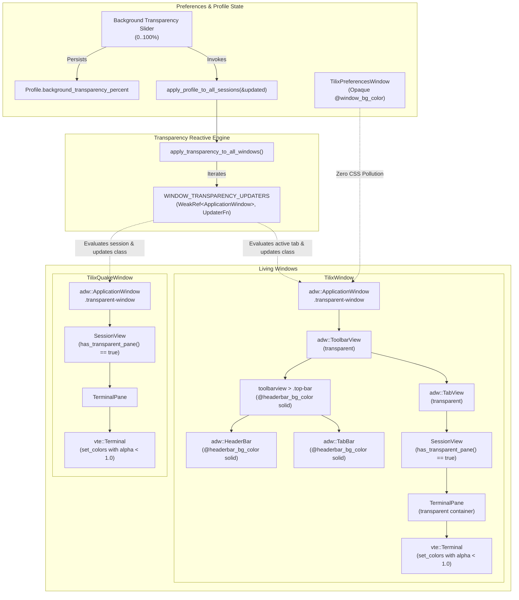

# Master Specification: Phase 17 — Window Transparency & Container Passthrough in GTK4 / Libadwaita

- **Document ID:** `SPEC-0017`
- **Date:** 2026-09-21
- **Status:** Proposed / Ready for Execution
- **Workflow Level:** Medium/Large (Phase 17 of Tilix Rewrite)
- **Preceding Specifications:**
  - [`docs/specs/spec-0001-rust-tilix-foundation-2026-09-15.md`](file:///playground/tilix/docs/specs/spec-0001-rust-tilix-foundation-2026-09-15.md)
  - [`docs/specs/spec-0002-sessions-sync-profiles-2026-09-15.md`](file:///playground/tilix/docs/specs/spec-0002-sessions-sync-profiles-2026-09-15.md)
  - [`docs/specs/spec-0003-wayland-quake-osc-dnd-2026-09-15.md`](file:///playground/tilix/docs/specs/spec-0003-wayland-quake-osc-dnd-2026-09-15.md)
  - [`docs/specs/spec-0004-packaging-distribution-polish-2026-09-16.md`](file:///playground/tilix/docs/specs/spec-0004-packaging-distribution-polish-2026-09-16.md)
  - [`docs/specs/spec-0005-window-style-wide-handle-2026-09-17.md`](file:///playground/tilix/docs/specs/spec-0005-window-style-wide-handle-2026-09-17.md)
  - [`docs/specs/spec-0006-pane-toolbar-terminal-title-2026-09-17.md`](file:///playground/tilix/docs/specs/spec-0006-pane-toolbar-terminal-title-2026-09-17.md)
  - [`docs/specs/spec-0007-custom-keybindings-manager-2026-09-17.md`](file:///playground/tilix/docs/specs/spec-0007-custom-keybindings-manager-2026-09-17.md)
  - [`docs/specs/spec-0008-pane-dnd-docking-detach-2026-09-17.md`](file:///playground/tilix/docs/specs/spec-0008-pane-dnd-docking-detach-2026-09-17.md)
  - [`docs/specs/spec-0009-profile-customization-complete-2026-09-17.md`](file:///playground/tilix/docs/specs/spec-0009-profile-customization-complete-2026-09-17.md)
  - [`docs/specs/spec-0010-profile-preferences-ui-parity-2026-09-17.md`](file:///playground/tilix/docs/specs/spec-0010-profile-preferences-ui-parity-2026-09-17.md)
  - [`docs/specs/spec-0011-session-and-application-title-options-2026-09-18.md`](file:///playground/tilix/docs/specs/spec-0011-session-and-application-title-options-2026-09-18.md)
  - [`docs/specs/spec-0012-dynamic-window-geometry-default-size-2026-09-18.md`](file:///playground/tilix/docs/specs/spec-0012-dynamic-window-geometry-default-size-2026-09-18.md)
  - [`docs/specs/spec-0013-terminal-zoom-and-alt-drag-2026-09-18.md`](file:///playground/tilix/docs/specs/spec-0013-terminal-zoom-and-alt-drag-2026-09-18.md)
  - [`docs/specs/spec-0014-osc52-and-clipboard-integration-2026-09-19.md`](file:///playground/tilix/docs/specs/spec-0014-osc52-and-clipboard-integration-2026-09-19.md)
  - [`docs/specs/spec-0015-compact-mode-density-2026-09-19.md`](file:///playground/tilix/docs/specs/spec-0015-compact-mode-density-2026-09-19.md)
  - [`docs/specs/spec-0016-library-crate-and-test-compilation-optimization-2026-09-20.md`](file:///playground/tilix/docs/specs/spec-0016-library-crate-and-test-compilation-optimization-2026-09-20.md)
- **Target Location:** `/playground/tilix`

---

## 1. Context & Motivation

### 1.1 The Problem: GTK4 & Libadwaita Background Opacity
In Preferences -> Profiles -> Color, Tilix offers a "Background transparency" slider ranging from 0% (fully opaque) to 100% (fully transparent). In `src/ui/terminal_pane.rs`, this setting is properly parsed into an alpha channel on the background `gtk::gdk::RGBA` color passed to `vte::Terminal::set_colors`:

```rust
if profile.background_transparency_percent > 0 {
    let alpha = (100 - profile.background_transparency_percent.min(100)) as f32 / 100.0;
    bg = gtk::gdk::RGBA::builder()
        .red(bg.red())
        .green(bg.green())
        .blue(bg.blue())
        .alpha(alpha)
        .build();
}
widgets.terminal.set_colors(Some(&fg), Some(&bg), &palette_refs);
```

While VTE4 renders its grid cells with the desired alpha channel, in modern GTK4 and Libadwaita environments, windows do not display true desktop wallpaper transparency. Instead, semi-transparent terminal text simply blends into an opaque, solid gray background (`@window_bg_color`), washing out colors and failing to provide desktop passthrough.

### 1.2 The Root Cause: Container Stacking Hierarchy
In GTK4 / Libadwaita, widgets are rendered via GSK (GTK Scene Kit) render nodes in strict tree order:
1. `adw::ApplicationWindow` has a solid default background (`background-color: @window_bg_color;`).
2. Inside the window, `adw::ToolbarView` paints its own opaque `@window_bg_color` background.
3. Inside `adw::ToolbarView`, `adw::TabView` paints its own container background.
4. Inside each tab page, `SessionView` and `.terminal-pane` (`gtk::Box` / `gtk::Overlay`) wrap the `vte::Terminal`.

Because each intermediate container defaults to opaque rendering, VTE’s semi-transparent drawing buffers composite on top of the solid gray background of `adw::TabView` / `adw::ToolbarView` / `adw::ApplicationWindow` rather than compositing directly against the Wayland or X11 compositor background.

### 1.3 The Solution: Targeted Container Passthrough & Scoped Transparency
Phase 17 resolves this issue holistically by implementing:
1. **Scoped Transparency CSS Rules (`.transparent-window`):**
   In `src/ui/window.rs:setup_css()`, define CSS rules that make `adw::ApplicationWindow`, `adw::ToolbarView`, `adw::TabView`, and `.terminal-pane` transparent *only* when the `.transparent-window` class is present on the window root.
2. **Top-Chrome Readability Safeguards:**
   Window chrome widgets (`headerbar`, `tabbar`, `toolbarview > .top-bar`) must explicitly retain solid, opaque styling (`@headerbar_bg_color` and `@headerbar_fg_color`). Window control buttons, tab labels, split buttons, and window titles remain 100% crisp and readable, preventing desktop wallpaper clutter from degrading interface usability.
3. **Reactive Window & Quake Transparency Synchronization:**
   Dynamically add and remove `.transparent-window` on `TilixWindow` and `TilixQuakeWindow` whenever the active tab, pane, or profile has `background_transparency_percent > 0`. When all panes in the active view are opaque, the window cleanly drops `.transparent-window`, restoring standard Libadwaita opaque painting.
4. **Strict Isolation & Zero CSS Pollution:**
   Modal dialogs and preferences windows (such as `TilixPreferencesWindow`, shortcuts dialogs, and about dialogs) never receive `.transparent-window` and remain 100% standard opaque Libadwaita surfaces.
5. **Headless & Display Test Suite:**
   Add automated test coverage in `tests/test_phase17_transparency.rs` validating CSS syntax, reactive class attachment, Quake window support, multi-tab switching, and dialog isolation.

---

## 2. Amended Documents & Scope

- **Amended Document:** [`docs/architecture/overview.md`](file:///playground/tilix/docs/architecture/overview.md)
- **Status of Living Architecture:** Active (Version bumped to 0.17.0 for Phase 17)

### 2.1 Affected Scope

1. **`src/ui/window.rs`:**
   - Extend `setup_css()` with scoped `.transparent-window` rules for `adw::ApplicationWindow`, `toolbarview`, `tabview`, `.terminal-pane`, while enforcing opaque `@headerbar_bg_color` for `headerbar`, `tabbar`, and `toolbarview > .top-bar`.
   - Maintain a thread-local transparency updater registry `WINDOW_TRANSPARENCY_UPDATERS`.
   - Register transparency updaters during `TilixWindow` creation and wire `tab_view.connect_selected_page_notify` to re-evaluate transparency on tab switches.
   - Expose public `apply_transparency_to_all_windows()` and trigger it from `apply_profile_to_all_sessions(profile: &Profile)`.
   - Expose `register_transparency_updater(window: &adw::ApplicationWindow, updater: Rc<dyn Fn()>)` for external window types like `TilixQuakeWindow`.
2. **`src/ui/session_view.rs`:**
   - Add `pub fn has_transparent_pane(&self) -> bool` to `SessionView`, returning `true` if any contained `TerminalPane` has a profile with `background_transparency_percent > 0`.
3. **`src/ui/terminal_pane.rs`:**
   - Add `pub fn is_transparent(&self) -> bool` to `TerminalPane`, checking whether `self.current_profile().background_transparency_percent > 0`.
4. **`src/ui/quake.rs`:**
   - Wire `TilixQuakeWindow` to register with `WINDOW_TRANSPARENCY_UPDATERS`.
   - Reactively add/remove `.transparent-window` on `TilixQuakeWindow` based on `self.session_view.borrow().has_transparent_pane()`.
   - Expose `pub fn update_transparency(&self)` on `TilixQuakeWindow`.
5. **`tests/test_phase17_transparency.rs` (New Integration Suite):**
   - Automated tests covering CSS parsing, pane and session transparency queries, reactive projection on `TilixWindow` and `TilixQuakeWindow`, tab switching dynamics, and preferences dialog isolation.

### 2.2 Unaffected Scope

- `src/pty/*`: Process management, PTY allocation, and OSC 52 remain unchanged.
- `src/model/layout.rs`: Split layout math and docking tree logic remain unchanged.
- `src/model/keybindings.rs`: Shortcut bindings and action catalogs remain unchanged.
- `src/model/config.rs`: `AppConfig` schema remains unchanged (`background_transparency_percent` is already part of `Profile` in `src/model/profile.rs`).
- `src/ui/preferences.rs`: The "Background transparency" slider in Preferences is already wired to save and call `apply_profile_to_all_sessions`; it automatically benefits from the reactive transparency broadcast.

---

## 3. Goals & Non-Goals

### Goals

1. **Desktop Wallpaper Transparency in GTK4 / Libadwaita:**
   - When a profile specifies `background_transparency_percent > 0`, the VTE terminal must composite directly against the system compositor (Wayland/X11), revealing underlying desktop wallpapers or background applications.
2. **Intermediate Container Passthrough:**
   - Clear all intermediate background fills on `adw::ApplicationWindow`, `adw::ToolbarView`, `adw::TabView`, and `.terminal-pane` when `.transparent-window` is active.
3. **Top Chrome Readability & Contrast:**
   - Preserve 100% opaque backgrounds on `adw::HeaderBar`, `adw::TabBar`, and `toolbarview > .top-bar`. Buttons, tab text, and window titles must never turn transparent or unreadable.
4. **Dynamic & Reactive Window Projection:**
   - Toggling the transparency slider in Preferences or switching between tabs with different profile transparency levels must update the window's CSS class instantly without requiring application restart.
5. **Full Quake Drop-Down Support:**
   - `TilixQuakeWindow` must support identical transparency behavior when using a transparent profile.
6. **Zero Dialog CSS Pollution:**
   - Preferences windows, about dialogs, and shortcuts windows must remain solid and completely unaffected.

### Non-Goals

- Implementing blur behind the window (Mutter / GNOME Shell does not support client-requested background blur in upstream Wayland protocol extensions; blur is an external compositor responsibility).
- Transparent header bars or transparent tab bars (headerbar transparency produces poor contrast against random wallpaper content and violates GNOME HIG).
- Modifying VTE font rendering or text antialiasing pipelines.

---

## 4. Architecture & Design Decisions

### 4.1 Decision Gating: Facts, Decisions, Assumptions, Deferred Items

- **Facts:**
  - `Profile.background_transparency_percent` (0..100) already controls the alpha channel passed to `vte::Terminal::set_colors` in `src/ui/terminal_pane.rs`.
  - GTK4 / Libadwaita widgets (`adw::ApplicationWindow`, `adw::ToolbarView`, `adw::TabView`) render default solid backgrounds (`@window_bg_color`) unless overridden by CSS.
  - CSS providers installed via `gtk::style_context_add_provider_for_display` with `STYLE_PROVIDER_PRIORITY_APPLICATION` apply globally to all windows on that display.
  - Tilix windows are tracked via weak reference registries in `src/ui/window.rs` (e.g. `WINDOW_INSTANCES`, `WINDOW_HEADER_BARS`, `WINDOW_TITLE_UPDATERS`).
- **Decisions:**
  - **Scoped Class Targeting (`.transparent-window`):** Instead of altering base Libadwaita widget rules globally, all transparency rules require the ancestor class `.transparent-window` on the window root. This guarantees 100% isolation for other windows and dialogs.
  - **Container Passthrough Rule Set:**
    - `window.transparent-window, window.transparent-window.background, window.transparent-window > contents { background-color: transparent; background: transparent; }`
    - `window.transparent-window toolbarview, window.transparent-window toolbarview > stack, window.transparent-window toolbarview > stack > * { background-color: transparent; background: transparent; }`
    - `window.transparent-window tabview, window.transparent-window tabview > stack, window.transparent-window tabview > stack > * { background-color: transparent; background: transparent; }`
    - `window.transparent-window .terminal-pane, window.transparent-window .terminal-pane > box, window.transparent-window .terminal-pane overlay { background-color: transparent; background: transparent; }`
    - `window.quake-window.transparent-window { background-color: transparent; background: transparent; }`
  - **Solid Chrome Enforcement:**
    - `window.transparent-window headerbar, window.transparent-window toolbarview > .top-bar, window.transparent-window toolbarview > .top-bar headerbar { background-color: @headerbar_bg_color; color: @headerbar_fg_color; }`
    - `window.transparent-window tabbar, window.transparent-window tabbar .box, window.transparent-window tabbar tabbox { background-color: @headerbar_bg_color; }`
  - **Dynamic State Engine (`WINDOW_TRANSPARENCY_UPDATERS`):**
    - Similar to `WINDOW_TITLE_UPDATERS`, introduce `WINDOW_TRANSPARENCY_UPDATERS: RefCell<Vec<(glib::WeakRef<adw::ApplicationWindow>, Rc<dyn Fn()>)>>`.
    - TilixWindow registers an updater that inspects the active tab's `SessionView::has_transparent_pane()`.
    - `apply_transparency_to_all_windows()` prunes dead references and executes live updaters whenever profiles are broadcast via `apply_profile_to_all_sessions()`.
- **Assumptions:**
  - Display servers (Wayland compositors like Mutter, Sway, Wayfire, and X11 compositors like Picom) support ARGB visual surfaces for GTK4 `ApplicationWindow` when background color is transparent.
- **Deferred Items:**
  - Per-pane transparency masks when split panes have different transparency profiles (in GTK4, window-level visual transparency applies to the window surface; opaque panes render opaque content over the transparent surface).

### 4.2 Architecture Decision Table

| Option | Pros | Cons | Verdict |
| :--- | :--- | :--- | :--- |
| **Option 1: Scoped `.transparent-window` CSS + Intermediate Passthrough (Chosen)** | Pure CSS solution; zero native C/GSK hacking; instant reactive class toggling; maintains solid headerbar and tabbar; zero dialog pollution. | Requires explicit passthrough selectors for all intermediate containers (`toolbarview`, `tabview`). | **Accepted** |
| **Option 2: Global Unconditional CSS Transparency** | Fewer CSS selectors. | Destroys dialog styling; makes Preferences and Shortcuts windows transparent; makes headerbar buttons unreadable. | **Rejected** |
| **Option 3: Custom GSK Snapshot Rendering / Cairo Override** | Total control over render passes. | Breaks GTK4 scene graph pipeline; extremely fragile across GTK minor version upgrades; huge maintenance burden. | **Rejected** |

---

## 5. Detailed Technical Specifications

### 5.1 The Transparency CSS System (`src/ui/window.rs:setup_css()`)

In `setup_css()`, the application stylesheet is augmented with the following rules:

```css
/* ========================================================================= */
/* Window Transparency & Container Passthrough (Phase 17)                    */
/* ========================================================================= */

/* 1. Root Window Passthrough */
window.transparent-window,
window.transparent-window.background,
window.transparent-window > contents {
    background-color: transparent;
    background: transparent;
}

/* 2. Quake Window Root Passthrough */
window.quake-window.transparent-window,
window.quake-window.transparent-window.background,
window.quake-window.transparent-window > contents {
    background-color: transparent;
    background: transparent;
}

/* 3. Intermediate Container Passthrough (ToolbarView & TabView) */
window.transparent-window toolbarview {
    background-color: transparent;
    background: transparent;
}
window.transparent-window toolbarview > stack,
window.transparent-window toolbarview > stack > * {
    background-color: transparent;
    background: transparent;
}

window.transparent-window tabview,
window.transparent-window tabview > stack,
window.transparent-window tabview > stack > * {
    background-color: transparent;
    background: transparent;
}

/* 4. Terminal Pane Container Passthrough */
window.transparent-window .terminal-pane,
window.transparent-window .terminal-pane > box,
window.transparent-window .terminal-pane overlay {
    background-color: transparent;
    background: transparent;
}

/* 5. Top Chrome Readability Safeguards (HeaderBar & TabBar) */
window.transparent-window headerbar,
window.transparent-window toolbarview > .top-bar,
window.transparent-window toolbarview > .top-bar headerbar {
    background-color: @headerbar_bg_color;
    color: @headerbar_fg_color;
}

window.transparent-window tabbar,
window.transparent-window tabbar .box,
window.transparent-window tabbar tabbox {
    background-color: @headerbar_bg_color;
}
```

### 5.2 Transparency Detection in TerminalPane & SessionView

1. **`src/ui/terminal_pane.rs`:**
   Expose query method on `TerminalPane`:
   ```rust
   impl TerminalPane {
       pub fn is_transparent(&self) -> bool {
           self.current_profile.borrow().background_transparency_percent > 0
       }
   }
   ```

2. **`src/ui/session_view.rs`:**
   Expose query method on `SessionView`:
   ```rust
   impl SessionView {
       pub fn has_transparent_pane(&self) -> bool {
           self.panes.borrow().values().any(|p| p.is_transparent())
       }
   }
   ```

### 5.3 Reactive State Engine & Window Registry (`src/ui/window.rs`)

1. **Updater Registry Type Definition:**
   ```rust
   type WindowTransparencyUpdater = (glib::WeakRef<adw::ApplicationWindow>, Rc<dyn Fn()>);

   thread_local! {
       ...
       static WINDOW_TRANSPARENCY_UPDATERS: RefCell<Vec<WindowTransparencyUpdater>> = const { RefCell::new(Vec::new()) };
   }
   ```

2. **Registration Function:**
   ```rust
   pub fn register_transparency_updater(window: &adw::ApplicationWindow, updater: Rc<dyn Fn()>) {
       WINDOW_TRANSPARENCY_UPDATERS.with(|updaters| {
           updaters.borrow_mut().push((window.downgrade(), updater));
       });
   }
   ```

3. **Global Transparency Broadcast:**
   ```rust
   pub fn apply_transparency_to_all_windows() {
       WINDOW_TRANSPARENCY_UPDATERS.with(|updaters| {
           updaters.borrow_mut().retain(|(win_weak, updater)| {
               if win_weak.upgrade().is_some() {
                   updater();
                   true
               } else {
                   false
               }
           });
       });
   }
   ```

4. **Integration with `apply_profile_to_all_sessions`:**
   ```rust
   pub fn apply_profile_to_all_sessions(profile: &Profile) {
       WIDGET_TO_SESSION.with(|m| {
           for session in m.borrow().values() {
               session.borrow().apply_profile(profile);
           }
       });
       apply_transparency_to_all_windows();
   }
   ```

5. **`TilixWindow` Lifecycle Wiring:**
   - In `TilixWindow::new_empty_with_profile(app, profile)`:
     - Check `profile.background_transparency_percent > 0`. If true, apply `window.add_css_class("transparent-window")`.
     - Construct a closure `update_transparency: Rc<dyn Fn()>` capturing weak references to `window`, `tab_view`, and `sessions`:
       ```rust
       let win_weak_trans = window.downgrade();
       let tv_weak_trans = tab_view.downgrade();
       let sess_trans = Rc::clone(&sessions);
       let update_transparency: Rc<dyn Fn()> = Rc::new(move || {
           if let (Some(w), Some(tv)) = (win_weak_trans.upgrade(), tv_weak_trans.upgrade()) {
               let is_trans = tv.selected_page()
                   .and_then(|p| sess_trans.borrow().get(&p).cloned())
                   .map(|s| s.borrow().has_transparent_pane())
                   .unwrap_or(false);
               if is_trans {
                   w.add_css_class("transparent-window");
               } else {
                   w.remove_css_class("transparent-window");
               }
           }
       });
       ```
     - Register the updater via `register_transparency_updater(&window, Rc::clone(&update_transparency))`.
     - Connect tab notifications to invoke `update_transparency`:
       - `tab_view.connect_selected_page_notify`
       - `tab_view.connect_page_attached`
       - `tab_view.connect_page_detached`
     - Provide public `pub fn update_transparency(&self)` on `TilixWindow`.

### 5.4 `TilixQuakeWindow` Lifecycle Wiring (`src/ui/quake.rs`)

In `TilixQuakeWindow::new(app)`:
- If the default profile or initial session has `has_transparent_pane()`, call `window.add_css_class("transparent-window")`.
- Construct and register a transparency updater:
  ```rust
  let win_weak_trans = window.downgrade();
  let sess_weak_trans = Rc::downgrade(&session_view);
  let update_trans: Rc<dyn Fn()> = Rc::new(move || {
      if let (Some(w), Some(s)) = (win_weak_trans.upgrade(), sess_weak_trans.upgrade()) {
          if s.borrow().has_transparent_pane() {
              w.add_css_class("transparent-window");
          } else {
              w.remove_css_class("transparent-window");
          }
      }
  });
  crate::ui::window::register_transparency_updater(&window, update_trans);
  ```
- Expose `pub fn update_transparency(&self)` on `TilixQuakeWindow`.

### 5.5 Dialog Isolation Safeguards

- `TilixPreferencesWindow` (an `adw::PreferencesWindow`) does not register a transparency updater and does not receive `.transparent-window`.
- Because all transparency rules in `setup_css()` require the ancestor class `.transparent-window`, no modal dialogs or preferences windows will ever match the transparency rules.
- Automated tests will verify that `TilixPreferencesWindow` never possesses `.transparent-window`.

---

## 6. System Architecture Diagram



---

## 7. Implementation Phasing & File Changes

| File | Change Type | Description |
| :--- | :--- | :--- |
| `src/ui/window.rs` | Modified | Add `.transparent-window` rules to `setup_css()`, define `WINDOW_TRANSPARENCY_UPDATERS`, implement `register_transparency_updater`, `apply_transparency_to_all_windows`, update `apply_profile_to_all_sessions`, and wire `TilixWindow`. |
| `src/ui/session_view.rs` | Modified | Implement `has_transparent_pane(&self) -> bool` on `SessionView`. |
| `src/ui/terminal_pane.rs` | Modified | Implement `is_transparent(&self) -> bool` on `TerminalPane`. |
| `src/ui/quake.rs` | Modified | Wire `TilixQuakeWindow` to register with `WINDOW_TRANSPARENCY_UPDATERS`, apply initial class, and provide `update_transparency(&self)`. |
| `tests/test_phase17_transparency.rs` | New | Comprehensive headless integration test suite verifying CSS parsing, pane/session queries, reactive window projection, Quake window, tab switching, and dialog isolation. |
| `docs/architecture/overview.md` | Modified | Bump version to 0.17.0 and document GTK4/Libadwaita container passthrough transparency architecture. |

---

## 8. Verification & Testing Strategy

### 8.1 Automated Integration Tests (`tests/test_phase17_transparency.rs`)

1. **`test_phase17_setup_css_loads_transparency_rules`:**
   Calls `setup_css()` inside `run_gtk_test` and validates that the expanded stylesheet parses and registers without errors.
2. **`test_phase17_terminal_pane_is_transparent`:**
   Verifies `TerminalPane::is_transparent()` returns `true` when profile has `background_transparency_percent > 0` and `false` when 0.
3. **`test_phase17_session_view_has_transparent_pane`:**
   Verifies `SessionView::has_transparent_pane()` returns `true` if any split pane has transparency and `false` when all are opaque.
4. **`test_phase17_tilix_window_initialization_with_transparency`:**
   Verifies that creating a `TilixWindow` with a transparent profile immediately adds `.transparent-window`, whereas an opaque profile does not.
5. **`test_phase17_reactive_projection_profile_broadcast`:**
   Verifies that calling `apply_profile_to_all_sessions` dynamically adds `.transparent-window` to an initially opaque window, and removes it when reverting to an opaque profile.
6. **`test_phase17_quake_window_transparency`:**
   Verifies that `TilixQuakeWindow` reactively gains and loses `.transparent-window` during profile transparency broadcasts.
7. **`test_phase17_multi_tab_transparency_switching`:**
   Creates a `TilixWindow` with Tab 1 (transparent) and Tab 2 (opaque). Verifies that switching selected tabs toggles `.transparent-window` on the parent window.
8. **`test_phase17_preferences_window_css_isolation`:**
   Verifies that `TilixPreferencesWindow` does not have `.transparent-window` and does not inherit transparency classes during profile broadcasts.

### 8.2 Execution Validation
Run full workspace test suite:
```bash
cargo test
cargo test --test test_phase17_transparency
```

---

## 9. Risks, Mitigations & Trade-offs

| Risk | Severity | Mitigation |
| :--- | :--- | :--- |
| **Top chrome becomes unreadable over busy desktop wallpapers** | High | Explicitly style `headerbar`, `tabbar`, and `toolbarview > .top-bar` with `@headerbar_bg_color` and `@headerbar_fg_color`. Top bars remain 100% solid and opaque. |
| **Global transparency leaks into dialogs (Preferences, About, Shortcuts)** | High | Strictly scope all transparency rules under `window.transparent-window`. Never use unscoped `window` or bare element selectors. |
| **Memory leaks from dead window references in updater registry** | Low | Use `glib::WeakRef<adw::ApplicationWindow>` and prune dead references using `retain(...)` during every broadcast, matching the proven pattern of `WINDOW_TITLE_UPDATERS`. |
| **Compositor doesn't support alpha channel** | Low | Gracefully falls back to standard background behavior (the compositor blends with its root background color without crashing). |
