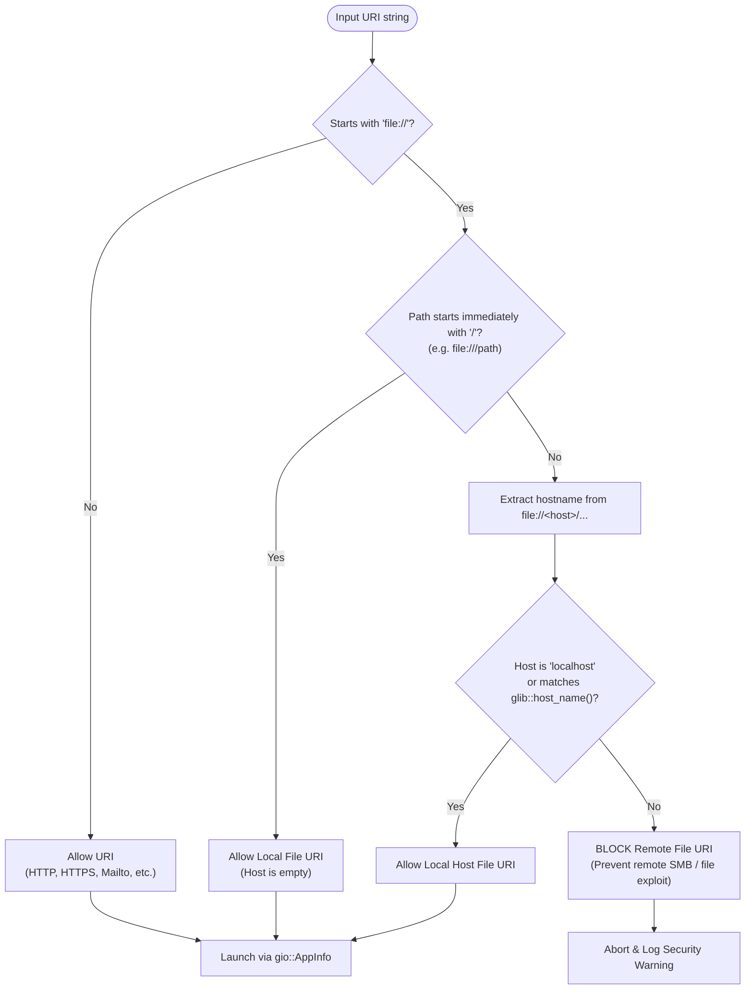

# Master Specification: Phase 18 — OSC 8 Hyperlinks & Upstream Parity

- **Document ID:** `SPEC-0018`
- **Date:** 2026-09-22
- **Status:** Proposed / Ready for Execution
- **Workflow Level:** Medium/Large (Phase 18 of Tilix Rewrite)
- **Preceding Specifications:**
  - [`docs/specs/spec-0001-rust-tilix-foundation-2026-09-15.md`](file:///playground/tilix/docs/specs/spec-0001-rust-tilix-foundation-2026-09-15.md)
  - [`docs/specs/spec-0002-sessions-sync-profiles-2026-09-15.md`](file:///playground/tilix/docs/specs/spec-0002-sessions-sync-profiles-2026-09-15.md)
  - [`docs/specs/spec-0003-wayland-quake-osc-dnd-2026-09-15.md`](file:///playground/tilix/docs/specs/spec-0003-wayland-quake-osc-dnd-2026-09-15.md)
  - [`docs/specs/spec-0004-packaging-distribution-polish-2026-09-16.md`](file:///playground/tilix/docs/specs/spec-0004-packaging-distribution-polish-2026-09-16.md)
  - [`docs/specs/spec-0005-window-style-wide-handle-2026-09-17.md`](file:///playground/tilix/docs/specs/spec-0005-window-style-wide-handle-2026-09-17.md)
  - [`docs/specs/spec-0006-pane-toolbar-terminal-title-2026-09-17.md`](file:///playground/tilix/docs/specs/spec-0006-pane-toolbar-terminal-title-2026-09-17.md)
  - [`docs/specs/spec-0007-custom-keybindings-manager-2026-09-17.md`](file:///playground/tilix/docs/specs/spec-0007-custom-keybindings-manager-2026-09-17.md)
  - [`docs/specs/spec-0008-pane-dnd-docking-detach-2026-09-17.md`](file:///playground/tilix/docs/specs/spec-0008-pane-dnd-docking-detach-2026-09-17.md)
  - [`docs/specs/spec-0009-profile-customization-complete-2026-09-17.md`](file:///playground/tilix/docs/specs/spec-0009-profile-customization-complete-2026-09-17.md)
  - [`docs/specs/spec-0010-profile-preferences-ui-parity-2026-09-17.md`](file:///playground/tilix/docs/specs/spec-0010-profile-preferences-ui-parity-2026-09-17.md)
  - [`docs/specs/spec-0011-session-and-application-title-options-2026-09-18.md`](file:///playground/tilix/docs/specs/spec-0011-session-and-application-title-options-2026-09-18.md)
  - [`docs/specs/spec-0012-dynamic-window-geometry-default-size-2026-09-18.md`](file:///playground/tilix/docs/specs/spec-0012-dynamic-window-geometry-default-size-2026-09-18.md)
  - [`docs/specs/spec-0013-terminal-zoom-and-alt-drag-2026-09-18.md`](file:///playground/tilix/docs/specs/spec-0013-terminal-zoom-and-alt-drag-2026-09-18.md)
  - [`docs/specs/spec-0014-osc52-and-clipboard-integration-2026-09-19.md`](file:///playground/tilix/docs/specs/spec-0014-osc52-and-clipboard-integration-2026-09-19.md)
  - [`docs/specs/spec-0015-compact-mode-density-2026-09-19.md`](file:///playground/tilix/docs/specs/spec-0015-compact-mode-density-2026-09-19.md)
  - [`docs/specs/spec-0016-library-crate-and-test-compilation-optimization-2026-09-20.md`](file:///playground/tilix/docs/specs/spec-0016-library-crate-and-test-compilation-optimization-2026-09-20.md)
  - [`docs/specs/spec-0017-window-transparency-libadwaita-2026-09-21.md`](file:///playground/tilix/docs/specs/spec-0017-window-transparency-libadwaita-2026-09-21.md)
- **Target Location:** `/playground/tilix`

---

## 1. Context & Motivation

### 1.1 The Problem: Terminal Hyperlinks & Upstream Tilix Parity
Operating System Command (OSC) 8 is the industry-standard escape sequence specification for embedding explicit clickable hyperlinks inside terminal emulator text streams (e.g. `\x1b]8;id=123;https://example.com\x1b\\Click Here\x1b]8;;\x1b\\`). Unlike regular expression URL matching—which heuristically scans plain text for URI patterns—OSC 8 provides HTML-like anchor semantics: the displayed text can be arbitrary anchor text while the underlying target URI is completely distinct.

In the original upstream Tilix terminal emulator authored by Gerald Nunn in D/GTK3, OSC 8 hyperlinks were fully integrated:
1. Users could toggle OSC 8 hyperlink processing per profile in the **Compatibility** tab via an "Allow hyperlinks" switch.
2. Clicking a hyperlink with `Ctrl + Left-Click` activated the link via the desktop's default URI handler (`gio::AppInfo::launch_default_for_uri`).
3. Right-clicking a hyperlink dynamically augmented the context menu with **"Open Link"** and **"Copy Link Address"** actions.
4. For security, upstream Tilix inspected `file://` URIs, blocking remote hostnames to prevent remote SMB/file execution vulnerabilities.

In the current Tilix Rust implementation:
- `Profile` lacks an `allow_hyperlinks` toggle.
- VTE4's hyperlink capabilities (`terminal.set_allow_hyperlink()`, `terminal.check_hyperlink_at()`) are unconfigured.
- Left-clicking with `Ctrl` is not intercepted, causing VTE to misinterpret the click as a normal text selection or cursor placement.
- The context menu is static and lacks dynamic "Open Link" and "Copy Link Address" items when right-clicking over a hyperlink.
- There is no security validation protecting against malicious remote `file://` URIs.
- The Profile Preferences Compatibility tab lacks a toggle for OSC 8 hyperlinks.

Phase 18 completes full upstream parity for OSC 8 hyperlinks across the domain model, VTE terminal pane, context menu, window actions, and preferences UI.

---

## 2. Upstream Tilix Alignment

In upstream Tilix (`source/gx/tilix/terminal/terminal.d` and `source/gx/tilix/prefeditor/profileeditor.d`):
1. **Schema Property:** Upstream GSettings schema `com.gexperts.Tilix.Profile` defined the key `allow-hyperlink` as a boolean defaulting to `true`.
2. **VTE Activation:** Upstream Tilix called `vte_terminal_set_allow_hyperlink(vteTerminal, profile.allowHyperlink)`.
3. **Primary Activation:** Upstream Tilix connected to button press events; if `GDK_CONTROL_MASK` was present on button 1 (left click) and `vte_terminal_check_hyperlink_at(x, y)` returned a non-null URI, Tilix opened the URI with `AppInfo.launchDefaultForURI`.
4. **Context Menu Parity:** When button 3 (right click) was pressed, Tilix checked `vte_terminal_check_hyperlink_at(x, y)`. If a hyperlink was present, it dynamically inserted "Open Link" and "Copy Link Address" at the top of the context menu.
5. **Security Gating on `file://` URIs:** Upstream Tilix checked whether `file://` URIs specified a remote host. If the host portion was non-empty, not `"localhost"`, and did not equal the machine's local hostname (`glib.getHostname()`), Tilix blocked the link to protect users from executing remote files or leaking SMB credentials to malicious servers.

Phase 18 mirrors this exact architecture in Rust Tilix using modern GTK4 event controllers (`gtk::GestureClick`), Libadwaita preferences, GIO menu models, and headless-testable pure validation functions.

---

## 3. Amended Documents & Scope

- **Amended Living Architecture:** [`docs/architecture/overview.md`](file:///playground/tilix/docs/architecture/overview.md)
- **Status of Living Architecture:** Active (Version bumped to 0.18.0 with Section 30 documenting OSC 8 Hyperlinks & Upstream Parity)

### 3.1 Affected Scope

1. **`src/model/profile.rs`:**
   - Add `pub allow_hyperlinks: bool` to `Profile` with `#[serde(default = "default_true")]` defaulting to `true`.
   - Add `fn default_true() -> bool { true }`.
   - Add Serde unit tests validating backward compatibility (JSON lacking `"allow_hyperlinks"` key) and forward compatibility.
2. **`src/ui/terminal_pane.rs`:**
   - Call `terminal.set_allow_hyperlink(profile.allow_hyperlinks)` on pane creation and inside `apply_profile_to_widgets()`.
   - Add `current_hyperlink_uri: Rc<RefCell<Option<String>>>` to track the URI under the pointer for context menu actions.
   - Implement `is_safe_file_uri(uri: &str) -> bool` to perform host validation on `file://` URIs.
   - Implement `launch_uri_safe(uri: &str) -> bool` using `gio::AppInfo::launch_default_for_uri()`.
   - Implement `gtk::GestureClick` controller on `terminal` configured with `PropagationPhase::Capture`:
     - On Ctrl + Left-Click (Primary button): query `terminal.check_hyperlink_at(x, y)`. If present, validate and launch URI, claiming the event sequence to prevent selection interference.
     - On Right-Click (Secondary button): query `terminal.check_hyperlink_at(x, y)`. If present, store URI in `current_hyperlink_uri` and build dynamic menu with "Open Link" and "Copy Link Address"; if absent, clear `current_hyperlink_uri` and restore base menu.
   - Expose public methods on `TerminalPane`: `open_link(&self)`, `copy_link_address(&self)`, and `current_hyperlink_uri(&self) -> Option<String>`.
3. **`src/ui/session_view.rs`:**
   - Implement `pub fn open_link_active(&self)` delegating to `active_pane().open_link()`.
   - Implement `pub fn copy_link_address_active(&self)` delegating to `active_pane().copy_link_address()`.
4. **`src/ui/window.rs`:**
   - Register window actions `win.open-link` and `win.copy-link-address` on `TilixWindow`, dispatching to `active_session().open_link_active()` and `active_session().copy_link_address_active()`.
5. **`src/ui/preferences.rs`:**
   - Add `adw::SwitchRow` for "Allow hyperlinks (OSC 8)" under the Profile Compatibility tab.
   - Wire populate and save callbacks to synchronize `Profile.allow_hyperlinks`.
6. **`tests/test_phase18_osc8_hyperlinks.rs` (New Integration Suite):**
   - Headless test suite covering:
     - Profile serde backward and forward compatibility.
     - VTE `allow-hyperlink` synchronization.
     - `Osc52StreamParser` passthrough cleanliness for OSC 8 sequences.
     - `file://` URI safety validation (local paths, localhost, system hostname, remote hosts).
     - Context menu dynamic structure and window action activation.

### 3.2 Unaffected Scope

- `src/pty/*`: Process management, PTY proxy, and child spawning remain unchanged; `Osc52StreamParser` already passes non-52 OSC sequences through without mutation.
- `src/model/layout.rs`: Split layout math and docking tree logic remain unchanged.
- `src/model/keybindings.rs`: Keybinding manager remains unchanged (`Ctrl + Click` is handled via pointer event controller).
- `src/ui/quake.rs`: Quake window automatically benefits from the pane and profile updates.

---

## 4. Requirements, Goals & Non-Goals

### Goals

1. **OSC 8 Hyperlink Rendering & Configuration:**
   - Full support for standard OSC 8 escape sequences in terminal output.
   - Profile-level toggle (`allow_hyperlinks`) in `Profile` defaulting to `true`.
2. **Ctrl + Left-Click Pointer Activation:**
   - When the user presses `Ctrl + Primary Click` over a valid hyperlink, the target URI is safely launched in the desktop's default browser or handler.
   - The event sequence is claimed to prevent spurious terminal text selection.
3. **Context Menu Parity:**
   - Right-clicking over an OSC 8 hyperlink dynamically exposes "Open Link" (`win.open-link`) and "Copy Link Address" (`win.copy-link-address`) in a prepended section.
   - Right-clicking elsewhere presents the standard terminal context menu without link items.
4. **Upstream Security Gating for `file://` URIs:**
   - `file:///path` and `file://localhost/path` are permitted.
   - `file://<hostname>/path` is permitted only if `<hostname>` equals `glib::host_name()`.
   - Remote `file://` hostnames are strictly blocked to prevent remote exploitation.
5. **Libadwaita Preferences Integration:**
   - The Profile Compatibility tab contains a responsive `adw::SwitchRow` titled "Allow hyperlinks (OSC 8)".
6. **Zero-Regression Streaming Cleanliness:**
   - Ensure the PTY proxy streaming parser preserves OSC 8 bytes without corruption, truncation, or dropped escape codes.

### Non-Goals

- Heuristic regex-based text URL parsing (which is covered by custom hyperlink rules in Phase 9). OSC 8 handles explicit terminal hyperlinks.
- Displaying popover tooltips on link hover (VTE does not emit hover events in GTK4 without polling, and tooltip popovers distract from fast-paced terminal workflows).
- Custom desktop URI dispatchers outside `gio::AppInfo::launch_default_for_uri`.

---

## 5. Architectural Design & Detailed Decisions

### 5.1 Decision Gating: Facts, Decisions, Assumptions, Deferred Items

- **Facts:**
  - `vte4` crate feature `"v0_76"` provides `terminal.set_allow_hyperlink(bool)`, `terminal.allows_hyperlink() -> bool`, and `terminal.check_hyperlink_at(x, y) -> Option<glib::GString>`.
  - `gio::AppInfo::launch_default_for_uri(uri, None::<&gio::AppLaunchContext>)` is the standard, secure way to launch URIs on GNOME/Linux.
  - In GTK4, pointer gestures attached with `PropagationPhase::Capture` run before widget internal handlers, allowing clean event interception.
  - `glib::host_name()` returns the current host machine name as a `GString`.
- **Decisions:**
  - **Capture Phase Pointer Interception:** Use `gtk::GestureClick` on `terminal` with `set_button(0)` and `PropagationPhase::Capture`. Primary clicks check `CONTROL_MASK` and claim the sequence on hyperlink hit; secondary clicks query `check_hyperlink_at(x, y)` and swap the context menu model before VTE pops up the menu.
  - **State Storage:** Use `Rc<RefCell<Option<String>>>` inside `TerminalPane` to store the active hyperlink URI under the cursor when right-clicked.
  - **Dynamic Menu Construction:** Generate the context menu on demand when right-clicked: prepending a link section when a URI is present, and falling back to the standard menu when absent.
  - **Safe URI Validation Function:** Implement `is_safe_file_uri(uri: &str) -> bool` as a modular function that can be verified headlessly in unit tests.
- **Assumptions:**
  - Standard desktop browsers handle valid `http://`, `https://`, `mailto:`, and other non-file URI schemes safely via GIO.
- **Deferred Items:**
  - User-configurable browser overrides (deferred to future desktop integration phase; GIO default application association is GNOME HIG standard).

---

### 5.2 Domain Model Schema Extension

In `src/model/profile.rs`:

```rust
fn default_true() -> bool {
    true
}

#[derive(Debug, Clone, PartialEq, Serialize, Deserialize)]
#[serde(default)]
pub struct Profile {
    // ...
    // Compatibility Tab
    pub backspace_binding: EraseBindingPreference,
    pub delete_binding: EraseBindingPreference,
    pub encoding: String,
    pub cjk_utf8_ambiguous_width: CjkWidthPreference,
    #[serde(default = "default_true")]
    pub allow_hyperlinks: bool,
    // ...
}

impl Default for Profile {
    fn default() -> Self {
        Self {
            // ...
            backspace_binding: EraseBindingPreference::Auto,
            delete_binding: EraseBindingPreference::Auto,
            encoding: "UTF-8".into(),
            cjk_utf8_ambiguous_width: CjkWidthPreference::Narrow,
            allow_hyperlinks: true,
            // ...
        }
    }
}
```

Serde tests guarantee backward compatibility: if a profile JSON serialized by earlier versions of Tilix (Phase 1–17) is deserialized, `allow_hyperlinks` automatically defaults to `true`.

---

### 5.3 Terminal Pane & VTE Subsystem Architecture

#### 5.3.1 VTE Configuration & Propagation
During `TerminalPane::new`:
```rust
terminal.set_allow_hyperlink(current_profile.borrow().allow_hyperlinks);
```
Inside `apply_profile_to_widgets`:
```rust
widgets.terminal.set_allow_hyperlink(profile.allow_hyperlinks);
```

#### 5.3.2 Pointer Click Interception & Gesture Controller
In `TerminalPane::new`:
```rust
let current_hyperlink_uri: Rc<RefCell<Option<String>>> = Rc::new(RefCell::new(None));

let click_gesture = gtk::GestureClick::new();
click_gesture.set_button(0); // Listen to all mouse buttons
click_gesture.set_propagation_phase(gtk::PropagationPhase::Capture);

let term_ref = terminal.clone();
let uri_holder = Rc::clone(&current_hyperlink_uri);

click_gesture.connect_pressed(move |gesture, _n, x, y| {
    let btn = gesture.current_button();
    let state = gesture.current_event_state();

    if btn == gtk::gdk::BUTTON_PRIMARY && state.contains(gtk::gdk::ModifierType::CONTROL_MASK) {
        if let Some(uri) = term_ref.check_hyperlink_at(x, y) {
            let uri_str = uri.to_string();
            Self::launch_uri_safe(&uri_str);
            gesture.set_state(gtk::EventSequenceState::Claimed);
        }
    } else if btn == gtk::gdk::BUTTON_SECONDARY {
        if let Some(uri) = term_ref.check_hyperlink_at(x, y) {
            *uri_holder.borrow_mut() = Some(uri.to_string());
            let menu = Self::build_context_menu(true);
            term_ref.set_context_menu_model(Some(&menu));
        } else {
            *uri_holder.borrow_mut() = None;
            let menu = Self::build_context_menu(false);
            term_ref.set_context_menu_model(Some(&menu));
        }
    }
});
terminal.add_controller(click_gesture);
```

#### 5.3.3 Security Gating for `file://` URIs
To achieve 100% security parity with upstream Tilix:
```rust
pub fn is_safe_file_uri(uri: &str) -> bool {
    let lower = uri.to_ascii_lowercase();
    if let Some(rest) = lower.strip_prefix("file://") {
        if rest.starts_with('/') {
            // file:///path -> host is empty -> local path
            return true;
        }
        let host = match rest.find('/') {
            Some(idx) => &rest[..idx],
            None => rest,
        };
        if host.is_empty() || host == "localhost" {
            return true;
        }
        let local_host = glib::host_name().to_string().to_ascii_lowercase();
        if host == local_host {
            return true;
        }
        // Remote file URI detected - blocked for security
        return false;
    }
    true
}

pub fn launch_uri_safe(uri: &str) -> bool {
    if !Self::is_safe_file_uri(uri) {
        eprintln!("Blocked unsafe remote file URI: {}", uri);
        return false;
    }
    let res = gio::AppInfo::launch_default_for_uri(uri, None::<&gio::AppLaunchContext>);
    res.is_ok()
}
```

#### 5.3.4 Dynamic Context Menu Builder
```rust
fn build_context_menu(has_link: bool) -> gio::Menu {
    let menu = gio::Menu::new();

    if has_link {
        let link_section = gio::Menu::new();
        link_section.append(Some("Open Link"), Some("win.open-link"));
        link_section.append(Some("Copy Link Address"), Some("win.copy-link-address"));
        menu.append_section(None, &link_section);
    }

    // Section 1: Clipboard
    let clip_section = gio::Menu::new();
    clip_section.append(Some("Copy"), Some("win.copy"));
    clip_section.append(Some("Copy as HTML"), Some("win.copy-html"));
    clip_section.append(Some("Paste"), Some("win.paste"));
    clip_section.append(Some("Paste Primary Selection"), Some("win.paste-primary"));
    menu.append_section(None, &clip_section);

    // Section 2: Selection
    let sel_section = gio::Menu::new();
    sel_section.append(Some("Select All"), Some("win.select-all"));
    menu.append_section(None, &sel_section);

    // Section 3: Splits
    let split_section = gio::Menu::new();
    split_section.append(Some("Split Right"), Some("win.split-right"));
    split_section.append(Some("Split Down"), Some("win.split-down"));
    split_section.append(Some("Close Terminal"), Some("win.close-pane"));
    menu.append_section(None, &split_section);

    // Section 4: Preferences
    let pref_section = gio::Menu::new();
    pref_section.append(Some("Preferences..."), Some("win.preferences"));
    menu.append_section(None, &pref_section);

    menu
}
```

---

### 5.4 SessionView & Window Action Subsystem

In `src/ui/session_view.rs`:
```rust
impl SessionView {
    pub fn open_link_active(&self) {
        if let Some(pane) = self.active_pane() {
            pane.open_link();
        }
    }

    pub fn copy_link_address_active(&self) {
        if let Some(pane) = self.active_pane() {
            pane.copy_link_address();
        }
    }
}
```

In `src/ui/terminal_pane.rs`:
```rust
impl TerminalPane {
    pub fn current_hyperlink_uri(&self) -> Option<String> {
        self.current_hyperlink_uri.borrow().clone()
    }

    pub fn open_link(&self) {
        if let Some(ref uri) = *self.current_hyperlink_uri.borrow() {
            Self::launch_uri_safe(uri);
        }
    }

    pub fn copy_link_address(&self) {
        if let Some(ref uri) = *self.current_hyperlink_uri.borrow() {
            self.terminal.display().clipboard().set_text(uri);
        }
    }
}
```

In `src/ui/window.rs` (`setup_actions`):
```rust
// Open Link
{
    let action = gio::SimpleAction::new("open-link", None);
    let tab_view_weak = self.tab_view.downgrade();
    let sessions = Rc::clone(&self.sessions);
    action.connect_activate(move |_, _| {
        let Some(tv) = tab_view_weak.upgrade() else { return; };
        let Some(page) = tv.selected_page() else { return; };
        let session_opt = sessions.borrow().get(&page).cloned();
        if let Some(session) = session_opt {
            session.borrow().open_link_active();
        }
    });
    self.window.add_action(&action);
}

// Copy Link Address
{
    let action = gio::SimpleAction::new("copy-link-address", None);
    let tab_view_weak = self.tab_view.downgrade();
    let sessions = Rc::clone(&self.sessions);
    action.connect_activate(move |_, _| {
        let Some(tv) = tab_view_weak.upgrade() else { return; };
        let Some(page) = tv.selected_page() else { return; };
        let session_opt = sessions.borrow().get(&page).cloned();
        if let Some(session) = session_opt {
            session.borrow().copy_link_address_active();
        }
    });
    self.window.add_action(&action);
}
```

---

### 5.5 Profile Preferences UI Parity

In `src/ui/preferences.rs` under `// 5. Compatibility Tab`:
```rust
let hyperlink_row = adw::SwitchRow::new();
hyperlink_row.set_title("Allow hyperlinks (OSC 8)");
hyperlink_row.set_subtitle("Enable support for explicit OSC 8 terminal hyperlinks");
hyperlink_row.set_active(true);

let hyperlink_group = adw::PreferencesGroup::new();
hyperlink_group.add(&hyperlink_row);
compat_grid.attach(&hyperlink_group, 0, 6, 2, 1);
```

Populate callback:
```rust
hyperlink_row.set_active(p.allow_hyperlinks);
```

Save callback:
```rust
prof.allow_hyperlinks = hyperlink_row.is_active();
```

Synchronize event:
```rust
connect_sync!(hyperlink_row, notify_active);
```

---

## 6. Architectural Diagrams

### 6.1 OSC 8 Component Architecture & Interaction Flow

```mermaid
flowchart TD
    subgraph PTY_Subsystem ["PTY & Stream Parsing"]
        ChildProcess["Child Process / Shell<br/>(printf '\\e]8;;https://tilix.dev\\e\\\\Tilix\\e]8;;\\e\\\\')"]
        Proxy["PtyProxy Interceptor"]
        OscParser["Osc52StreamParser<br/>(Passes OSC 8 transparently)"]
        ChildProcess -->|Byte Stream| Proxy
        Proxy -->|Chunk| OscParser
        OscParser -->|Passthrough Bytes| VTE["vte4::Terminal"]
    end

    subgraph TerminalPane_Subsystem ["TerminalPane Event Layer"]
        VTE -->|Render Cells with OSC 8 Anchor| Canvas["Terminal Grid"]
        GestureCtrl["gtk::GestureClick<br/>(PropagationPhase::Capture)"]
        Canvas -.->|Pointer Event| GestureCtrl
        GestureCtrl -->|Ctrl + Left-Click| Check1["vte_terminal_check_hyperlink_at(x, y)"]
        GestureCtrl -->|Right-Click| Check2["vte_terminal_check_hyperlink_at(x, y)"]
    end

    subgraph Security_Execution ["Security Gating & Execution"]
        Check1 -->|Some(URI)| SecCheck["is_safe_file_uri(uri)"]
        SecCheck -->|Safe| GIO["gio::AppInfo::launch_default_for_uri"]
        SecCheck -->|Remote Host Blocked| Warning["Log Warning / Abort"]
    end

    subgraph Context_Menu ["Dynamic Context Menu"]
        Check2 -->|Some(URI)| BuildDynamic["Build Menu Model with<br/>'win.open-link' & 'win.copy-link-address'"]
        Check2 -->|None| BuildStandard["Build Standard Menu Model<br/>(Clipboard, Splits, Preferences)"]
        BuildDynamic --> SetModel["terminal.set_context_menu_model()"]
        BuildStandard --> SetModel
    end
```

### 6.2 Ctrl + Left-Click Pointer Activation Sequence

```mermaid
sequenceDiagram
    autonumber
    actor User
    participant Term as vte4::Terminal
    participant Gesture as gtk::GestureClick (Capture)
    participant Pane as TerminalPane
    participant Safety as is_safe_file_uri
    participant GIO as gio::AppInfo

    User->>Term: Ctrl + Left-Click at (x, y)
    Term->>Gesture: connect_pressed(btn=1, state=CONTROL_MASK)
    Gesture->>Term: check_hyperlink_at(x, y)
    Term-->>Gesture: Some("https://tilix.dev")
    Gesture->>Pane: launch_uri_safe("https://tilix.dev")
    Pane->>Safety: is_safe_file_uri("https://tilix.dev")
    Safety-->>Pane: true (HTTP/HTTPS safe)
    Pane->>GIO: launch_default_for_uri("https://tilix.dev", None)
    GIO-->>Pane: Ok(())
    Gesture->>Gesture: set_state(EventSequenceState::Claimed)
    Note over Term,Gesture: Event consumed; no terminal text selection triggered
```

### 6.3 File URI Security Validation Flow



---

## 7. Test & Validation Strategy

A dedicated test suite `tests/test_phase18_osc8_hyperlinks.rs` together with unit tests in `src/model/profile.rs` and `src/ui/terminal_pane.rs` ensures robust verification:

### 7.1 Test Matrix

| Category | Test Case | Target / Scope | Method |
| :--- | :--- | :--- | :--- |
| **Domain Serde** | Default `allow_hyperlinks` | `Profile::default()` | Verify `allow_hyperlinks == true` |
| **Domain Serde** | Backward Compatibility | JSON missing `allow_hyperlinks` | Deserialize legacy JSON, verify defaults to `true` |
| **Domain Serde** | Serde Roundtrip | `allow_hyperlinks = false` | Serialize and deserialize, verify false preserved |
| **VTE State** | Allow Hyperlink Sync | `TerminalPane` & VTE | Verify `terminal.allows_hyperlink()` matches `Profile` |
| **VTE State** | Profile Reapplication | `apply_profile()` | Verify toggling profile toggles `terminal.allows_hyperlink()` |
| **PTY Cleanliness**| OSC 8 Passthrough | `Osc52StreamParser` | Verify `\x1b]8;;url\x1b\\text\x1b]8;;\x1b\\` bytes unaltered |
| **Security** | Local `file:///` Path | `is_safe_file_uri` | `file:///home/user/test.txt` -> `true` |
| **Security** | Localhost `file://` | `is_safe_file_uri` | `file://localhost/etc/hosts` -> `true` |
| **Security** | Hostname `file://` | `is_safe_file_uri` | `file://<glib::host_name()>/tmp` -> `true` |
| **Security** | Remote Host Block | `is_safe_file_uri` | `file://attacker.com/evil.sh` -> `false` |
| **Security** | SMB Share Block | `is_safe_file_uri` | `file://smb-server/share/file` -> `false` |
| **Context Menu** | Dynamic Item Generation | `build_context_menu` | Check `win.open-link` presence when link true, absent when false |
| **Window Action**| Action Registration | `TilixWindow` | Verify `win.open-link` and `win.copy-link-address` actions registered |

---

## 8. Compatibility, Security & Risk Analysis

1. **Remote File Execution & Credential Leaks (`file://`):**
   - *Risk:* An attacker outputting malicious OSC 8 sequences could specify `file://evil.com/payload` to trigger remote share mounting or credential negotiation.
   - *Mitigation:* Strict validation in `is_safe_file_uri` mirrors upstream Tilix, blocking any non-local hostname.
2. **Event Sequence Contention with VTE Selection:**
   - *Risk:* Clicking the terminal could simultaneously trigger VTE selection or cursor movement while activating a link.
   - *Mitigation:* Connecting `GestureClick` in `PropagationPhase::Capture` and calling `set_state(EventSequenceState::Claimed)` when a hyperlink is activated prevents VTE from handling the event.
3. **Configuration Backward & Forward Compatibility:**
   - *Risk:* Existing configuration files without `allow_hyperlinks` failing to deserialize.
   - *Mitigation:* `#[serde(default = "default_true")]` guarantees legacy configs load seamlessly.
4. **Performance & Main-Thread Blocking:**
   - *Risk:* URL querying on pointer movement degrading frame rate.
   - *Mitigation:* No continuous pointer motion tracking; `terminal.check_hyperlink_at(x, y)` is queried exclusively on discrete mouse button click events.
